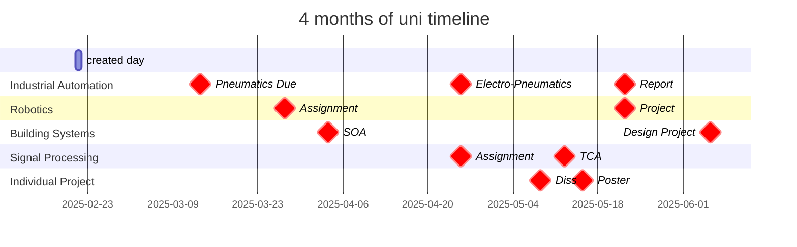

```dataview
TABLE link(dateformat(due,"yyyy-MM-dd"),dateformat(due,"yyyy-MM-dd")) AS "Due Date", due - date(today) AS "Due In", weight + "%" AS "Weight", substring(module, 8) as Module
FROM "Projects/Uni Projects" AND #Assessment
SORT due 
```
