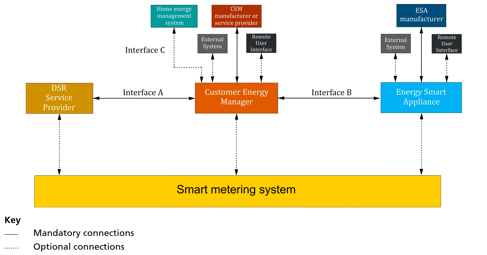
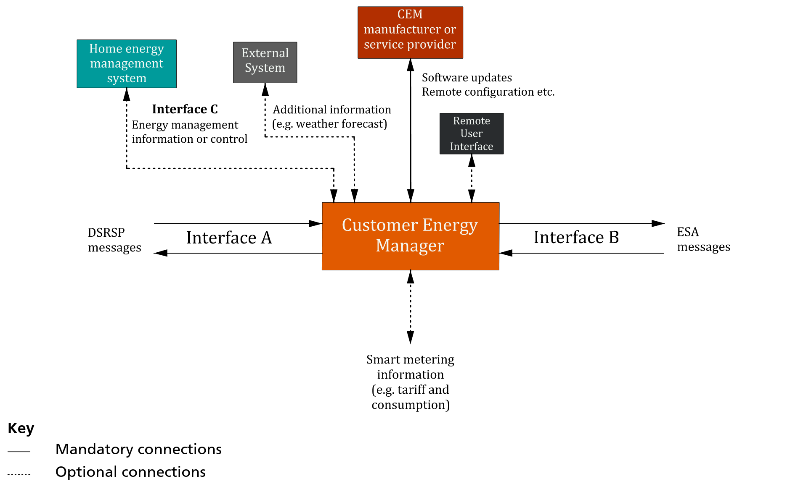
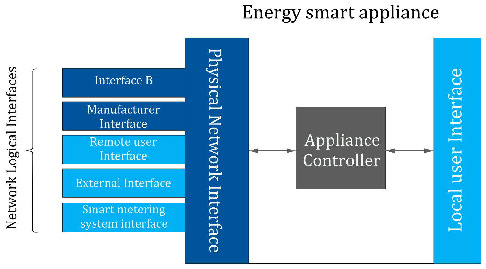

# PAS1878: Energy smart appliances. System functionality and architecture. Specification

> [!Cite] [2021-PAS1878](zotero://select/library/items/HZWW53ZW)
> [1]  _PAS1878: Energy smart appliances. System functionality and architecture. Specification_. in PAS, no. 1878. London: British Standards Institution, 2021.
> > [!example]- Metadata    
> > **Title**:: PAS1878: Energy smart appliances. System functionality and architecture. Specification
> > **Year**:: 2021
> > **Citekey**:: 2021-PAS1878
> > **Sources**:: [Zotero](zotero://select/library/items/HZWW53ZW) [pdf](file:////home/joeashton/Zotero/storage/FJA7F9TN/2021%20-%20Energy%20smart%20appliances.%20System%20functionality%20and%20architecture.%20Specification.pdf) 
> > **Tags:** #👁, #🖋
> > 
> > **itemType**:: book
> > **Publisher**:: British Standards Institution
> > **Location**:: London
> > **ISBN**:: 978 0 539 05131 5

# Notes

%% begin notes %%

## Interfaces

%% end notes %%

# Annotations

%% begin annotations %%

> [!MagentaHighlight] [see in Zotero](zotero://open-pdf/library/items/FJA7F9TN?page=1&annotation=IY8C27CA)
> This PAS specifies requirements and criteria that an electrical appliance needs to meet in order to perform and be classified as an energy smart appliance (ESA).

> [!YellowHighlight] [see in Zotero](zotero://open-pdf/library/items/FJA7F9TN?page=1&annotation=496N87LL)
> 
> - Interoperability: the ability of an ESA to work seamlessly across any appropriate DSR service operated by any authorized system actor.  
> - Data privacy: the secure transmission and storing of data on the device or with any controlling party.  
> - Grid stability: the prevention of outages on the grid caused by inappropriate operation of ESAs.  
> - Cyber security: the appropriate protection of ESAs from unauthorized access and the correct use of ESAs by authorized parties only in order to achieve valid DSR events.

## Definitions

> [!YellowHighlight] [see in Zotero](zotero://open-pdf/library/items/FJA7F9TN?page=3&annotation=SFDGHAI6)
> customer energy manager (CEM)  logical entity providing functionality used to manage one or more ESAs or ESAGs, specific to a supply point, in order to provide DSR services

> [!YellowHighlight] [see in Zotero](zotero://open-pdf/library/items/FJA7F9TN?page=3&annotation=3AJYT7FV)
> demand side response (DSR)  shifting (in time) and/or modulation (increase or decrease) of electricity consumption and/or production through the controlled operation of ESAs, in line with consumer preferences, in response to signals from, and acting in agreement with, regulated electricity market participants

> [!YellowHighlight] [see in Zotero](zotero://open-pdf/library/items/FJA7F9TN?page=3&annotation=W724JA9F)
> demand side response service provider (DSRSP)  organization using ESAs to provide demand siderelated energy management services to regulated electricity market participants

> [!YellowHighlight] [see in Zotero](zotero://open-pdf/library/items/FJA7F9TN?page=4&annotation=CMLZ6ND6)
> energy smart appliance (ESA)  appliance that meets the requirements specified in this PAS; it is communications-enabled and able to respond automatically to price and/or other signals by shifting or modulating its electricity consumption and/ or production

## System overview

> [!Quote] With Smart Metering [see in Zotero](zotero://open-pdf/library/items/FJA7F9TN?page=10&annotation=7M8D22GZ)
> 

> [!YellowHighlight] [see in Zotero](zotero://open-pdf/library/items/FJA7F9TN?page=61&annotation=7WBWZSB4)
> The DSR architecture defined in this PAS functions as a standalone architecture and is also fully technically compatible with the GB smart metering architecture

### Role of the CEM
[customer energy manager (CEM)](customer%20energy%20manager%20(CEM).md)

> [!Quote] [see in Zotero](zotero://open-pdf/library/items/FJA7F9TN?page=8&annotation=7C6VQZH2)
> 
> 

> [!YellowHighlight] [see in Zotero](zotero://open-pdf/library/items/FJA7F9TN?page=8&annotation=C9UJED42)
> The CEM shall act as a logical intermediary between a DSRSP and ESAs, interpreting the status of the ESA within the context of the flexibility requirements of the DSRSP, sending flexibility status information to the DSRSP and initiating ESA flexibility actions.

> [!PurpleHighlight] [see in Zotero](zotero://open-pdf/library/items/FJA7F9TN?page=8&annotation=WFDEXN59)
> The CEM shall perform cyber-security operations in accordance with Clause 6 on messages that it receives from, and sends to, an ESA and DSRSP.

> [!PurpleHighlight] [see in Zotero](zotero://open-pdf/library/items/FJA7F9TN?page=8&annotation=WYT49MTK)
> The CEM shall perform any reformatting or protocol transcoding on DSRSP-bound messages that it receives from the ESA in order to meet the communications and message format requirements of Interface A in accordance with Clause 5.

> [!PurpleHighlight] [see in Zotero](zotero://open-pdf/library/items/FJA7F9TN?page=8&annotation=F4V4AXMY)
> The CEM shall perform any reformatting or protocol transcoding on ESA-bound messages that it receives from the DSRSP in order to meet the communications and message format requirements in accordance with 5.3.

> [!YellowHighlight] [see in Zotero](zotero://open-pdf/library/items/FJA7F9TN?page=8&annotation=6VQPHCB9)
> The CEM shall connect to no more than one DSRSP but shall be able to connect to at least one ESA at any given time.

### Role of the ESA
[energy smart appliance (ESA)](energy%20smart%20appliance%20(ESA).md)

> [!Quote] [see in Zotero](zotero://open-pdf/library/items/FJA7F9TN?page=7&annotation=ZURYEPJW)
> 

> [!YellowHighlight] [see in Zotero](zotero://open-pdf/library/items/FJA7F9TN?page=7&annotation=WMJWYEH9)
> An ESA shall send registration, de-registration, authentication, flexibility offer, flexibility offer cancellation and status messages to its associated CEM for subsequent communication to the DSRSP.

> [!YellowHighlight] [see in Zotero](zotero://open-pdf/library/items/FJA7F9TN?page=7&annotation=88WJEQFB)
> An ESA shall receive registration, de-registration, authentication, flexibility offer request, flexibility offer cancellation and status messages from the DSRSP via its associated CEM.

> [!YellowHighlight] [see in Zotero](zotero://open-pdf/library/items/FJA7F9TN?page=7&annotation=HLGUCPZW)
> An ESA shall connect to no more than one CEM at any given time.

> [!YellowHighlight] [see in Zotero](zotero://open-pdf/library/items/FJA7F9TN?page=7&annotation=66Y2L4QM)
> The ESA shall support a local (built-in) and/or remote user interface for the input of user preferences, ESA DSR operation control and the display of DSR status.

### Role of the DSRSP
[DSR service provider (DSRSP)](DSR%20service%20provider%20(DSRSP).md)

> [!YellowHighlight] [see in Zotero](zotero://open-pdf/library/items/FJA7F9TN?page=9&annotation=8GGJZYT7)
> The DSRSP shall be responsible for managing DSR energy flexibility amongst its subscribed ESA portfolio.

> [!YellowHighlight] [see in Zotero](zotero://open-pdf/library/items/FJA7F9TN?page=9&annotation=JREZLP9H)
> The DSRSP receives sets of flexibility offers from each of the active ESAs in its cohort. When implementing a DSR event, the DSRSP shall select one offer from a range of sets of options and send the selection to the appropriate ESA via the associated CEM.

## Operation
### Interfaces
[IDSR interfaces](IDSR%20interfaces.md)

> [!YellowHighlight] [see in Zotero](zotero://open-pdf/library/items/FJA7F9TN?page=10&annotation=Z2IG49E7)
> The DSRSP and the CEM shall exchange information relating to device registration, de-registration, flexibility offers, DSR events, status and cyber-security breaches across Interface A.

> [!YellowHighlight] [see in Zotero](zotero://open-pdf/library/items/FJA7F9TN?page=11&annotation=EMISIXJU)
> The CEM and the ESA shall exchange information relating to device registration, de-registration, flexibility offers, DSR events, status and cyber-security breaches across Interface B.

> [!YellowHighlight] [see in Zotero](zotero://open-pdf/library/items/FJA7F9TN?page=11&annotation=85NC8TRQ)
> Both the CEM and the ESA shall communicate with a remote manufacturer, or service provider portal, using a logical interface defined by the manufacturer/ service provider.  As a minimum, this interface shall be used to supply the CEM and ESA with firmware updates, certificate management information

> [!YellowHighlight] [see in Zotero](zotero://open-pdf/library/items/FJA7F9TN?page=11&annotation=REP5G359)
> A local (built in) or remote user interface shall be provided for the ESA

> [!YellowHighlight] [see in Zotero](zotero://open-pdf/library/items/FJA7F9TN?page=11&annotation=6KHT5T5F)
> Either the CEM or the ESA can connect to one or more external service providers (e.g. weather service, grid carbon intensity monitoring service) in order to provide additional functionality.

> [!YellowHighlight] [see in Zotero](zotero://open-pdf/library/items/FJA7F9TN?page=11&annotation=FFVG2LXS)
> The DSR system may provide for an interface or interfaces with a smart metering system.

> [!YellowHighlight] [see in Zotero](zotero://open-pdf/library/items/FJA7F9TN?page=11&annotation=L67FEE35)
> A CEM can connect to a home energy management system (HEMS) over Interface C.
> 

### Information Flow

> [!YellowHighlight] [see in Zotero](zotero://open-pdf/library/items/FJA7F9TN?page=13&annotation=4JT6RSF4)
> During normal operation, the ESA shall:
> a) inform the DSRSP, via the CEM, of its current flexibility offers;
> b) inform the DSRSP, via the CEM, of any current flexibility offer updates;
> c) act upon a request to implement a flexibility offer from the DSRSP, via the CEM, providing the CEM with updated profiles in response;
> d) for any accepted flexibility offer requests, indicate that it is operating in a DSR event period using its user interface;
> e) either periodically report its instantaneous power consumption to the DSRSP via the CEM during a DSR event, or log its power consumption during a DSR event and report this to the DSRSP via the CEM as an actual power profile at the end of the DSR event;
> f) send an acknowledgement for each accepted flexibility offer request to the DSRSP; and
> g) indicate to the DSRSP that it has cancelled the previously selected flexibility offer.
> The CEM shall pass information between the DSRSP and ESA, unencrypting and encrypting between Interface A and Interface B.

### Operation modes

> [!YellowHighlight] [see in Zotero](zotero://open-pdf/library/items/FJA7F9TN?page=13&annotation=JZYPH7KP)
> Mode 1: Routine mode  The CEM shall be able to perform energy management functions and manage the consumption/production/ storage of its connected ESA(s) according to consumer preferences

> [!YellowHighlight] [see in Zotero](zotero://open-pdf/library/items/FJA7F9TN?page=13&annotation=9HB2QFUI)
> Mode 2: Response mode  The ESA shall immediately enter Mode 2 (Response mode) once it has acknowledged to its registered DSRSP that it will be accepting and performing a valid flexibility offer

> [!YellowHighlight] [see in Zotero](zotero://open-pdf/library/items/FJA7F9TN?page=14&annotation=BBC8HLHP)
> The ESA shall remain in Mode 2 until:  
> - the period stated by the DSRSP request ends;  
> - the DSRSP requests the period to end; or  
> - the consumer overrides the DSR operation; or  
> - the failsafe protections occur.

> [!YellowHighlight] [see in Zotero](zotero://open-pdf/library/items/FJA7F9TN?page=14&annotation=UC6E6E4S)
> Mode 3: Consumer override  The ESA shall enter Mode 3 whenever it receives a manual override (i.e. modify, decline or cancel) from the Consumer.  In Mode 3, the ESA shall allow the Consumer to override any Mode 1 (routine) or Mode 2 (response) operation at any time.

> [!YellowHighlight] [see in Zotero](zotero://open-pdf/library/items/FJA7F9TN?page=14&annotation=8NGLK3S8)
> Mode 4: Failsafe  The CEM and ESA control logic shall ensure that the CEM and ESA do not perform in a manner that can lead to an unsafe, harmful or otherwise hazardous situation. Whenever such a condition is imminent, the CEM and ESA shall transition into a failsafe state (Mode 4).

### Power Profiles 
[power profile](power%20profile.md)

> [!YellowHighlight] [see in Zotero](zotero://open-pdf/library/items/FJA7F9TN?page=24&annotation=233RCG84)
> each CEM shall provide the DSRSP with information relating to the actual power values or profiles provided by its ESAs

> [!YellowHighlight] [see in Zotero](zotero://open-pdf/library/items/FJA7F9TN?page=24&annotation=N4UV7MCY)
> The ESA shall indicate its flexibility capability by generating a set of indexed forecast power profiles

> [!YellowHighlight] [see in Zotero](zotero://open-pdf/library/items/FJA7F9TN?page=25&annotation=9YLAKFTE)
> An ESA shall generate at least three forecast power profiles:  
> - intended operation (IO);  
> - most delayed (MD); and  
> - least delayed (LD).

> [!YellowHighlight] [see in Zotero](zotero://open-pdf/library/items/FJA7F9TN?page=26&annotation=KZ8HQR4C)
> ESAs able to produce power, such as battery storage, shall also generate two additional forecast power profiles:  
> - most delayed production (MD_P);  
> - least delayed production (LD_P).

> [!YellowHighlight] [see in Zotero](zotero://open-pdf/library/items/FJA7F9TN?page=27&annotation=6GAS2I3X)
> a) the ESA shall calculate the initial IO, MD and LD forecast power profiles for a given flexibility forecast period as part of a flexibility offer;
> b) these shall be sent to the DSRSP via the CEM as a flexibility offer update whenever their status changes or they expire;
> c) following the beginning of the flexibility forecast period, the ESA shall send updates for the IO, LD and MD forecast power profiles as they change with time and ESA status; and
> d) upon requesting a flexibility offer, the DSRSP can select either LD or MD as it sees fit and send the request to the ESA via the CEM, which shall respond as quickly as possible, either implementing the DSRSP’s request or rejecting it if it is not applicable

> [!YellowHighlight] [see in Zotero](zotero://open-pdf/library/items/FJA7F9TN?page=26&annotation=WETEQNJF)
> Forecast power profiles shall denote power consumption using positive power values and power production using negative power values.

> [!YellowHighlight] [see in Zotero](zotero://open-pdf/library/items/FJA7F9TN?page=26&annotation=7LF5IA8C)
> When operating in Great Britain, the ESA shall apply a randomized offset in the range 0 s to 600 s by default

#### Intended Operation (IO) 

> [!YellowHighlight] [see in Zotero](zotero://open-pdf/library/items/FJA7F9TN?page=26&annotation=EZEDHMPV)
> Intended operation: The “intended operation” (IO) power profile shall correspond to the operation of the ESA when not responding to a flexibility offer request from a DSRSP.

#### Most Delayed (MD)

> [!YellowHighlight] [see in Zotero](zotero://open-pdf/library/items/FJA7F9TN?page=26&annotation=S6Q89AT9)
> Most delayed: The “most delayed” (MD) power profile shall correspond to the latest time at which an ESA is able to start whilst still meeting the requirements of the consumer

#### Least Delayed (LD)

> [!YellowHighlight] [see in Zotero](zotero://open-pdf/library/items/FJA7F9TN?page=26&annotation=SXX9H6CS)
> Least delayed: The “least delayed” (LD) power profile shall correspond to the earliest time at which an ESA is able to start

#### Frequency Response

> [!YellowHighlight] [see in Zotero](zotero://open-pdf/library/items/FJA7F9TN?page=27&annotation=9DB2CEI6)
> If they have the capability, ESAs shall be capable of automatically invoking frequency response behaviour

> [!YellowHighlight] [see in Zotero](zotero://open-pdf/library/items/FJA7F9TN?page=21&annotation=9LHTQQYG)
> ###### Table 8 – Frequency response indicator values
| Frequency Response Capability indicator value | ESA Frequency response capability                                                                              |
| --------------------------------------------- | -------------------------------------------------------------------------------------------------------------- |
| 0                                             | No frequency response capability                                                                               |
| 1                                             | static frequency response capability                                                                           |
| 2                                             | dynamic frequency response capability with a response linearly proportional to the frequency deviation         |
| 3                                             | dynamic frequency response capability with a response proportional to the square of the frequency deviation    |
| N                                             | dynamic frequency response capability with a response proportional to (N-1)th power of the frequency deviation |

%% end annotations %%

%% Import Date: 2025-03-31T18:05:42.300+01:00 %%
