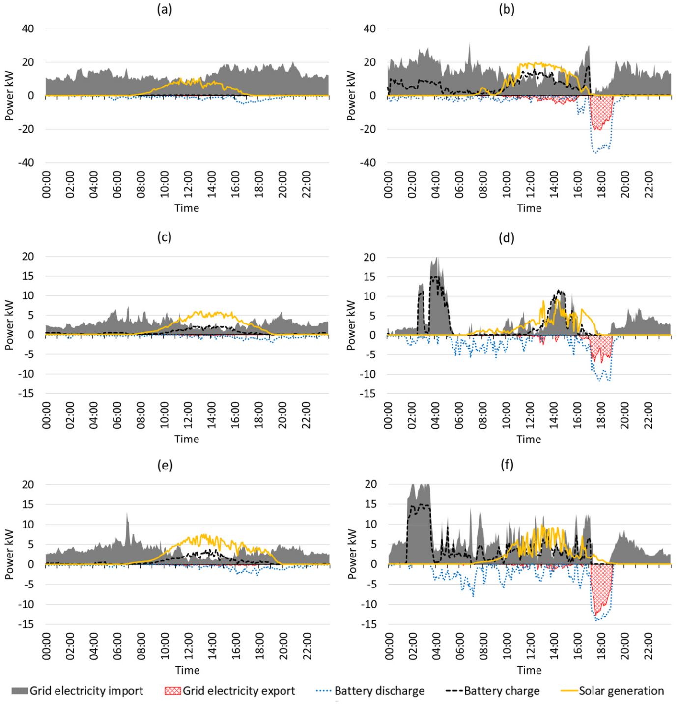
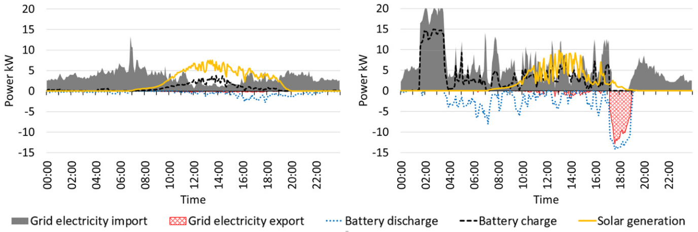
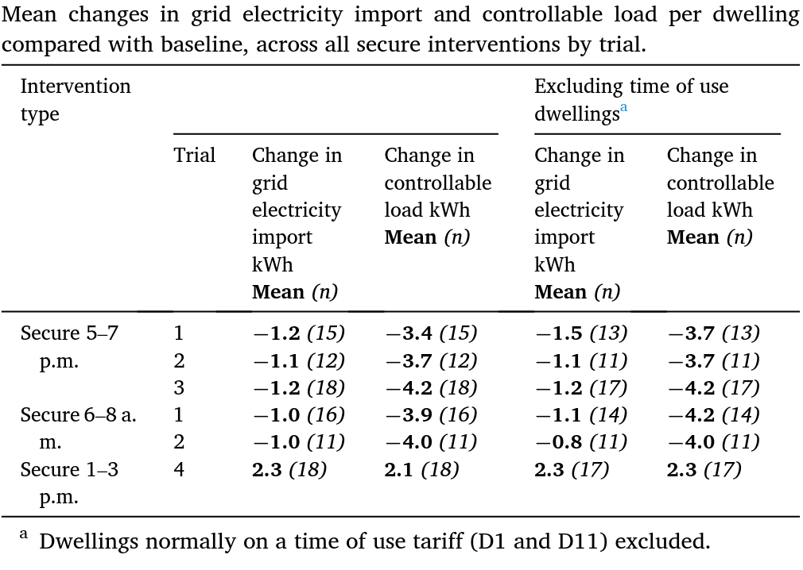
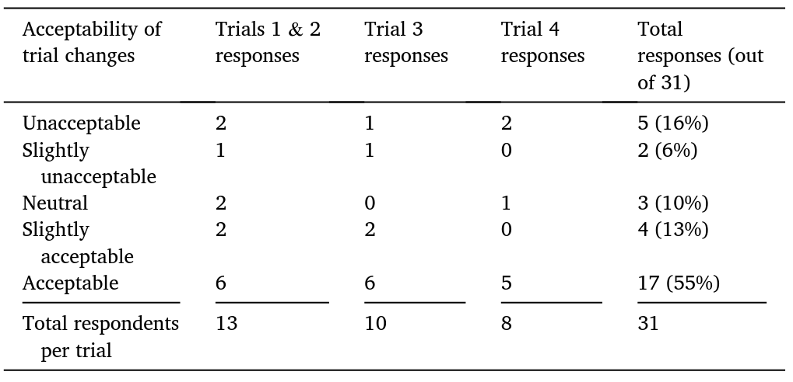

# Empirical evaluation of demand side response trials in UK dwellings with smart low carbon technologies

> [!Cite] [guptaR2022-EmpiricalEvaluationDemand](zotero://select/library/items/J9T8NNZZ)
> [1]  R. Gupta and J. Morey, ‘Empirical evaluation of demand side response trials in UK dwellings with smart low carbon technologies’, _Renewable Energy_, vol. 199, pp. 993–1004, Nov. 2022, doi: [10.1016/j.renene.2022.09.008](https://doi.org/10.1016/j.renene.2022.09.008). Available: [https://www.sciencedirect.com/science/article/pii/S0960148122013441](https://www.sciencedirect.com/science/article/pii/S0960148122013441). [Accessed: Apr. 07, 2025]
> > [!example]- Metadata    
> > **Title**:: Empirical evaluation of demand side response trials in UK dwellings with smart low carbon technologies
> > **Year**:: 2022
> > **Citekey**:: guptaR2022-EmpiricalEvaluationDemand
> > **Sources**:: [Zotero](zotero://select/library/items/J9T8NNZZ) [pdf](file:////home/joeashton/Zotero/storage/X7TUZ8B3/Gupta%20and%20Morey%20-%202022%20-%20Empirical%20evaluation%20of%20demand%20side%20response%20trials%20in%20UK%20dwellings%20with%20smart%20low%20carbon%20technologi.pdf) 
> > **Tags:** #👁, #🖋, #Energy-flexibility, #Heat-pumps, #Low-carbon-technologies, #Resident-experience, #Residential-demand-response, #Smart-energy-systems
> > **FirstAuthor**:: Gupta, Rajat
> > **Author**:: Morey, Johanna
> > 
> > **itemType**:: journalArticle
> > **Journal**:: *Renewable Energy*
> > **Volume**:: 199
> > **Pages**:: 993-1004
> > **DOI**:: 10.1016/j.renene.2022.09.008

> [!abstract]- Abstract
> Low carbon technologies along with smart control have a role in residential demand side response (DSR) to shift the timing of household energy consumption away from peak times and align it with generation of renewable electricity. This paper empirically evaluates the impact of DSR trials on grid electricity import and resident experience regarding disruption to daily routines, thermal comfort and noise disturbance in 17 thermally efficient social housing dwellings (Barnsley, England). Four types of DSR trials were run through 22 interventions performed in March to April 2021. Each dwelling was equipped with a 5 kWh electro-chemical battery and air source heat pump, and all but one dwelling had solar photovoltaic (PV) panels (1.3–3.0 kWp). Interventions were applied against a flat (single) rate tariff as well as dynamic time-of-use tariffs. On average, secure turn-down interventions between 5 and 7 p.m. resulted in a reduction in grid electricity import of 1.2 kWh per household and a reduction in controllable load (heat pump plus battery energy) of 3.7 kWh per household. The batteries enabled 2.5 kWh per household of electricity to be exported to the grid for these interventions. On average, turn-up interventions between 1 and 3 p.m. resulted in an increase of 2.3 kWh per household in grid electricity import. Individual dwellings showed different levels of demand response depending on the levels and patterns of household electricity consumption. The resident experience was evaluated by means of a series of telephone surveys. Householders were generally accepting of the trials in terms of changes in indoor temperature, hot water availability, noise disturbance and disruption to household routines. However, some general concerns were raised about the energy systems relating to indoor temperature, hot water temperature and energy costs. The general acceptability of automated DSR, conditional on thermal comfort limits and manual override, is promising for the wider application of residential DSR driven by price signals, although ongoing household engagement in DSR schemes will require a continued focus on the householder experience with training and support in using new technologies. A routine period of inspection should be employed to identify any issues with energy system issues ahead of DSR initiation.

# Notes

%% begin notes %%%% end notes %%

# Annotations

%% begin annotations %%

> [!MagentaHighlight] [see in Zotero](zotero://open-pdf/library/items/X7TUZ8B3?page=995&annotation=H9U6WRLL)
> Four types of DSR trials were conducted between 12th March and May 5, 2021 (Table 2) on alternate weekdays. A total of 22 interventions each of 2 h duration was applied. The dwellings were divided into three trial groups (A, B and C). Groups A and B each consisted of six dwellings and Group C contained five dwellings.

> [!MagentaHighlight] [see in Zotero](zotero://open-pdf/library/items/X7TUZ8B3?page=995&annotation=M4379KNU)
> For Trial 1, all 17 dwellings were subject to turn-down interventions at peak times (6–8 a.m., 5–7 p.m.) against their usual tariff.

> [!MagentaHighlight] [see in Zotero](zotero://open-pdf/library/items/X7TUZ8B3?page=995&annotation=9GSUUP4I)
> For Trial 2 (Groups A and B), turn-down interventions at peak times were overlaid on a dynamic Octopus Agile2 price signal using forecast electricity prices.

> [!MagentaHighlight] [see in Zotero](zotero://open-pdf/library/items/X7TUZ8B3?page=995&annotation=U52IRETY)
> For Trial 3 (Groups A and B), turn-down interventions were overlaid on a carbon optimisation price signal which was based upon forecast carbon grid intensity for the  Yorkshire region.

> [!MagentaHighlight] [see in Zotero](zotero://open-pdf/library/items/X7TUZ8B3?page=995&annotation=9JIBYICD)
> For Trial 4 (Groups A and B) turn-up interventions were applied during 1–3 p.m., to represent times when generation from local renewables (e.g. solar, wind) might be available.

> [!MagentaHighlight] [see in Zotero](zotero://open-pdf/library/items/X7TUZ8B3?page=996&annotation=TDIZ8AB2)
> A baseline method was applied whereby baseline energy consumption was calculated as the average of the energy consumption for the appropriate 2 h time interval over the five baseline days (weekdays).

> [!MagentaHighlight] [see in Zotero](zotero://open-pdf/library/items/X7TUZ8B3?page=996&annotation=ZI6EB5F4)
> Two metrics are used to quantify the impact of interventions, the change in grid electricity import and the change in controllable load compared with the relevant baseline.

> [!MagentaHighlight] [see in Zotero](zotero://open-pdf/library/items/X7TUZ8B3?page=996&annotation=BZEMYGTG)
> Controllable load is the combined effect of heat pump electricity consumption and battery energy.

> [!OrangeHighlight] [see in Zotero](zotero://open-pdf/library/items/X7TUZ8B3?page=997&annotation=3HTBDLYR)
> Secure turn-down interventions were often more effective than  dynamic turn-down interventions due to the higher battery energy level at the start of the secure interventions.

> [!Quote] [see in Zotero](zotero://open-pdf/library/items/X7TUZ8B3?page=998&annotation=6GSEZIR7)
> 
> > [!note]
> > Aggregate daily power profiles for example turn-down interventions with their respective baselines. (a) 22–26 February baseline - All dwellings, (b) Trial 1, Intervention 1 (Secure turn-down with default tariff, 5–7 p.m.), (c) 29 March-2 April baseline – Group A, (d) Trial 2A, Intervention 7 (Dynamic turn-down and Octopus Agile price signal, 5–7 p.m.), (e) 12–16 April baseline – Group A, (f) Trial 3A, Intervention 11 (Secure turn-down and carbon optimisation price signal, 5–7 p.m.).

> [!Quote] [see in Zotero](zotero://open-pdf/library/items/X7TUZ8B3?page=998&annotation=JM24VY8F)
> 
> > [!note]
> > Aggregate daily power profiles for (Left) 12–16 April baseline – Group A, (right) Trial 3A, Intervention 11 Secure turn-down and carbon optimisation price signal, 5–7 p.m.

> [!Quote] [see in Zotero](zotero://open-pdf/library/items/X7TUZ8B3?page=999&annotation=5DRC9XTX)
> 

> [!OrangeHighlight] [see in Zotero](zotero://open-pdf/library/items/X7TUZ8B3?page=1000&annotation=RRPN5Q54)
> the mean change in controllable load for secure turn-down interventions across Trials 1 to 3 ranged from −3.7 kWh to −4.2 kWh and the secure turn-up interventions resulted in an increase in grid electricity import of 2.3 kWh, on average.

> [!OrangeHighlight] [see in Zotero](zotero://open-pdf/library/items/X7TUZ8B3?page=1001&annotation=9RVSL6ZC)
> 58% (out of 31) responses stated that the indoor temperature felt the same as usual

> [!OrangeHighlight] [see in Zotero](zotero://open-pdf/library/items/X7TUZ8B3?page=1002&annotation=LMVAQSV9)
> Across the three surveys, 77% (out of 31) responses, stated that the changes experienced during the trials, i.e. to hot water availability, indoor temperatures and noise disturbance from the battery and heat pump, were acceptable or slightly acceptable, or that households were neutral towards them.

> [!Quote] [see in Zotero](zotero://open-pdf/library/items/X7TUZ8B3?page=1002&annotation=V63I82CV)
> 
> > [!note]
> > Householder’s acceptability of trial changes during trials.%% end annotations %%

%% Import Date: 2025-04-10T00:49:39.145+01:00 %%
