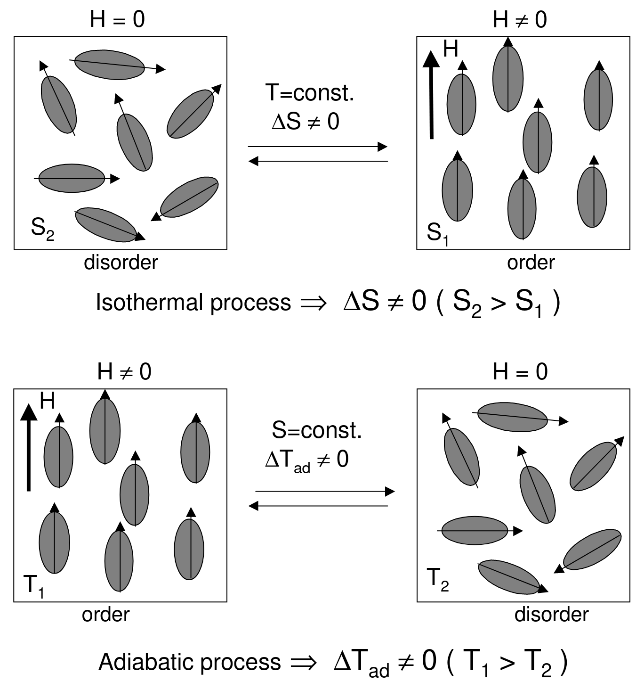

# Magnetocaloric Effect In Gd5(SixGe1-x)4 Alloys

> [!Cite] [casanovaifernandezF2004-MagnetocaloricEffectGd5SixGe1x4](zotero://select/library/items/JHSRBRH4)
> [1]  F. Casanova i Fernàndez, ‘Magnetocaloric Effect In Gd5(SixGe1-x)4 Alloys’, Ph.D. Thesis, Universitat de Barcelona, 2004. Available: [https://www.tdx.cat/handle/10803/1789](https://www.tdx.cat/handle/10803/1789). [Accessed: Mar. 27, 2025]
> > [!example]- Metadata    
> > **Title**:: Magnetocaloric Effect In Gd5(SixGe1-x)4 Alloys
> > **Year**:: 2004
> > **Citekey**:: casanovaifernandezF2004-MagnetocaloricEffectGd5SixGe1x4
> > **Sources**:: [Zotero](zotero://select/library/items/JHSRBRH4) [pdf](file:////home/joeashton/Zotero/storage/ZF8XFREV/1.CHAPTER_1.pdf) 
> > **Tags:** #👁, #🖋, #53, #Aliatges, #Ciències-Experimentals-i-Matemàtiques, #Efecte-magnetocalòric, #Magnetisme
> > **FirstAuthor**:: Casanova i Fernàndez, Fèlix
> > 
> > **itemType**:: thesis

> [!abstract]- Abstract
> This Ph.D. Thesis has been devoted to the preparation and characterisation of bulk Gd5(SixGe1-x)4 alloys and to the study of the magnetocaloric effect at the first-order magnetostructural transition appearing in these compounds. We summarise the most relevant results from this research:  - Bulk Gd5(SixGe1-x)4 samples with 0¡Âx ¡Â0.5 have been prepared by using our home-made arc-melting furnace. Characterisation techniques (SEM, microprobe, XRD, DSC, magnetisation, ac susceptibility) show that the 5:4 phase with the desired x is obtained. Some spread around the nominal value and secondary 5:3 and 1:1 phases are detected. Heat treatment favour the segregation of these secondary phases, but also reduce the spread in the x value. A treatment at 920 ¨¬C for 4 hours in a 10-5 mb vacuum furnace enables a trade-off between phase segregation and removal of x spread.  - A new differential scanning calorimeter (DSC), which operates under applied magnetic fields of up to 5 T and within the temperature range 10-300 K, has been developed. This calorimeter enables an accurate determination of the entropy change associated with a magnetostructural phase transition. The transition can be induced by sweeping either T or H.   - It has been shown that the Clausius-Clapeyron equation and DSC measurements yield the entropy change associated with the first-order magnetostructural transition, &#8710;S. If the Maxwell relation is evaluated only within the field range over which the transition takes place, the same value is obtained. When the Maxwell relation is evaluated over the whole field range, the T and H dependences of the magnetisation in each phase outside the transition region yield an additional entropy change to that associated with that of the actual first-order transition. The transition temperature Tt must significantly shift with the applied field, in order to achieve a large MCE taking advantage of &#8710;S.  - DSC under H has been used to measure &#8710;S for Gd5(SixGe1-x)4, x ¡Â0.5. &#8710;S scales with Tt, which is a direct consequence of the fact that Tt is tuned by x and H and it is thus expected to be universal for any material showing a field-induced transition. The specific shape of &#8710;S vs. Tt will depend on the details of the phase diagram, Tt(x). The scaling of &#8710;S shows the equivalence of magnetovolume and substitution-related effects in Gd5(SixGe1-x)4 alloys.  - The variation of the transition field with the transition temperature, dHt/dTt, has been studied in Gd5(SixGe1-x)4 for 0¡Âx ¡Â0.5. It is shown that dHt/dTt governs the scaling of &#8710;S with Tt. Two distinct behaviours for dHt/dTt have been found on the two compositional ranges where the magnetostructural transition occurs, showing the difference in the strength of the magnetoelastic coupling in this system.  - It has been shown that an unreported field-induced magnetic phase transition exists from the AFM phase to a phase which presents short-range correlations (SRAFM). The results suggest that the transition results from the breaking of the long-range AFM correlations when a magnetic field is applied, which leads to competing FM and AFM short-range correlations. FM correlations are also relevant in the whole long-range AFM phase. The expected transition from the SRAFM to the PM phase takes place at  ~240 K at zero field, being widened and smoothed under applied field. This finding in the Ge-rich Gd5(SixGe1-x)4 alloys arises from the competition between the intraslab FM interactions and the interslab AFM interactions.  - The dynamics of the first-order transition in Gd5(SixGe1-x)4 alloys has been studied by cycling virgin samples. The field-induced entropy change increases during the first cycles, then reaching a stationary value. This behaviour is related to the avalanche distribution, which also evolves with cycling. The structure of avalanches becomes repetitive after a few cycles tending towards a power-law distribution, unveiling the athermal character of the transition.

# Notes

%% begin notes %%

The magnetochaloric effect refers to the temperature change of a magnetic material due to the application of a magnetic field. This is due to the contribution of the changing arrangement of the magnetic sub-lattice to entropy. [@casanovaifernandezF2004-MagnetocaloricEffectGd5SixGe1x4]
This effect can be used in place of compression in traditional vapour compression based heat pumps as follows: In place of isothermal compression, isothermal magnetisation induces an alignment of the magnetic sub-lattice decreasing entropy which can be converted to heat. In place of adiabatic expansion, adiabatic demagnetisation where heat is converted into magnetic entropy i.e. disorder in the magnetic sub-lattice.[@casanovaifernandezF2004-MagnetocaloricEffectGd5SixGe1x4]

%% end notes %%

# Annotations

%% begin annotations %%

> [!YellowHighlight] [see in Zotero](zotero://open-pdf/library/items/ZF8XFREV?page=1&annotation=WB2FQWAW)
> "The magnetocaloric effect (MCE) is de ned as the heating or cooling (i.e., the temperature change) of a magnetic material due to the application of a magnetic eld."

> [!YellowHighlight] [see in Zotero](zotero://open-pdf/library/items/ZF8XFREV?page=1&annotation=PVESP9AQ)
> "All magnetic materials intrinsically show MCE, although the intensity of the effect depends on the properties of each material."

> [!YellowHighlight] [see in Zotero](zotero://open-pdf/library/items/ZF8XFREV?page=1&annotation=K4CM6QIT)
> "The physical origin of the MCE is the coupling of the magnetic sublattice to the applied magnetic eld, H, which changes the magnetic contribution to the entropy of the solid."

> [!YellowHighlight] [see in Zotero](zotero://open-pdf/library/items/ZF8XFREV?page=2&annotation=QXD7TDGX)
> "rising the eld increases magnetic order (i.e., decreases magnetic entropy), then ∆Tad(T, ∆H) is positive and magnetic solid heats up, while ∆S m(T, ∆H) is negative."

> [!Quote] [see in Zotero](zotero://open-pdf/library/items/ZF8XFREV?page=3&annotation=9WNRBLPR)
> 
> > [!note]
> > Figure 1.1: Schematic picture that shows the two basic processes of the magnetocaloric effect when a magnetic eld is applied or removed in a magnetic system: the isothermal process, which leads to an entropy change, and the adiabatic process, which yields a variation in temperature.

> [!YellowHighlight] [see in Zotero](zotero://open-pdf/library/items/ZF8XFREV?page=11&annotation=DM9AMN4L)
> "The fact that |(∂M/∂T )H| is large allows these magnetic materials to have a signi cant MCE. Since it is not the absolute value of the magnetisation, but rather its derivative with respect to temperature the one that must be large to obtain a large MCE,"%% end annotations %%

%% Import Date: 2025-04-02T05:21:56.022+01:00 %%
