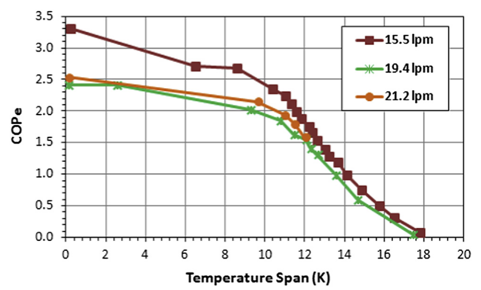

# The performance of a large-scale rotary magnetic refrigerator

> [!Cite] [jacobsS2014-PerformanceLargescaleRotary](zotero://select/library/items/NP5RIKFK)
> [1]  S. Jacobs _et al._, ‘The performance of a large-scale rotary magnetic refrigerator’, _International Journal of Refrigeration_, vol. 37, pp. 84–91, Jan. 2014, doi: [10.1016/j.ijrefrig.2013.09.025](https://doi.org/10.1016/j.ijrefrig.2013.09.025). Available: [https://linkinghub.elsevier.com/retrieve/pii/S0140700713002594](https://linkinghub.elsevier.com/retrieve/pii/S0140700713002594). [Accessed: Mar. 19, 2025]
> > [!example]- Metadata    
> > **Title**:: The performance of a large-scale rotary magnetic refrigerator
> > **Year**:: 2014
> > **Citekey**:: jacobsS2014-PerformanceLargescaleRotary
> > **Sources**:: [Zotero](zotero://select/library/items/NP5RIKFK) [pdf](file:////home/joeashton/Zotero/storage/ZPWGAEEN/Jacobs%20et%20al.%20-%202014%20-%20The%20performance%20of%20a%20large-scale%20rotary%20magnetic%20refrigerator.pdf) 
> > **Tags:** #👁, #🖋
> > **FirstAuthor**:: Jacobs, S.
> > **Author**:: Auringer, J.
> > **Author**:: Boeder, A.
> > **Author**:: Chell, J.
> > **Author**:: Komorowski, L.
> > **Author**:: Leonard, J.
> > **Author**:: Russek, S.
> > **Author**:: Zimm, C.
> > 
> > **itemType**:: journalArticle
> > **Journal**:: *International Journal of Refrigeration*
> > **Volume**:: 37
> > **Pages**:: 84-91
> > **DOI**:: 10.1016/j.ijrefrig.2013.09.025

> [!abstract]- Abstract
> Astronautics has constructed a large-scale rotary magnetic refrigerator which was designed to provide 2 kW of cooling power over a temperature span of 12 K with Electrical Coefficient Of Performance (COPe) > 2. The system uses a NdFeB magnet assembly with peak field of 1.44 T which rotates over twelve beds arranged circumferentially. Each bed was packed with six layers of LaFeSiH of different Curie temperatures, chosen to optimize system performance over the desired span. We report here on the performance of this system at flow rates ranging from 12.5 to 21.2 L min 1. At the largest flow rate, the system produced 3042 W of cooling power at zero span and peak performance of 2502 W over a span of 11 K. To our knowledge, this represents the largest cooling power yet observed for a magnetic refrigeration system. We show that the measured performance is in good agreement with theoretical prediction.

# Notes

%% begin notes %%%% end notes %%

# Annotations

%% begin annotations %%

> [!YellowHighlight] [see in Zotero](zotero://open-pdf/library/items/ZPWGAEEN?page=89&annotation=7X83Q2A7)
> For temperature spans below about 10 K, the COPe of the system remained above 2. At its point of peak performance (as measured by the specific exergetic cooling power), the system operated with COPe 1⁄4 1.9. At its design operating point (2 kW over a 12 K span), the COPe was 1.6,

> [!Quote] [see in Zotero](zotero://open-pdf/library/items/ZPWGAEEN?page=89&annotation=8FL9QCLL)
> 
> > [!note]
> > Fig. 9 e The electrical COP of the Astronautics system at flow rates 15.5, 19.4, and 21.2 L minL1.%% end annotations %%

%% Import Date: 2025-04-03T02:12:43.632+01:00 %%
