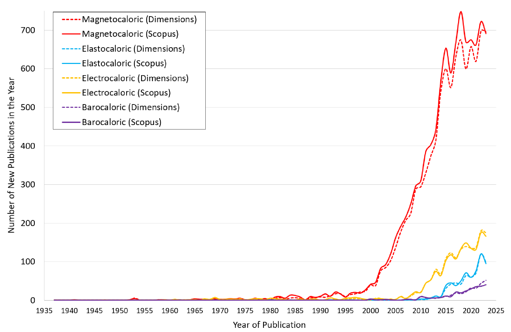
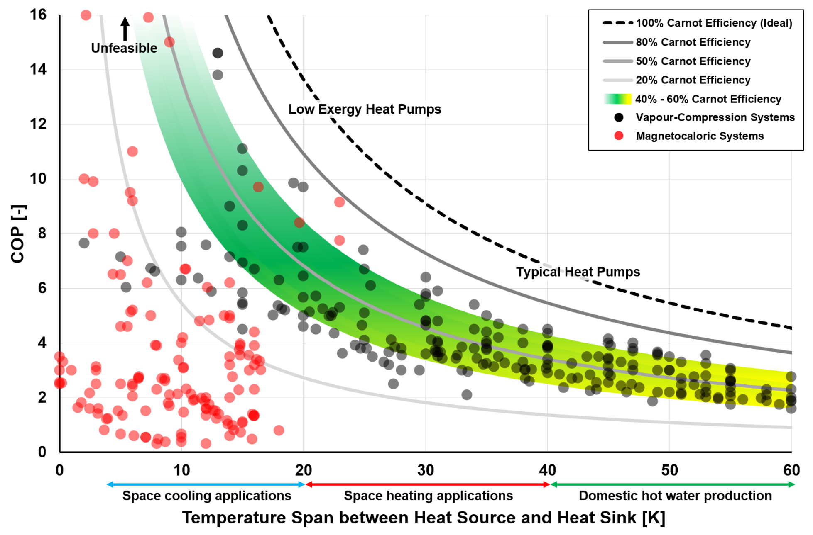
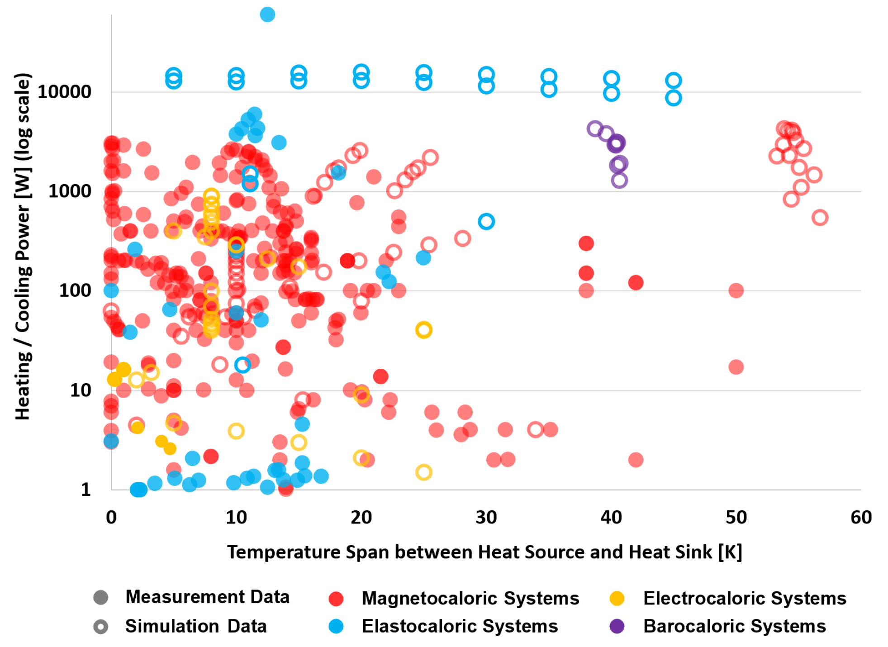
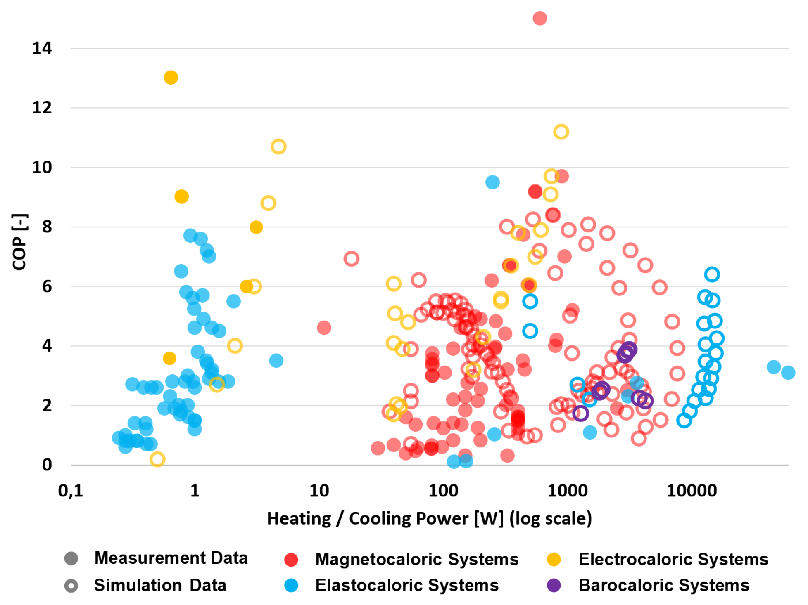

# Performance overview of caloric heat pumps: magnetocaloric, elastocaloric, electrocaloric and barocaloric systems: Update 2024

> [!Cite] [johraH2024-PerformanceOverviewCaloricHeatPumps](zotero://select/library/items/MRI4P4TH)
> [1]  H. Johra, ‘Performance overview of caloric heat pumps: magnetocaloric, elastocaloric, electrocaloric and barocaloric systems: Update 2024’, Aalborg University, Technical Report 323, Oct. 2024. doi: [10.54337/aau747557298](https://doi.org/10.54337/aau747557298). Available: [http://dx.doi.org/10.54337/aau747557298](http://dx.doi.org/10.54337/aau747557298)
> > [!example]- Metadata    
> > **Title**:: Performance overview of caloric heat pumps: magnetocaloric, elastocaloric, electrocaloric and barocaloric systems: Update 2024
> > **Year**:: 2024
> > **Citekey**:: johraH2024-PerformanceOverviewCaloricHeatPumps
> > **Sources**:: [Zotero](zotero://select/library/items/MRI4P4TH) [pdf](file:////home/joeashton/Zotero/storage/ZNK7XEH4/Johra%20-%202024%20-%20Performance%20overview%20of%20caloric%20heat%20pumps%20magnetocaloric,%20elastocaloric,%20electrocaloric%20and%20baroca.pdf) 
> > **Tags:** #👁, #🖋
> > **FirstAuthor**:: Johra, Hicham
> > 
> > **itemType**:: report

> [!abstract]- Abstract
> The aim of this technical report is to give an overview of the performance of different heating and cooling caloric systems: magnetocaloric, elastocaloric, electrocaloric and barocaloric heat pumps. The performance of these innovative caloric heat pump systems is compared with that of conventional vapour-compression heat pumps. This overview is built upon experimental and numerical data collected from 160 scientific publications and technical reports. The present technical report is an update of previous supplementary materials for the article “Innovative heating and cooling systems based on caloric effects: A review” presented at the CLIMA 2022 conference (REHVA 14th HVAC World Congress. 22-25 May 2022, Rotterdam, The Netherlands). New entries from scientific publications have been added, and a few typos and interpretation mistakes have been corrected compared to the previous version of the supplementary materials.

# Notes

%% begin notes %%%% end notes %%

# Annotations

%% begin annotations %%

> [!Quote] [see in Zotero](zotero://open-pdf/library/items/ZNK7XEH4?page=10&annotation=83XBIH3W)
> 
> > [!note]
> > Number of new scientific publications per year as a function of the year of publication for the keywords “Magnetocaloric”, “Elastocaloric”, “Electrocaloric” and “Barocaloric” in the Scopus and Dimensions databases.

> [!MagentaHighlight] [see in Zotero](zotero://open-pdf/library/items/ZNK7XEH4?page=13&annotation=SNULNPHZ)
> In this report, the performance of the caloric heating/cooling systems is assessed according to 3 main  characteristics:  
> - The effective heating or cooling power output [W].  
> - The coefficient of performance (COP), which should include all the system’s inefficiencies (e.g., pump  energy demand, motor energy demand, valve energy demand, etc).  
> - The temperature span between the heat source and the heat sink (the difference between the inlet  temperature of the fluid from the heat source to the device and the outlet temperature of the fluid  from the device to the heat sink).

> [!YellowHighlight] [see in Zotero](zotero://open-pdf/library/items/ZNK7XEH4?page=14&annotation=VPFU2WCJ)
> conventional  vapour-compression heat pumps typically have a Carnot efficiency between 40% and 60% for temperature  spans compatible with building applications.

> [!YellowHighlight] [see in Zotero](zotero://open-pdf/library/items/ZNK7XEH4?page=14&annotation=5LN3IXHD)
> some recent magnetocaloric and elastocaloric prototypes have  much better performance with COPs comparable to or higher than conventional vapour-compression heat  pumps.

> [!Quote] [see in Zotero](zotero://open-pdf/library/items/ZNK7XEH4?page=16&annotation=UDYYC5QL)
> 
> > [!note]
> > Performance overview of different magnetocaloric heat pump prototypes: COP as a function of temperature span for magnetocaloric and conventional vapour-compression heat pumps (measurement data only) [4].> [!YellowHighlight] [see in Zotero](zotero://open-pdf/library/items/ZNK7XEH4?page=14&annotation=AHLAMRY5)
> Simulation results suggest that caloric systems could also be employed for higher temperature lift  (necessary for domestic hot water production and high-temperature heating systems) with very good COPs.

> [!YellowHighlight] [see in Zotero](zotero://open-pdf/library/items/ZNK7XEH4?page=18&annotation=86B3C24P)
> simulation studies  indicate a possibility for a significant increase in the heating/cooling power output and temperature span of  all caloric systems.

> [!Quote] [see in Zotero](zotero://open-pdf/library/items/ZNK7XEH4?page=18&annotation=QAD294QH)
> 
> > [!note]
> > Performance overview of different caloric heat pump systems: heating/cooling power output as a function of temperature span for magnetocaloric, elastocaloric, electrocaloric, and barocaloric heat pumps (simulation and measurement data).

> [!Quote] [see in Zotero](zotero://open-pdf/library/items/ZNK7XEH4?page=20&annotation=285LUBNV)
> 
> > [!note]
> > Performance overview of different caloric heat pump systems: COP as a function of heating/cooling power output for magnetocaloric, elastocaloric, electrocaloric, and barocaloric heat pumps (simulation and measurement data).%% end annotations %%

%% Import Date: 2025-04-03T02:12:43.677+01:00 %%
