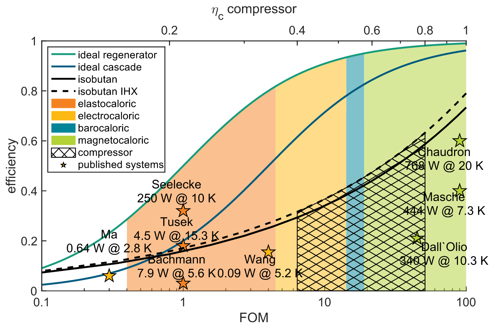
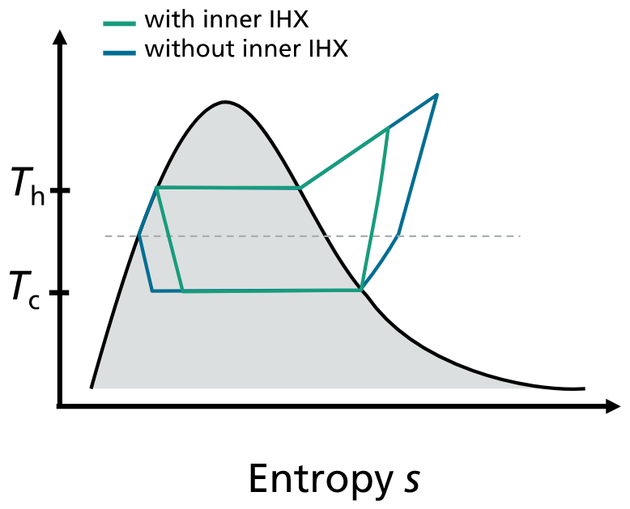

# On the efficiency of caloric materials in direct comparison with exergetic grades of compressors

> [!Cite] [schipperJ2023-EfficiencyCaloricMaterials](zotero://select/library/items/K6FTTAM7)
> [1]  J. Schipper _et al._, ‘On the efficiency of caloric materials in direct comparison with exergetic grades of compressors’, _J. Phys. Energy_, vol. 5, no. 4, p. 045002, Aug. 2023, doi: [10.1088/2515-7655/ace7f4](https://doi.org/10.1088/2515-7655/ace7f4). Available: [https://dx.doi.org/10.1088/2515-7655/ace7f4](https://dx.doi.org/10.1088/2515-7655/ace7f4). [Accessed: Apr. 02, 2025]
> > [!example]- Metadata    
> > **Title**:: On the efficiency of caloric materials in direct comparison with exergetic grades of compressors
> > **Year**:: 2023
> > **Citekey**:: schipperJ2023-EfficiencyCaloricMaterials
> > **Sources**:: [Zotero](zotero://select/library/items/K6FTTAM7) [pdf](file:////home/joeashton/Zotero/storage/AJ7BZKJJ/Schipper%20et%20al.%20-%202023%20-%20On%20the%20efficiency%20of%20caloric%20materials%20in%20direct%20comparison%20with%20exergetic%20grades%20of%20compressors.pdf) 
> > **Tags:** #👁, #🖋
> > **FirstAuthor**:: Schipper, Jan
> > **Author**:: Bach, David
> > **Author**:: Mönch, Stefan
> > **Author**:: Molin, Christian
> > **Author**:: Gebhardt, Sylvia
> > **Author**:: Wöllenstein, Jürgen
> > **Author**:: Schäfer-Welsen, Olaf
> > **Author**:: Vogel, Christian
> > **Author**:: Langebach, Robin
> > **Author**:: Bartholomé, Kilian
> > 
> > **itemType**:: journalArticle
> > **Journal**:: *Journal of Physics: Energy*
> > **Volume**:: 5
> > **Issue**:: 4
> > **Pages**:: 045002
> > **DOI**:: 10.1088/2515-7655/ace7f4

> [!abstract]- Abstract
> Efficiency improvements in heat pump can drastically reduce global energy demand. Caloric heat pumps are currently being investigated as a potentially more efficient alternative to vapor compression systems. Caloric heat pumps are driven by solid-state materials that exhibit a significant change in temperature when a field is applied, such as a magnetic or an electric field as well as mechanical stress. For most caloric materials, the phase transition results in a certain amount of power dissipation, which drastically impacts the efficiency of a caloric cooling system. The impact on the efficiency can be expressed by a figure of merit (FOM), which can directly be deduced from material properties. This FOM has been derived for 36 different magneto-, elasto-, electro and barocaloric material classes based on literature data. It is found that the best materials can theoretically attain second law efficiencies of over 90%. The FOM is analogous to the isentropic efficiency of idealized compressors of vapor compression systems. The isentropic efficiency can thus be directly linked to the theoretically achievable efficiency of a compressor-based refrigeration system for a given refrigerant. In this work a theoretical comparison is made between efficiency of caloric heat pumps and vapor compression systems based on the material losses for the caloric heat pump and the efficiency of the compressor for vapor compression systems. The effect of heat regeneration is considered in both cases. In vapor compression systems, the effect of the working fluid on the efficiency is also studied.

# Notes

%% begin notes %%%% end notes %%

# Annotations

%% begin annotations %%

> [!YellowHighlight] [see in Zotero](zotero://open-pdf/library/items/AJ7BZKJJ?page=5&annotation=8NKBAZ4E)
> The most common magnetocaloric materials are gadolinium and lanthanum-iron-silicon (LaFeSi) based alloys.

> [!RedHighlight] [see in Zotero](zotero://open-pdf/library/items/AJ7BZKJJ?page=5&annotation=WK2538P3)
> The magnetocaloric materials in table 1 typically require fields of more than 10 T for a full phase transition. Current magnetocaloric demonstrators are based on permanent magnets which produce fields of around 1 T.

> [!Quote] [see in Zotero](zotero://open-pdf/library/items/AJ7BZKJJ?page=10&annotation=2B7ZQPLV)
> 
> > [!note]
> > Comparison of the achievable efficiencies of the different caloric technologies with classical compressors. FOM ranges of the best magnetocaloric materials (green), barocaloric materials (blue), electrocaloric (yellow) and elastocaloric materials (orange). The black curve shows the maximum achievable exergetic efficiency of a compressor system using isobutane (Th = 55 ◦C, Tc = 5 ◦C) as a function of the isentropic efficiency. The hatched area indicates the typical range of isentropic efficiency for today’s systems. Some experimental caloric systems of magnetocalorics (green), electrocalorics (yellow) and elastocalorics (orange) are marked as asterisks.

> [!MagentaHighlight] [see in Zotero](zotero://open-pdf/library/items/AJ7BZKJJ?page=10&annotation=I8K98ZE2)
> In this comparison, loss types that are shared between the two technologies are ignored. The remaining efficiency reducers are hysteresis losses described by the FOM for caloric systems and losses during compression described by ηc for vapor compression systems.

> [!OrangeHighlight] [see in Zotero](zotero://open-pdf/library/items/AJ7BZKJJ?page=11&annotation=65S6VHJD)
> Magneto- and barocaloric materials are already at a point where systems are possible, that would even surpass a vapor compression system with a 100% efficient compressor. Nevertheless, up to now no system has been published where the efficiency exceeds 60% of Carnot. Thus, further effort in the development of caloric systems is required to get closer to the potential efficiency limit of caloric materials.> [!YellowHighlight] [see in Zotero](zotero://open-pdf/library/items/AJ7BZKJJ?page=1&annotation=ESXIFS2G)
> Vapor compression systems, which are the most common type of heat pumps, achieve exergetic efficiencies of up to 50% [4, 5], indicating that there is still room for improvement.

> [!YellowHighlight] [see in Zotero](zotero://open-pdf/library/items/AJ7BZKJJ?page=1&annotation=TQTMNK5L)
> In some of these materials this effect is highly reversible, suggesting that it should be possible to build more efficient heat pumps

> [!PurpleHighlight] [see in Zotero](zotero://open-pdf/library/items/AJ7BZKJJ?page=1&annotation=QI9KQBNS)
> Chaudron et al [6]

> [!YellowHighlight] [see in Zotero](zotero://open-pdf/library/items/AJ7BZKJJ?page=2&annotation=GPHMTY76)
> For caloric systems, this maximum efficiency potential is determined by properties of the caloric materials.

> [!YellowHighlight] [see in Zotero](zotero://open-pdf/library/items/AJ7BZKJJ?page=2&annotation=LPCGU5XE)
> For vapor compression systems, the corresponding property is the isentropic efficiency of the compressor.

> [!RedHighlight] [see in Zotero](zotero://open-pdf/library/items/AJ7BZKJJ?page=2&annotation=PR2R8UHM)
> It should be noted that several different figures of merits have been defined for caloric materials over the years that focus on different desirable properties.

> [!MagentaHighlight] [see in Zotero](zotero://open-pdf/library/items/AJ7BZKJJ?page=2&annotation=Z48YJBXM)
> The reversible heat defined by Gottschall et al [7] focuses on the size of the caloric effect.

> [!MagentaHighlight] [see in Zotero](zotero://open-pdf/library/items/AJ7BZKJJ?page=2&annotation=9ASCYZQD)
> we will focus on efficiency losses that are specific to each technology and ignore those that are shared between the technologies.

> [!MagentaHighlight] [see in Zotero](zotero://open-pdf/library/items/AJ7BZKJJ?page=2&annotation=DLND2CM7)
> the efficiency of the field generation device (magnetic resp. electric field, force) is not included in the efficiency evaluation.

> [!YellowHighlight] [see in Zotero](zotero://open-pdf/library/items/AJ7BZKJJ?page=2&annotation=K2BFCYMA)
> For a caloric system, the efficiency mainly gets diminished due to hysteresis of the phase transition.

> [!YellowHighlight] [see in Zotero](zotero://open-pdf/library/items/AJ7BZKJJ?page=2&annotation=E65LV632)
> a small increase in hysteresis from 0.5% to 1% could reduce efficiency in active caloric regeneration systems by as much as 50%.

> [!PurpleHighlight] [see in Zotero](zotero://open-pdf/library/items/AJ7BZKJJ?page=2&annotation=RYFTVVBJ)
> Hess et al [15] provided a theoretical maximum performance of a caloric material in a Carnot-like cycle. Zeggai et al [16] later came to the same conclusion when looking at the efficiency of electrocaloric materials.

> [!PurpleHighlight] [see in Zotero](zotero://open-pdf/library/items/AJ7BZKJJ?page=2&annotation=7RIHKRUA)
> cascaded systems

> [!MagentaHighlight] [see in Zotero](zotero://open-pdf/library/items/AJ7BZKJJ?page=2&annotation=I4QVNWF6)
> The COP is defined as the ratio between heat that is being removed/added ∆Qc, ∆Qh by the system and the required work W that needs to be put into the system during one closed cycle:  COPcooling = ∆Qc  W , COPheating = ∆Qh  W .

> [!YellowHighlight] [see in Zotero](zotero://open-pdf/library/items/AJ7BZKJJ?page=8&annotation=HXBKRGFU)
> The idealized vapor compression cycle (figure 7(a)) can be divided into the following steps: 1 → 2 s /2: Starting from the evaporation curve, vapor gets compressed by the compressor. This causes vapor to reach a temperature above the condenser temperature. In an ideal and adiabatic compressor this step is isentropic and the vapor gets compressed to the point 2 s. Real compressors exhibit losses due to friction, causing the entropy to increase slightly during this step so that point 2 is reached at the end of this step 2 s/2 → 2′: The overheated gas gets cooled down isobarically by the condenser until it reaches the evaporation curve. 2′ → 3: After reaching the wet steam area the fluid gets liquified. This process is isothermal and isobaric. 3 → 4: The liquid working fluid gets expanded by throttling. This process step is in good approximation isenthalpically. 4 → 1: Heat intake to the liquid/vapor and evaporates it. Like 2′-3 this process is isobaric an isothermal as well. The irreversibility of a real compressor can be considered by the isentropic efficiency ηc of the compressor [88]. This is in accordance with international standards for performance measurements for refrigeration compressors, such as DIN EN 12 900 [89] or AHRI 540 [90], respectively. Assuming an adiabatic compressor for the considerations done here, the isentropic efficiency can be defined by:  ηc = h2s − h1  h2 − h1

> [!Quote] [see in Zotero](zotero://open-pdf/library/items/AJ7BZKJJ?page=9&annotation=QT6ZXDT8)
> 
> > [!note]
> > Comparison between the basic vapor compression cycle without an IHX and a modified cycle with a IHX.

> [!YellowHighlight] [see in Zotero](zotero://open-pdf/library/items/AJ7BZKJJ?page=10&annotation=4N8LPU8M)
> IHX can further improve the efficiency, but the effect is much smaller compared the effect regeneration has in a caloric system.

> [!PurpleHighlight] [see in Zotero](zotero://open-pdf/library/items/AJ7BZKJJ?page=10&annotation=W8RHTHLK)
> The highest experimental efficiency of a caloric system is 60% published by Chaudron et al [6].%% end annotations %%

%% Import Date: 2025-04-03T02:12:44.031+01:00 %%
