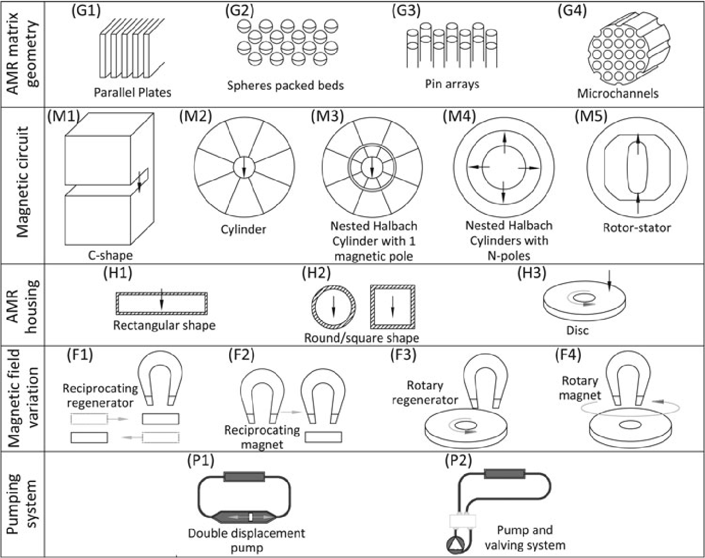

# Magnetic heat pumps: An overview of design principles and challenges

> [!Cite] [trevizoliPV2016-MagneticHeatPumps](zotero://select/library/items/TPG8QRWK)
> [1]  P. V. Trevizoli _et al._, ‘Magnetic heat pumps: An overview of design principles and challenges’, _Science and Technology for the Built Environment_, vol. 22, no. 5, pp. 507–519, Jul. 2016, doi: [10.1080/23744731.2016.1171632](https://doi.org/10.1080/23744731.2016.1171632). Available: [https://doi.org/10.1080/23744731.2016.1171632](https://doi.org/10.1080/23744731.2016.1171632). [Accessed: Mar. 27, 2025]
> > [!example]- Metadata    
> > **Title**:: Magnetic heat pumps: An overview of design principles and challenges
> > **Year**:: 2016
> > **Citekey**:: trevizoliPV2016-MagneticHeatPumps
> > **Sources**:: [Zotero](zotero://select/library/items/TPG8QRWK) [pdf](file:////home/joeashton/Zotero/storage/Y79PRGPH/Trevizoli%20et%20al.%20-%202016%20-%20Magnetic%20heat%20pumps%20An%20overview%20of%20design%20principles%20and%20challenges.pdf) 
> > **Tags:** #👁, #🖋
> > **FirstAuthor**:: Trevizoli, Paulo V.
> > **Author**:: , Christiaanse ,Theodor V.
> > **Author**:: , Govindappa ,Premakumara
> > **Author**:: , Niknia ,Iman
> > **Author**:: , Teyber ,Reed
> > **Author**:: , Barbosa Jr.,Jader R.
> > **Author**:: and Rowe, Andrew
> > 
> > **itemType**:: journalArticle
> > **Journal**:: *Science and Technology for the Built Environment*
> > **Volume**:: 22
> > **Issue**:: 5
> > **Pages**:: 507-519
> > **DOI**:: 10.1080/23744731.2016.1171632

> [!abstract]- Abstract
> Active magnetic regeneration is one of the most promising alternative technologies for the development of heat pumps and cooling systems for applications around room temperature. In the open literature, numerous works can be found in which much effort has been put on the development of magnetocaloric materials, magnetic circuits and prototypes. In this article, the authors discuss some of the main challenges encountered in the literature and how design choices impact cooling power and work requirements from a system engineering perspective. First, based on a generic schematic representation of a magnetocaloric heat pump, or refrigerator, various problems and challenges found in the current state of the art are pointed out and discussed. Second, different design principles for magnetic heat pumps are examined. As a means to improving performance, an extended design/optimization methodology is proposed based on entropy generation minimization with performance criteria. Finally, some initial optimization results are presented and discussed.

# Notes

%% begin notes %%%% end notes %%

# Annotations

%% begin annotations %%

> [!YellowHighlight] [see in Zotero](zotero://open-pdf/library/items/Y79PRGPH?page=508&annotation=M2PCTPYA)
> The main components are: a regenerator assembly composed of MCM processed in a geometry with high surface area per unit volume, such as spherical particles in a packed bed; a magnetic circuit; a motion mechanism to modulate the magnetic field seen by the regenerator; a pumping system to create oscillating flow through the regenerator which transfers heat between the regenerator and the thermal reservoirs; and, the heat exchangers (Rowe 2011).

> [!YellowHighlight] [see in Zotero](zotero://open-pdf/library/items/Y79PRGPH?page=509&annotation=SR38DZDN)
> Magnetic cooling systems using an AMR cycle employ the MCM as a solid state refrigerant and as a regenerator.

> [!YellowHighlight] [see in Zotero](zotero://open-pdf/library/items/Y79PRGPH?page=509&annotation=3UISHKZ6)
> heat transfer fluid (in general a water/glycol solution for near room-temperature)

> [!YellowHighlight] [see in Zotero](zotero://open-pdf/library/items/Y79PRGPH?page=510&annotation=ZLLZDV37)
> Initial magnetic heat pump prototypes developed by Brown (1976) and Zimm et al. (1998) used superconducting coils to generate the magnetic field. In contrast, current state-of-art prototypes use permanent magnet circuits.

> [!YellowHighlight] [see in Zotero](zotero://open-pdf/library/items/Y79PRGPH?page=510&annotation=QJDS4XE9)
> Permanent magnets are advantageous mainly because of the relatively small energy cost to generate magnetic fields of the order of 1 up to 2 T. Other advantageous characteristics of permanent magnets are: (1) little maintenance is required; (2) the confined magnetic flux lines thereby avoiding electromagnetic perturbations in the surroundings; and, (3) they can be recycled.

> [!MagentaHighlight] [see in Zotero](zotero://open-pdf/library/items/Y79PRGPH?page=512&annotation=PL8ABMUK)
> current AMR design concepts

> [!Quote] [see in Zotero](zotero://open-pdf/library/items/Y79PRGPH?page=513&annotation=FG2CZICY)
> 
> > [!note]
> > Design principles of the main components of state-of-the-art magnetic heat pumps. Black arrows indicate magnetic field direction and gray arrows indicate movement.

> [!YellowHighlight] [see in Zotero](zotero://open-pdf/library/items/Y79PRGPH?page=514&annotation=XAMG5HD4)
> A methodology that has recently been used to rationally consider multiple physical phenomena in AMR systems is Entropy Generation Minization (EGM)

> [!PurpleHighlight] [see in Zotero](zotero://open-pdf/library/items/Y79PRGPH?page=514&annotation=DLLAW4IG)
> Entropy Generation Minization (EGM) (Bejan 1995; Li et al. 2008; Numazawa et al. 2012; Trevizoli 2015a; Trevizoli and Barbosa 2015b).%% end annotations %%

%% Import Date: 2025-04-02T05:21:56.189+01:00 %%
