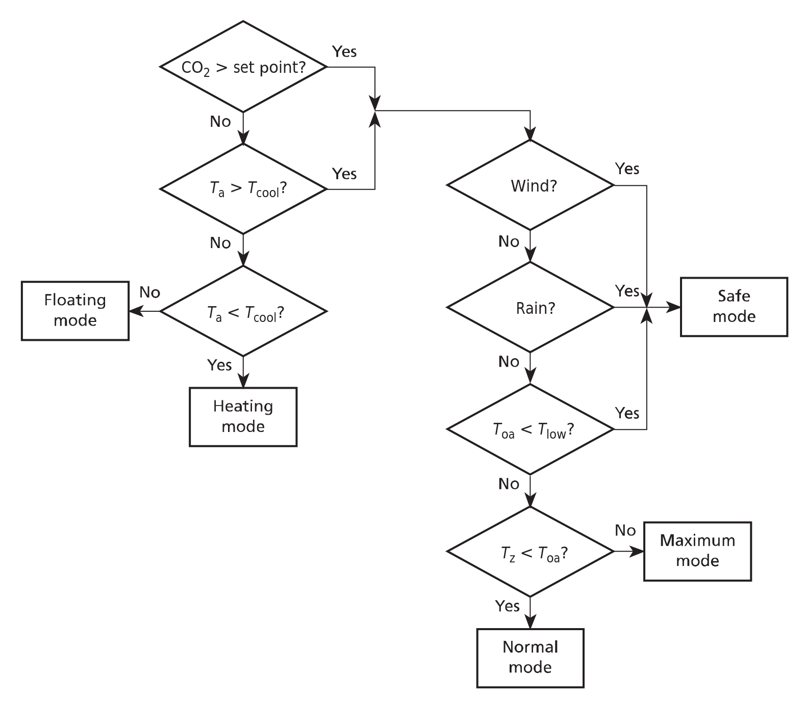
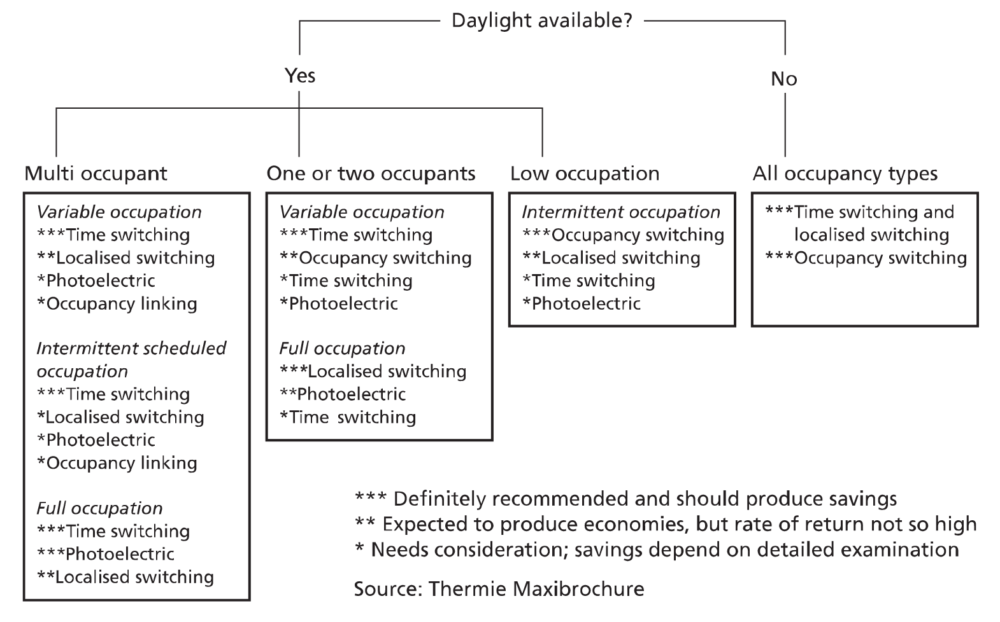
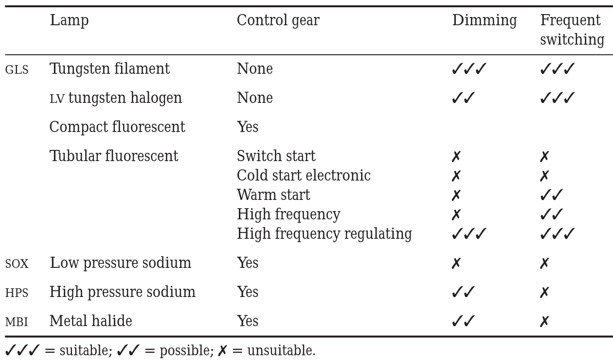
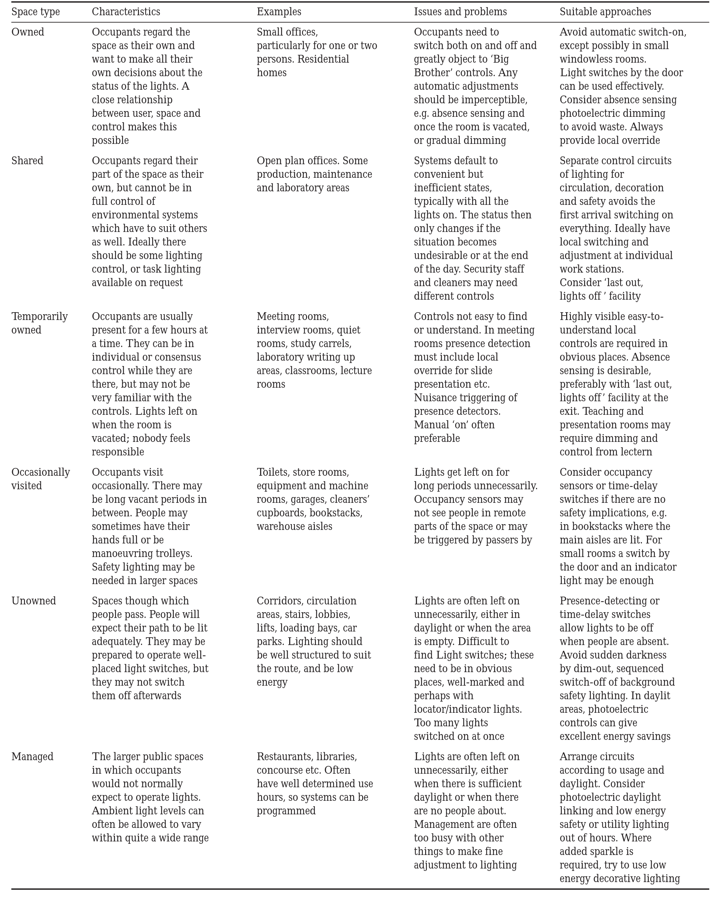

# Building control systems: CIBSE guide H

> [!Cite] [warburtonP2009-BuildingControlSystems](zotero://select/library/items/C3MZP73F)
> [1]  P. Warburton, K. J. Butcher, and Chartered Institution of Building Services Engineers, Eds., _Building control systems: CIBSE guide H_, Second edition. in CIBSE guide, no. H. London: Chartered Institution of Building Services Engineers, 2009.
> > [!example]- Metadata    
> > **Title**:: Building control systems: CIBSE guide H
> > **Year**:: 2009
> > **Citekey**:: warburtonP2009-BuildingControlSystems
> > **Sources**:: [Zotero](zotero://select/library/items/C3MZP73F) [pdf](file:////home/joeashton/Zotero/storage/2N6V2GLS/Warburton%20et%20al.%20-%202009%20-%20Building%20control%20systems.pdf) 
> > **FirstEditor**:: Warburton, Peter
> > **Editor**:: Butcher, K. J.
> > **Editor**:: Chartered Institution of Building Services Engineers
> > 
> > **itemType**:: book
> > **Publisher**:: Chartered Institution of Building Services Engineers
> > **Location**:: London
> > **ISBN**:: 978-1-906846-00-8 978-1-62870-526-3

# Annotations

%% begin annotations %%
## 5 Control strategies for subsystems

### 5.14 Natural ventilation
> [!BlueHighlight] [see in Zotero](zotero://open-pdf/library/items/2N6V2GLS?page=129&annotation=EKZCSSS6)
> # 5.14 Natural ventilation
> > [!note]
> > ## Summary
> > Avoid using AC, utilise passive heat/cooling/ventilation sources. Passive sources can be actively controlled, but not as accurately, however occupants accept this.
>
>> [!YellowHighlight] [see in Zotero](zotero://open-pdf/library/items/2N6V2GLS?page=129&annotation=LHHGQ6PW)
>> 
>> - solar shading and fenestration design to reduce solar gains  
>> - use of daylighting and high efficiency lamps to reduce internal gains from lighting  
>> - high thermal mass construction with exposed internal mass to give a thermal flywheel effect  
>> - design features to enhance natural ventilation flow, such as atria and ventilation stacks  
>> - user involvement, often by openable windows.
> 
>> [!OrangeHighlight] [see in Zotero](zotero://open-pdf/library/items/2N6V2GLS?page=129&annotation=MM3NCW3Z)
>> "CIBSE Applications Manual AM10(40) sets out the principles of successful design; a summary is given in Good Practice Guide GPG 237(41)."
> 
>> [!PurpleHighlight] [see in Zotero](zotero://open-pdf/library/items/2N6V2GLS?page=129&annotation=UFSG682M)
>> "occupants in naturally ventilated buildings are more tolerant of temperature variations than their counterparts in air conditioned buildings, particularly if there is some form of user control in the form of openable windows."
> 
>> [!YellowHighlight] [see in Zotero](zotero://open-pdf/library/items/2N6V2GLS?page=129&annotation=HR32WARP)
>> "Controlled devices for natural ventilation consist primarily of modulating inlet and outlet ventilation openings"
>> > [!note]
>> > In this context "controlled devices" typically refer to actuators that open/close ventilation openings.
> 
>> [!YellowHighlight] [see in Zotero](zotero://open-pdf/library/items/2N6V2GLS?page=129&annotation=UKARSA3P)
>> "Consideration must be given to the performance of the openings in rain and wind."
> 
>> [!YellowHighlight] [see in Zotero](zotero://open-pdf/library/items/2N6V2GLS?page=129&annotation=ILN87WVY)
>> "consideration must be given to any compromise of building security"

> [!BlueHighlight] [see in Zotero](zotero://open-pdf/library/items/2N6V2GLS?page=129&annotation=JB96US8U)
> # 5.14.2 Measurement devices
> > [!note]
> > ## Summary
> > Basically just says read chapter 3.
> > 
> > Sensors may monitor the following
> > 
> > external conditions:
> > - Temperature
> > - Wind
> > - Sun
> > - Rain
> > 
> > and/or internal conditions:
> > - Temperature
> > - CO_2
> > - Occupancy
> 
>> [!YellowHighlight] [see in Zotero](zotero://open-pdf/library/items/2N6V2GLS?page=129&annotation=G38QWX2J)
>> 
>> - External air temperature: this forms an essential input for natural ventilation control systems. The sensor should be mounted on the north face of the building and be provided with a radiation shield against solar and sky radiation.  
>> - Rain intensity sensors: these are fitted so that windows and vents may be shut automatically to prevent rain ingress. For a large building it may be advisable to mount sensors at opposite ends to detect approaching rain.  
>> - Wind speed: windows and vents may be shut or partially closed at high wind speeds to avoid damage or to control over-ventilation. If combined with a rain sensor, wind speed sensors can be used to give protection against driving rain ingress.  
>> - Wind direction: this can be used to select windward or leeward vents as appropriate.  
>> - Solar radiation: a solar radiation sensor may be used to increase ventilation rates at times of high solar gain or to automatically control the operation of solar screens or window blinds.  
>> - Slab temperature: the building fabric plays an essential part in passive temperature control and some natural ventilation control strategies use a measure of fabric temperature rather than internal air temperature. The sensor should be inserted to a depth of approximately 25 to 50 mm into the slab, packed with thermal paste and cemented in. As a less satisfactory alternative, a surface mounted sensor, covered with insulation, may be used. A 5-54 Building control systems  position should be chosen on an internal wall or ceiling remote from temperature disturbances.  
>> - CO2 concentration: this can be used as a set point  for ventilation control in addition to internal air temperature and is of value in buildings with a large but variable occupancy.  
>> - Occupation: the number of people in the controlled space may be used to set the target ventilation rate. This is feasible where the building has controlled entry and exit; in an integrated system it may be possible to obtain information from the security system.

> [!BlueHighlight] [see in Zotero](zotero://open-pdf/library/items/2N6V2GLS?page=130&annotation=6GMP7CRG)
> # 5.14.3 Control strategies
> > [!note]
> > ## Summary
> > - The primary aim of a ventilation system is to regulate CO2 concentration and dissipate heat gains. These are directly associated with occupation.
> > - There is a trade off between energy usage and controllability.
> > - It is typical to have different control strategies for occupation period vs night period.
>
>> [!YellowHighlight] [see in Zotero](zotero://open-pdf/library/items/2N6V2GLS?page=130&annotation=7NTM4A2E)
>> "The level of occupation may be used to estimate the rate of CO2 production and hence the required ventilation."
> 
>> [!YellowHighlight] [see in Zotero](zotero://open-pdf/library/items/2N6V2GLS?page=130&annotation=K5CK3ZKN)
>> "The use of night ventilation to dissipate heat gains acquired during the heat of the day and to precool the building fabric is an important strategy in avoiding the use of mechanical cooling and it is possible to keep the internal temperature below daytime external ambient temperature by this means."
> 
>> [!YellowHighlight] [see in Zotero](zotero://open-pdf/library/items/2N6V2GLS?page=130&annotation=SBE2SK5R)
>> "Where modulating control of natural ventilation openings is provided, it will not be possible to use fast acting control loops to try and achieve more accurate control."
> 
>> [!YellowHighlight] [see in Zotero](zotero://open-pdf/library/items/2N6V2GLS?page=130&annotation=SI9YTA8N)
>> "The target air quality is typically a CO2  concentration below a set point of 1000 ppm."
> 
>> [!YellowHighlight] [see in Zotero](zotero://open-pdf/library/items/2N6V2GLS?page=130&annotation=X8PDFWYU)
>> "Bringing in outside air at a higher temperature than the internal zone temperature will result in a heat gain, and there is an argument that vents should be closed to minimise the ingress of warm outside air. However, this does not allow for the effect of internal heat gains which will tend to increase the inside temperature to a level above that outside. In general it will be more effective to use warm outside air for ventilation than to allow the gains to build up inside without ventilation."

> [!BlueHighlight] [see in Zotero](zotero://open-pdf/library/items/2N6V2GLS?page=130&annotation=HA7K5Z39)
> # 5.14.3.2 Night cooling
> > [!note]
> > ## Summary
> > Utilise thermal mass to provide cooling during the day by pre-cooling it during the night.
>
>> [!YellowHighlight] [see in Zotero](zotero://open-pdf/library/items/2N6V2GLS?page=130&annotation=K5TEWDQN)
>> "The aim of night cooling is to use ventilation during the unoccupied period to dissipate heat gains absorbed by the building during the day."
> 
>> [!YellowHighlight] [see in Zotero](zotero://open-pdf/library/items/2N6V2GLS?page=130&annotation=4HZB3S97)
>> "The recommended control strategy simply uses ventilation to bring the zone temperature down to the lower limit of the comfort band, i.e. as low as possible without bringing the heating system into action."

> [!BlueHighlight] [see in Zotero](zotero://open-pdf/library/items/2N6V2GLS?page=131&annotation=VTHGM28W)
> # 5.14.4 Mixed-mode
> > [!note]
> > ## Summary
> > Mixed mode systems use natural & mechanical ventilation.
>
>> [!Quote] **Decision tree for natural ventilation during occupied period.** [see in Zotero](zotero://open-pdf/library/items/2N6V2GLS?page=131&annotation=PWZKT64Y)
>> 
>> > [!note] Key
>> > **Mode** : **Description**  
>> > Heating : Ventilation openings closed Floating Vents maintain position 
>> > Safe : Vents moved to safe position in wind etc. 
>> > Maximum : Vents fully open 
>> > Normal : Vents modulate to control Tz and CO2
>> > 
>> > **Symbol** : **Meaning** : **Typical value**  
>> > $T_{oa}$ : Outside air temperature  
>> > $T_{z}$ : Zone temperature  
>> > $T_{cool}$ : Cooling set point : 22 °C  
>> > $T_{heat}$ : Heating set point : 19 °C  
>> > $T_{low}$ : Cold outside air : 12 °C  
>> > $CO_{2}$ : Carbon dioxide : 1000 ppm
>
>> [!BlueHighlight] [see in Zotero](zotero://open-pdf/library/items/2N6V2GLS?page=132&annotation=CRNFKY6R)
>> 
>> - Contingency: this describes a building that has been designed primarily for natural ventilation, with the provision for the addition of mechanical services later if found necessary.  
>> - Zoned: some zones of the building are provided with mechanical services where there is a specific requirement. An example might be a building with naturally ventilated office spaces, a mechanically ventilated kitchen area and an air conditioned computer room.  
>> - Complementary: both natural ventilation and mechanical services serve the same zone. The systems may be operated in either changeover or concurrent mode. Concurrent systems often provide a basic level of mechanical ventilation to ensure a permanent draught free ventilation air supply, while allowing occupants to open windows as they choose. Changeover systems operate in distinct modes to satisfy different requirements. For example, windows may be openable in mild weather, but locked shut when mechanical plant is used for either heating or cooling. Changeover systems present practical problems of producing effective control strategies and ensuring that occupants are fully conversant with the different requirements of the various modes of operation.

### 5.15 Control methods

> [!BlueHighlight] [see in Zotero](zotero://open-pdf/library/items/2N6V2GLS?page=132&annotation=MX8A3RRI)
> # 5.15.1 Control methods
> > [!note]
> > ## Summary
> > There are 4 basic control methods:
> > 1. Local manual controls
> > 2. Timeswitches
> > 3. Occupancy detection
> > 4. Lighting level

> [!BlueHighlight] [see in Zotero](zotero://open-pdf/library/items/2N6V2GLS?page=132&annotation=YFJIKGW9)
> # 5.15.1.1 Localised manual controls
> > [!note]
> > ## Summary
> > Light switches, or remotes.
> > Wire lights that will be controlled together, put the controls close by.
>
>> [!YellowHighlight] [see in Zotero](zotero://open-pdf/library/items/2N6V2GLS?page=133&annotation=BH9HPNTD)
>> "Luminaires controlled by a single switch should cover an area with roughly constant daylight factor"
> 
>> [!YellowHighlight] [see in Zotero](zotero://open-pdf/library/items/2N6V2GLS?page=133&annotation=8S49XVFW)
>> "luminaires related to a particular activity or work group to be controlled together."
> 
>> [!YellowHighlight] [see in Zotero](zotero://open-pdf/library/items/2N6V2GLS?page=133&annotation=DJSEHQR3)
>> "The manual switches should be placed as near as possible to the area being controlled."
> 
>> [!YellowHighlight] [see in Zotero](zotero://open-pdf/library/items/2N6V2GLS?page=133&annotation=C2K8XJRP)
>> "the distance from the light switch to the furthest fitting that it controls is no more than 6 m, or twice the height of the fitting above floor level, whichever is greater."
> 
>> [!YellowHighlight] [see in Zotero](zotero://open-pdf/library/items/2N6V2GLS?page=133&annotation=C4A7RIHU)
>> "Where multiple switches are located together, clear labelling is of benefit."

> [!BlueHighlight] [see in Zotero](zotero://open-pdf/library/items/2N6V2GLS?page=133&annotation=ZCTSNYBV)
> # 5.15.1.2 Timeswitches
> > [!note]
> > ## Summary
> > Switch lights off at certain times, provide a means for users to turn them back on.
>
>> [!YellowHighlight] [see in Zotero](zotero://open-pdf/library/items/2N6V2GLS?page=133&annotation=CYP7Y7RJ)
>> "switch lights on shortly before work commences and to switch the full lighting off after working hours."
> 
>> [!YellowHighlight] [see in Zotero](zotero://open-pdf/library/items/2N6V2GLS?page=133&annotation=5AT2DIMH)
>> "lights may need to be left on for security and safety"
> 
>> [!YellowHighlight] [see in Zotero](zotero://open-pdf/library/items/2N6V2GLS?page=133&annotation=NT7TTVJE)
>> "some form of override should be provided for people working late; this should incorporate an extension timer to prevent the lights being left on all night."
> 
>> [!YellowHighlight] [see in Zotero](zotero://open-pdf/library/items/2N6V2GLS?page=133&annotation=MZUKAG82)
>> "Timeswitches are effective for external lighting, but require adjustment with season."
>
>> [!BlueHighlight] [see in Zotero](zotero://open-pdf/library/items/2N6V2GLS?page=133&annotation=P4UZI4IJ)
>> **Reset control**: Switch lighting off at sensible times i.e. lunch & end of day, occupants will switch back on the ones they actually need. #definition 
>
>> [!PurpleHighlight] [see in Zotero](zotero://open-pdf/library/items/2N6V2GLS?page=133&annotation=B96LUK9N)
>> "people are motivated to switch lights on rather than off"

> [!BlueHighlight] [see in Zotero](zotero://open-pdf/library/items/2N6V2GLS?page=133&annotation=4H722LAJ)
> # 5.15.1.3 Occupancy detection
> > [!note]
> > ## Summary
> > Switch lights on when occupants are detected and off when they arn't.
> > Avoid constant switching if not using LEDs.
>
>> [!PurpleHighlight] [see in Zotero](zotero://open-pdf/library/items/2N6V2GLS?page=133&annotation=28BY5D4F)
>> "the interval is chosen to avoid frequent switching, which can shorten lamp life."
> 
>> [!YellowHighlight] [see in Zotero](zotero://open-pdf/library/items/2N6V2GLS?page=133&annotation=UXJGK6G7)
>> "A minimum on period of 10 minutes should be set; general practice is to use on-times of up to 30 minutes."
> 
>> [!BlueHighlight] Absence sensing [see in Zotero](zotero://open-pdf/library/items/2N6V2GLS?page=133&annotation=F8W27QQK)
>> **absence sensing** : The presence sensor switches the light off when no occupancy has been detected for a set time, and a manual switch is used to turn them back on. #definition 
> 
>> [!YellowHighlight] [see in Zotero](zotero://open-pdf/library/items/2N6V2GLS?page=133&annotation=AKIJHQYC)
>> "Presence sensing finds application in infrequently used areas such as store rooms or spaces where people may have their hands full when entering."
> 
>> [!BlueHighlight] PIR [see in Zotero](zotero://open-pdf/library/items/2N6V2GLS?page=133&annotation=UAQ5GIQB)
>> PIR : Passive Infrared, the most common presence sensor. #definition 
> 
>> [!YellowHighlight] [see in Zotero](zotero://open-pdf/library/items/2N6V2GLS?page=133&annotation=SQ374WZI)
>> "The range of operation of a PIR is up to about 10 m. For larger spaces a microwave detector" which can achive 50 m.
> 
>> [!YellowHighlight] [see in Zotero](zotero://open-pdf/library/items/2N6V2GLS?page=133&annotation=AL6A43WU)
>> "Acoustic sensors are available which respond to noise."
> 
>> [!YellowHighlight] [see in Zotero](zotero://open-pdf/library/items/2N6V2GLS?page=133&annotation=IHV7HPLJ)
>> "Presence detectors are normally combined with a photocell, which prevents operation of the lighting when there is sufficient ambient light."

> [!BlueHighlight] [see in Zotero](zotero://open-pdf/library/items/2N6V2GLS?page=133&annotation=PNKVLWKC)
> # 5.15.1.4 Lighting level
> > [!note]
> > ## Summary
> > Prioritise the use of natural lighting, only switch on artificial lighting when this falls below acceptable levels.
>
>> [!PurpleHighlight] [see in Zotero](zotero://open-pdf/library/items/2N6V2GLS?page=133&annotation=I5ECJQKR)
>> "Photocells are used to monitor the light level in the space and regulate the lighting accordingly."
> 
>> [!YellowHighlight] [see in Zotero](zotero://open-pdf/library/items/2N6V2GLS?page=133&annotation=3QRDXDHR)
>> "a switch-on occurs when the daylight illuminance is about twice the required task illuminance and switch-off takes place when the combined artificial and daylight illuminance is three or four times the required task illuminance."
> 
>> [!YellowHighlight] [see in Zotero](zotero://open-pdf/library/items/2N6V2GLS?page=133&annotation=5MFWTREI)
>> "incorporate a time delay into the control system to avoid rapid switching"
> 
>> [!YellowHighlight] [see in Zotero](zotero://open-pdf/library/items/2N6V2GLS?page=133&annotation=TXHU3QB7)
>> "More effective control can be effected by the use of dimmers."
> 
>> [!PurpleHighlight] [see in Zotero](zotero://open-pdf/library/items/2N6V2GLS?page=133&annotation=VI722GMJ)
> "lamps are oversized when new" to provide the required illumination at the end of the cycle.

> [!BlueHighlight] [see in Zotero](zotero://open-pdf/library/items/2N6V2GLS?page=133&annotation=YNIA8C4E)
> # 5.15.1.5 Scene set control
> > [!note]
> > ## Summary
> > The use of different preset lighting schemes... exist?
>
>> [!YellowHighlight] [see in Zotero](zotero://open-pdf/library/items/2N6V2GLS?page=133&annotation=89D9ZFGR)
> "different lighting schemes may be required at different times of day."

> [!BlueHighlight] [see in Zotero](zotero://open-pdf/library/items/2N6V2GLS?page=133&annotation=W777QL47)
> # 5.15.2.1 System selection
> > [!note]
> > ## Summary
> > Considerations when designing a HVAC control strategy:
> > occupancy,
> > daylight,
> > desired level of control,
> > cost versus potential savings,
> > 
> > how all of these are likely to change,
>
>> [!YellowHighlight] [see in Zotero](zotero://open-pdf/library/items/2N6V2GLS?page=133&annotation=UFVWYVKV)
>> - the expected occupancy pattern  
>> - the availability of daylight  
>> - the desired level of control sophistication  
>> - the capital cost of the system versus potential savings  
>> - need to accommodate changes in the building or use patterns.

> [!BlueHighlight] [see in Zotero](zotero://open-pdf/library/items/2N6V2GLS?page=134&annotation=URZVF4C3)
> # 5.15.2.2 Lamps and control gear
> > [!note]
> > ## Summary
> > Probably worth looking at something more modern than this as it predates the widespread adoption of LED lighting.
>
>> [!YellowHighlight] [see in Zotero](zotero://open-pdf/library/items/2N6V2GLS?page=134&annotation=VSVA2DUJ)
>> "Building Regulations Part L(24) requires that offices, industrial and  storage areas shall achieve an average initial efficacy of not less than 45 luminaire-lumens per circuit watt as averaged over the whole area of these types of space in the building."
> 
>> [!Quote] Selection of lighting control strategy [see in Zotero](zotero://open-pdf/library/items/2N6V2GLS?page=134&annotation=A3GS4W5J)
>> 
> 
>> [!Quote] Principal lamp types and their suitability for control applications [see in Zotero](zotero://open-pdf/library/items/2N6V2GLS?page=134&annotation=M5ECFPHL)
>> 
> 
>> [!YellowHighlight] [see in Zotero](zotero://open-pdf/library/items/2N6V2GLS?page=135&annotation=BETPCQ7L)
>> "The life of a fluorescent lamp is adversely affected by frequent switching."
> 
>> [!YellowHighlight] [see in Zotero](zotero://open-pdf/library/items/2N6V2GLS?page=135&annotation=ISLNSNM4)
>> "Neither conventional starter switch circuits nor cold start electronic circuits are suitable for use with presence detection."
> 
>> [!YellowHighlight] [see in Zotero](zotero://open-pdf/library/items/2N6V2GLS?page=135&annotation=SYAHEQIG)
>> "The Lighting Industry Federation(52) recommends that where fluorescent lamps are to be switched frequently, the longer warm-up time should be considered and that a minimum on-time of 20 minutes should be employed"

> [!BlueHighlight] [see in Zotero](zotero://open-pdf/library/items/2N6V2GLS?page=135&annotation=27HT9L8L)
> # 5.15.2.3 Lighting control systems
> > [!note]
> > ## Summary
> > Basically just use the methods discussed in 5.15.1 in concert.

> [!BlueHighlight] [see in Zotero](zotero://open-pdf/library/items/2N6V2GLS?page=135&annotation=P44FVSZJ)
> # 5.15.2.4 Human factors
> > [!note]
> > ## Summary
> > Account for human behavior:
> > good at turning lights on,
> > bad at turning them off,
> > get annoyed at pretty much anything they notice,
> > want control,
>
>> [!YellowHighlight] [see in Zotero](zotero://open-pdf/library/items/2N6V2GLS?page=135&annotation=IFUUBYW5)
>> - People are good at judging whether they need the lights on: do not switch lights on or increase brightness automatically unless this is essential for safety, or appropriate for managed areas.  
>> - People are not good at switching lights off: try to provide automatic switch-off, but . . .  
>> - People do not like being plunged into darkness: where possible lights should be dimmed down, or a warning given. There should be readily accessible local override switches.  
>> - People dislike automatic systems which distract them or do not do what they want: automatic switching or stepped dimming is best done at fixed times rather than at seemingly random intervals. Occupancy detectors should be positioned to avoid nuisance triggering.  
>> - Local controls should be accessible and their operation intuitive: switches should be close to the point of decision and their operation clear.  
>> - Individual requirements differ: given the choice, users select a wide range of illuminance levels. Lower levels are often chosen for work with computer screens; people with less acute eyesight or more exacting work may need additional task lighting.
> 
>> [!Quote] Lighting controls for different categories of occupied space [see in Zotero](zotero://open-pdf/library/items/2N6V2GLS?page=136&annotation=G6CZR8HG)
>> 

%% end annotations %%

# Notes

%% begin notes %%%% end notes %%

%% Import Date: 2025-03-06T01:55:48.683+00:00 %%
