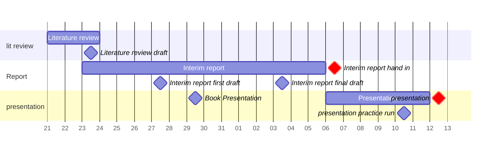
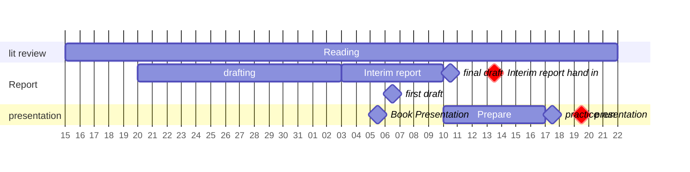

### Title Slide
Good morning,
Today I will be presenting my progress in my individual project
Titled
Nano Mechanical Analysis of Tubular Cell Cytoskeleton.

### Introduction
I hope you've seen the handout's for the presentation, I have added them to the chat here as well if not.

I will start by briefly refresh you with the assessment criteria, 
Then give a 1000 foot view of the project.
With that background out the way I will go through the progress up to this point, give you my reflections on said progress, and outline my future plans.

### Assessment Criteria
My aim here is to demonstrate to you that I can:

1. Do the work:
Investigate unfamiliar problems using appropriate tools to find solutions.

2. Share the work:
document the process, and communicate technical information clearly. 

3. Manage the work:
Plan my project and manage my time.

### Project Overview
What dose it mean to determine a change in cell elasticity, and what dose that have to do with diabetic nephropathy?

Diabetic nephropathy is a form of chronic kidney disease induced by diabetes. 
It's progressive with about 30% of people with diabetes reaching end stage renal desease, a point at which they require Dialysis or kidney replacement to stay alive. These are expensive and not always available, this is a problem set to get worse as diabetes is on the rise. 

There is a great deal or research into treatments to slow or even reverse the progression of kidney disease. A quantifiable measure of the progression of nephropathy is a critical tool for the development of such treatments. Methods effective on the cellular level are particularly helpful as they allow for high throughput screening with rapid iteration and lower costs. 

The elasticity of tubule cells as measured by atomic force indention may valuable biomarker.

### Project Timeline
Planning & time management looks different for everyone, despite appearances it's something I genuinely think about allot and spend allot of time doing. 

Through-out the project I have made use of gantt charts to help me visualise the time tasks are likely to take up.
I use these both for the project overall, and for shorter sprints, for example this was one I made in mid January to plan my work for the interim assessments. 

I leave room in plans for delays, and I'm usually aware as I make them of which bit's are optimistic and where I need to plan to be done 2 weeks ahead to have any hope of finishing on time. 

You can see below how the same chart ended up looking by February:

### Current Progress

#### Research
My research has progressed well, I began in October by building my understanding of the context of disease and the relevant physiology. 
Since then I've learnt more about atomic force microscopes and the various theory's that explain the mechanistic progression of the disease at the cellular level. 

#### Literature Review
The literature review wen't smoothly as having done so much research for the background I have honed my academic reading and note taking skills and methods.

At first I was trying to to shoehorn much of this into Obsidian a markdown editor which I use for my day to day note taking, planning, and drafting. Despite building a few scripts and tools to automate things it was cumbersome and began to get messy. 
While I am a fan of reinventing the wheel as a means of rounding out ones knowledge, this is a project with aims and deadlines, and building my own bibliography management system was clearly out of scope. 

I've since moved over to Zotero, and have become quite proficient with it. Using the right tool for the job expedited the process dramatically, I've now gone through around 60 papers having thoroughly processed, i.e. made more thorough highlights and notes on, 20.

As you can see in this summary table of some similar studies including Dr Siamantoras's own, we may expect to see a significant increase in cell stiffness associated with the progression of DN.

#### Curve Processing
I've also familiarised myself the JPK data processing software. In early December I produced my first set of young's modulus values based on an AFM indentation curve. 

I won't go into detail on the methodology just now as I have yet to finalise it and discuss it thoroughly with Dr Siamantoras. 

The 2 key functions provided by the software;
1. the first finds probe height based on the deflection of the cantilever and the z displacement of the sample,

2. the second fits the data to a hertzian force displacement model inferring the contact point and the elasticity of the cell. 

#### Contact models
There are varying degrees of complexity when modelling contact mechanics. 
At such small scales non contact interaction potentials can have a significant influence. When that's the case Derjaguin's approximation can be factored in. 
And cells are not ideal springs, and more advanced models like Fung can account for non linear elasticity. 

However by carefully selecting the range considered the Hertz model appears to achieve suitably accurate results. 

### Reflection on progress

I have found that despite adding significant buffers in my planned timelines, I seem to quite impervious to my own internal deadlines. I've been working on assessed work right up until, and at points past, the actual deadlines. This means my assessed work lacks the level of polish I'm capable of and mistakes that would have been easily caught in a proof read slip past. 

I think I could benefit from more regular check ins / progress reviews to provide oversight and accountability.

The current method of booking meetings as and when obstacles come up is not particularly effective. It's creating unnecessary admin work and delay in communication. I propose we find a regular bi-weekly slot, and have a standing arrangement for the same time and day. Of course should they need to be moved or cancelled that's still possible but the default will be to have a meeting rather than not.

### Future Plans

Over the next couple weeks I hope to review the JPK software method for finding young's modulus, and make some progress towards a larger dataset of youngs moduli and associated force indentation curves.

With a lover view of bringing that dataset into Matlab / Python to assess the significance of elasticity as a predictive marker and produce visualisations that effectively communicate my findings. 
Beyond that I may experiment with some more advanced methods to find other points of interest in the indentation data that could serve as biomarkers.

This is with the ultimate goal of proposing a method for measuring tubular cells as diseased vs healthy based on their AFM indention curve. 

### Thank You
Thank you for your attention

### Questions
If you have any questions, especially those that speak to the assessment points, I'll do my best to answer them now.