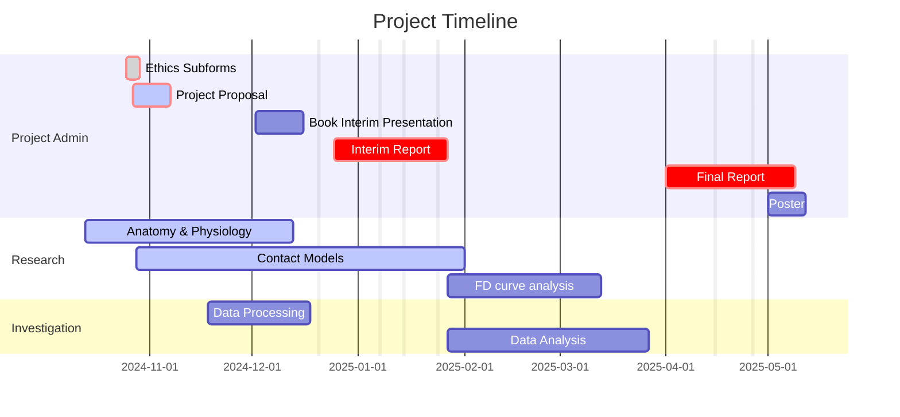

>[!SUMMARY] Table of Contents
>    - [[#Meeting Log]]
>    - [[#Project Brief]]
>    - [[#Understanding the Project brief]]
>    - [[#Gantt chart]]
>    - [[#Current Reading list]]

%% Page Break %% <div style="page-break-after: always;"></div>

## Meeting Log

---

> ![[First Meeting with Siamantouras]]

---

> ![[Reviewing project proposal]]

---

%% Page Break %% <div style="page-break-after: always;"></div>

## Project Brief

> [!QUOTE] Breif
>Diabetic nephropathy is a serious complication of diabetes resulting in end-stage kidney failure, a life-threatening condition that requires dialysis or kidney transplantation. Progression of the disease is associated with complex defects at the cellular and molecular level of the kidney’s filtering unit, the nephron. The condition ultimately leads to dysfunction of the tubular structure of the nephron that is responsible for filtration, with devastating effects for the organ.
> 
> This project focuses on the investigation of mechanical alterations of tubular cells, which are responsible for the structural integrity of the nephron. Nanomechanical analysis at single cell level in healthy and diseased conditions, contains valuable information about the dynamic behaviour of the cellular network, called the cytoskeleton, which maintains the physiological structure of cells. Analysis of the mechanical changes of the cytoskeleton in diabetic nephropathy can lead to novel understanding of the disease and development of single cell diagnostics and therapies related to nanomedicine.
> 
> However, due to the intricate nature of the cell at the molecular level, mechanical data are often complex, requiring fine processing, iterative modelling and sound statistical analysis. The aim of this project is to quantify mechanical properties of biological cells in healthy and diseased states by developing analytical methods to process nanoscale force-displacement measurements and calculate the mechanical properties of cells using mathematical models. The experimental data are available in a raw form and tasks include fine processing of nanoscale data, numerical analysis, development of data sets and statistical comparison between two or more variables. The results of the statistical analysis will be associated with the underlying molecular changes of the cytoskeleton during diabetic nephropathy and the potential for mechanical diagnostic information at the cellular level will be addressed.

%% Page Break %% <div style="page-break-after: always;"></div>

## Understanding the Project brief
%%[[2024-10-13]] @ 19:22%%

> ![[Projects/Uni Projects/Individual project/Notes/Knowledge/Diabetic Nephropathy/Diabetic nephropathy]]

> ![[Contact Mechanics]]

> ![[Knowledge/Engineering/Mechanical/Tribology/atomic force microscopy]]


%% Page Break %% <div style="page-break-after: always;"></div>

## Gantt chart
![[IndProj Proposal Annexes - gantt chart screen shot.png]]


``` js
Mermaid.js
gantt
title Project Timeline

dateFormat YYYY-MM-DD
excludes Christmas: 2024-12-20 to 2025-01-07, Exam week 1: 2025-01-14 to 2025-01-24, Exam week 2: 2025-04-15 to 2025-04-26

section Project Admin
	Ethics Subforms :crit, done, 2024-10-25, 4d
	Project Proposal :crit, active, 2024-10-27, 2024-11-07
	Book Interim Presentation : 2024-12-02, 2w
	Interim Report :crit, 2024-12-25, 2025-01-27
	Final Report :crit, 2025-04-01, 2025-05-09
	Poster : 2025-05-01, 2025-05-12

section Research
	Anatomy & Physiology :active, 2024-10-13, 2M
	Contact Models :active, 2024-10-28, 3M
	FD curve analysis: 2025-01-27, 45d

section Investigation
	Data Processing :2024-11-18 , 1M
	Data Analysis :2025-01-27, 2M

```

%% Page Break %% <div style="page-break-after: always;"></div>

## Current Reading list

> ![[IndProj Reading List]]