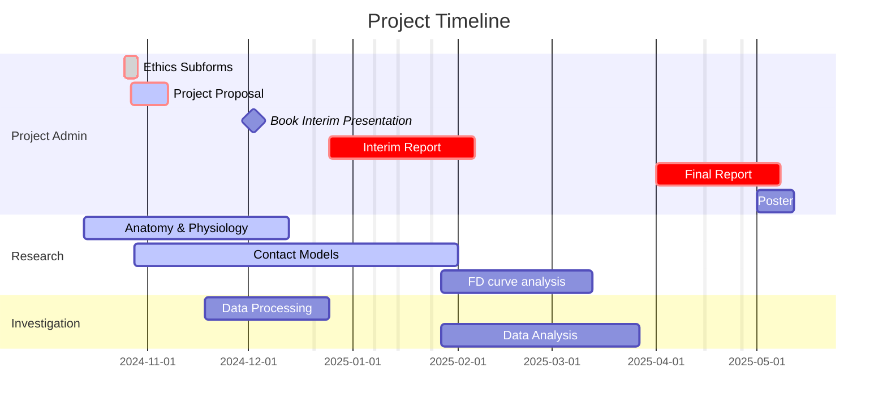

## Executive Summary

This document outlines a 3rd year individual project. In this project atomic force nanoindentation data of kidney tubular cells representing healthy and diabetic states will be processed and analysed. The key objective of this project is to quantify any difference in effective young's modulus between the healthy and diabetic samples.

%% table of contents %%

>[!SUMMARY] Table of Contents
>    - [[#Executive Summary]]
>    - [[#Background]]
>    - [[#Project Summary]]
>    - [[#Objectives]]
>    - [[#Deliverables]]
>    - [[#Project Outline]]
>        - [[#Gantt Chart]]
>        - [[#Research / Project Requirements]]
>        - [[#Data Processing]]
>        - [[#Analysis]]
>    - [[#References]]

%% Page Break %% 

## Background

Diabetic nephropathy is a serious complication of both type 1 and 2 diabetes resulting in kidney failure due to progressive damage to the nephrons, functional units responsible for filtering the blood.[^1] One mechanism that contributes to this damage are mechanical alterations to the F-actin cytoskeleton that provide the structure of the renal tubules[^6], a component of the nephron, these fine vessels line blood vessels and allow desirable molecules and ions to diffuse back into the blood.[^1] The cytoskeleton is a semisolid gel layer within the cell comprised of bundles of actin proteins held together by binding proteins providing mechanical structure and support to the cell.[^2] Late stage diabetic nephropathy is associated with changes in the expression of actin binding proteins which in turn change the mechanical properties of the cytoskeleton of tubules. These changes can include reduced cell adhesion, cell coupling and cell-to-cell communication which have profound effects on overall integrity and function of the tubule.[^3] As Diabetes is also associated with high blood pressure and inflammation these potentially weakened structures are under additional stress promoting kidney failure. 

An improved understanding of the changes of the mechanical properties of tubular cell cytoskeleton can lead to novel understanding of the disease and development of single cell diagnostics and therapies related to nanomedicine.
 
The study of the physical properties of living cells is challenging, most techniques that would provide suitable resolution require manipulations like staining drying or freezing which compromise the validity of the results. Atomic force microscopy provides a non destructive means of observing single cells close to their native state.[^4] Atomic force microscopes use the deflection of a very fine probe on the end of a cantilever to measure contact forces against a sample. In a process called nanoindentation a single cell can be advanced into the probe measuring the deflection of the cantilever against stage height to produce a force vs separation distance curve to gain insights into the physical properties of the cell.[^5]

%% Page Break %% 

## Project Summary

This project aims to quantify the change in tubular cell elasticity in healthy and diabetic states though analysis of nanoscale force-displacement data from AFM-single cell force spectroscopy (SCFS) measurements on individual cells. This project will require fine processing of nanoscale data, numerical analysis, development of data sets and statistical comparison.

## Objectives
%%[[2024-11-06]] @ 01:09%%

- Research
	- Identify the relevant Hertzian contact mechanics model and understand how the model applies to nano indentation force displacement curves
	- Conduct brief literature review on force displacement curves on single cell experiments
- Process raw data into force displacement curves
	- Identify errors and correct/reject curves as appropriate
	- Identify features such as:
		- contact/separation points
		- Linear region
		- features of the curve that correspond with the molecular structure.
- Statistical analysis
	- Calculation of Young's modulus
	- Graphs comparing healthy and diseased cells
	- If viable any parameters that may be effective for diagnosis along with Identifying Optimal indentation depth for tests

## Deliverables
%%[[2024-11-06]] @ 20:19%%

The first stage of this project that broadly lines up with the first semester will be spent on research and processing the data into force displacement curves and will conclude in an interim report and oral presentation.

The second stage of this project that takes place over the second semester will be focused on extracting insights from the force displacement curves with numerical calculations for young's modulus and identification of features that may prove useful for distinguishing healthy from diseased samples. This will be presented in a dissertation like report along with an academic poster. 

%% Page Break %% 

## Project Outline

### Gantt Chart

%%

%%

![[IndProj Proposal Annexes - gantt chart screen shot.png]]

### Research / Project Requirements
%%[[2024-11-05]] @ 23:58%%

%%
- Research
	- Identify and Understand the relevant Hertzian contact mechanics model
	- How the model applies to nano indentation force displacement curves
	- Conduct brief literature review on force displacement curves on single cell experiments
%%

%% Background %%

During the first month of the project some time will be dedicated to the broader background of the project, putting into context the data that will be analysed. This means a rudimentary understanding of atomic force microscopy, the means by which the data was produced, as well as a working understanding of the relevant physiology.

%% Data analysis with software %%

In order to process the data into a form conducive to this investigation I will need to build a working knowledge of the JPK signal processing software package along with developing my data processing skill set in python.

%% contact mechanics %%

A suitable model for the interaction must be developed to interoperate the results. This will involve building a working knowledge of the various mathematical models of the behaviours at play and an appreciation for their respective strengths and weaknesses.

%% data presentation skills %%

%% Page Break %% 

### Data Processing
%%[[2024-11-06]] @ 00:15%%

%%
- Process raw force displacement data,
	- Identify errors and correct/reject curves as appropriate
		- systematic
		- recording
	- Identify contact point
		- Identify contact with cell membrane
	- Identify Linear reigion
	- Identify molecular structure that correspond with features of the curve
	- Apply model
%%

The raw data must be scrutinised for validity & viability, where systematic or recording errors are found the datasets will be corrected or rejected as appropriate.

The raw data is recorded in the from of photodiode voltage versus the scanner position, this must be converted to force displacement curves. This involves accounting for things like; 
- spring constant of the cantilever, 
- relative displacement of the probe,
- point of contact with the cell membrane, 

Once the curves can be effectively plotted their features must be identified and labelled such as;[^6]
- the point of contact with the cell membrane, 
- the region of linear elastic deformation, 
- features that describe the molecular structure, 
- any influential non-idealities.

### Analysis
%%[[2024-11-06]] @ 00:40%%

%%
- Statistical analysis
	- Calculation of Young's modulus
		- Refine parameters
	- Graphs between healthy and diseased cells
	- Which parameters are most effective for diagnosis
	- Identify Optimal indentation depth 
%%

The the linear regions of the curves, produced in the [[#Data Processing]] stage, are investigated using an appropriate contact model, as found in the [[#Research]] stage. This will be to to determine young's modulus, first of the graphs, then the cells, then healthy vs diseased. When dealing with nano scale data this can require accounting for or overcoming complexities like;[^5]
%% - dielectric attraction / repulsion, %%
%% - hydrophilic repulsion & surface tension, %%
- viscosity of the fluids in the cell,
- contamination of the probe tip,
- out of plane relative motion.

Once the curves are understood visualisations will be produced in order to compare the behaviours of healthy and diseased cells. This will be in the hopes of identifying parameters that could be useful in single cell diagnosis. 

%% Page Break %% 

## References

[^1]: A. Madrazo-Ibarra and P. Vaitla, “Histology, Nephron,” 01-Jan-2024. [Online]. Available: https://www.ncbi.nlm.nih.gov/books/NBK554411/. [Accessed: 31-Oct-2024].

[^2]: G. M. Cooper, “Structure and Organization of Actin Filaments,” 01-Jan-2000. [Online]. Available: https://www.ncbi.nlm.nih.gov/books/NBK9908/. [Accessed: 31-Oct-2024].

[^3]: C. E. Hills, E. Siamantouras, S. W. Smith, P. Cockwell, K.-K. Liu, and P. E. Squires, “TGFβ modulates cell-to-cell communication in early epithelial-to-mesenchymal transition,” 01-Mar-2012. [Online]. Available: https://link.springer.com/article/10.1007/s00125-011-2409-9#Sec1. [Accessed: 06-Nov-2024].

[^4]: Y. F. Dufrêne, “Atomic Force Microscopy, a Powerful Tool in Microbiology,” 01-Oct-2002. [Online]. Available: https://journals.asm.org/doi/10.1128/jb.184.19.5205-5213.2002. [Accessed: 06-Nov-2024].

[^5]: H.-J. Butt, M. Jaschke, and W. Ducker, “Measuring surface forces in aqueous electrolyte solution with the atomic force microscope,” 01-Aug-1995. [Online]. Available: https://www.sciencedirect.com/science/article/pii/030245989501800T?via%3Dihub. [Accessed: 06-Nov-2024].

[^6]: Siamantouras E, et al, Quantifying cellular mechanics and adhesion in renal tubular injury using single cell force spectroscopy. Nanomedicine: NBM 2016;12:1013-1021, [http://dx.doi.org/10.1016/j.nano.2015.12.362](http://dx.doi.org/10.1016/j.nano.2015.12.362)