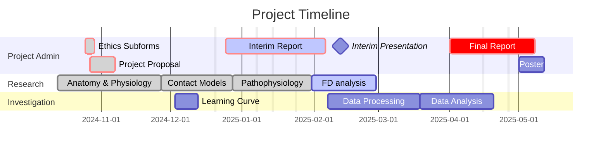

```dataview
CALENDAR file.ctime

FROM "Projects/Uni Projects/Individual project/Notes"
```

```dataview
Table 
	regexreplace(file.folder, ".*\/", "") AS Type,
	file.cday AS Created,
	file.mday AS Modified

FROM "Projects/Uni Projects/Individual project/Notes/Logs" OR "Projects/Uni Projects/Individual project/Notes/Meetings"
SORT file.ctime
```
