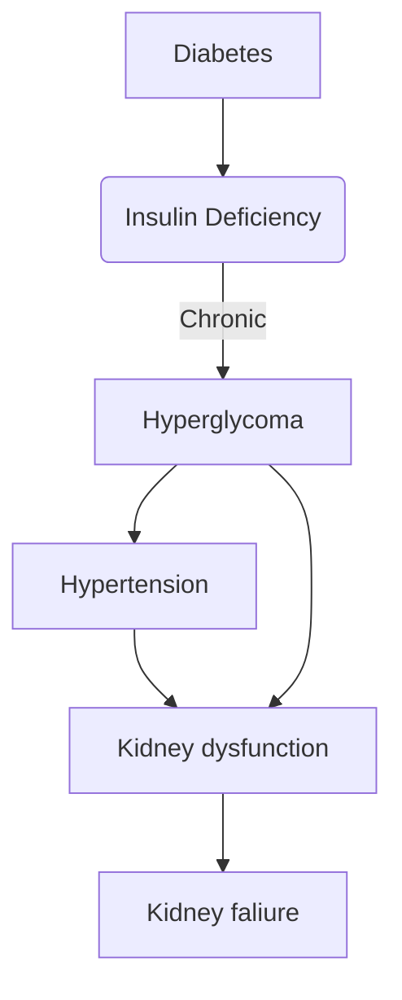

# Diabetic Nephropathy

## Summary 
%%[[2024-10-13]] @ 19:26%%

Nephropathy means [[kidney]] disease.

## Background

### Anatomy

![[kidney]]

![[nephron]]

![[glomerulus]]

## Mechanism

### Mechanism Overview
%%[[2024-10-22]] @ 00:19%%

https://www.youtube.com/watch?v=sGt-Wxde_6Q