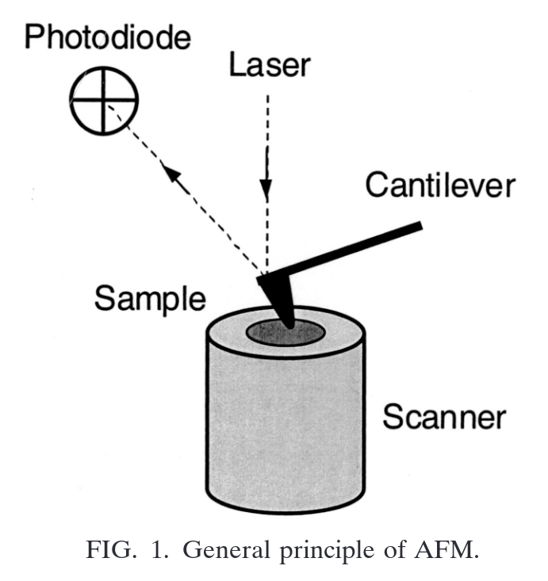
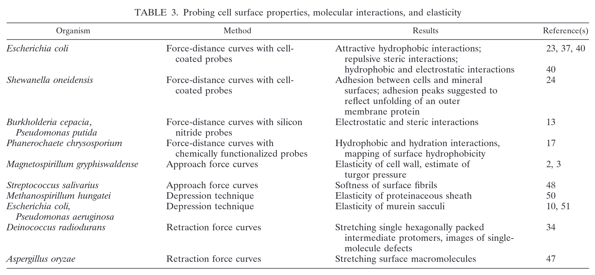

# Atomic Force Microscopy, a Powerful Tool in Microbiology

> [!Cite] [dufreneYF2002-AtomicForceMicroscopy](zotero://select/library/items/SFGMUPWM)
> [1]  Y. F. Dufrêne, ‘Atomic Force Microscopy, a Powerful Tool in Microbiology’, _Journal of Bacteriology_, vol. 184, no. 19, pp. 5205–5213, Oct. 2002, doi: [10.1128/jb.184.19.5205-5213.2002](https://doi.org/10.1128/jb.184.19.5205-5213.2002). Available: [https://journals.asm.org/doi/10.1128/jb.184.19.5205-5213.2002](https://journals.asm.org/doi/10.1128/jb.184.19.5205-5213.2002). [Accessed: Feb. 02, 2025]
> > [!example]- Metadata    
> > **Title**:: Atomic Force Microscopy, a Powerful Tool in Microbiology
> > **Year**:: 2002
> > **Citekey**:: dufreneYF2002-AtomicForceMicroscopy
> > **Sources**:: [Zotero](zotero://select/library/items/SFGMUPWM) [pdf](file:////home/joeashton/Zotero/storage/5RFG8L8I/Dufrêne%20-%202002%20-%20Atomic%20Force%20Microscopy,%20a%20Powerful%20Tool%20in%20Microbiology.pdf) 
> > **FirstAuthor**:: Dufrêne, Yves F.
> > 
> > **itemType**:: journalArticle
> > **Journal**:: *Journal of Bacteriology*
> > **Volume**:: 184
> > **Issue**:: 19
> > **Pages**:: 5205-5213
> > **DOI**:: 10.1128/jb.184.19.5205-5213.2002

# Annotations

%% begin annotations %%

> [!YellowHighlight]
> "AFM is more than a surface-imaging tool in that force measurements can be used to probe the physical properties of the specimen, such as molecular interactions, surface hydrophobicity, surface charges, and mechanical properties. These measurements provide new insight into the structure-function relationships of microbial surfaces."
> 
> [see in Zotero](zotero://open-pdf/library/items/5RFG8L8I?page=5205&annotation=H6UXIZWC)

> [!YellowHighlight]
> "Force-distance curves are recorded by monitoring, at a given x-y location, the cantilever deflection as a function of the vertical displacement of the piezoelectric scanner."
> 
> [see in Zotero](zotero://open-pdf/library/items/5RFG8L8I?page=5205&annotation=PC4M8E2E)

> [!YellowHighlight]
> "A raw curve is a plot of the photodiode voltage versus the scanner position. By using appropriate cor"
> 
> [see in Zotero](zotero://open-pdf/library/items/5RFG8L8I?page=5205&annotation=744CQPWJ)

> [!YellowHighlight]
> "rections, this can be converted into a force-versus-separation distance curve."
> 
> [see in Zotero](zotero://open-pdf/library/items/5RFG8L8I?page=5206&annotation=7IK29KRE)

> [!YellowHighlight]
> "At large probe-sample separation distances, the force experienced by the probe is null. As the probe approaches the surface, the cantilever may bend upwards due to repulsive forces until it jumps into contact when the gradient of attractive forces exceeds the spring constant plus the gradient of repulsive forces. The approach portion of the forcedistance curve can be used to measure surface forces, including van der Waals and electrostatic, solvation, hydration, and steric/bridging forces. When the force is increased in the contact region, the shape of the approach curve may provide direct information on the elasticity of the sample. When the probe is retracted from the surface, the curve often shows a hysteresis referred to as the adhesion “pull-off” force, which can be used to estimate the surface energy of solids or the binding forces between complementary biomolecules."
> 
> [see in Zotero](zotero://open-pdf/library/items/5RFG8L8I?page=5206&annotation=7C2PAWRH)

> [!YellowHighlight]
> "to withstand the force exerted by the scanning probe, the sample must be well attached to an appropriate solid substrate."
> 
> [see in Zotero](zotero://open-pdf/library/items/5RFG8L8I?page=5206&annotation=J3MQ2XXN)

> [!YellowHighlight]
> "When imaging in air, a layer of water condensation and other contamination often covers both probe and sample, forming a meniscus pulling the two together. The resulting strong attractive force, usually 10 to 100 nN, makes high-resolution imaging difficult and sometimes causes sample damage. The capillary force can be eliminated by performing the imaging in aqueous solution."
> 
> [see in Zotero](zotero://open-pdf/library/items/5RFG8L8I?page=5206&annotation=MUU2K33C)

> [!YellowHighlight]
> "because of thermal drift, it is often essential to readjust the applied force between image acquisitions."
> 
> [see in Zotero](zotero://open-pdf/library/items/5RFG8L8I?page=5206&annotation=WBRBYTWY)

> [!YellowHighlight]
> "(sub)nanometer resolution is routinely acquired on reconstituted surface layers by using commercial probes with a 10- to 50-nm radius of curvature. It is thought that nanoscale protrusions or asperities extending irregularly from the probe are responsible for the high resolution."
> 
> [see in Zotero](zotero://open-pdf/library/items/5RFG8L8I?page=5206&annotation=CIEC5YMW)

> [!Quote]
> 
> 
> [see in Zotero](zotero://open-pdf/library/items/5RFG8L8I?page=5206&annotation=3JR8KF4D)

> [!YellowHighlight]
> "The elastic properties of isolated bacterial cell wall components can also be explored by using the so-called depression technique (50, 51). In this technique, a solution containing the cell wall components is placed on a hard substrate and allowed to dry. The substrate contains grooves that are narrow compared to the width or the length of the material to be investigated, so that single wall components bridging one or more grooves can be obtained. The force measurement consists of placing the probe at the midpoint of the unsuspended wall component region and increasing or decreasing the force"
> 
> [see in Zotero](zotero://open-pdf/library/items/5RFG8L8I?page=5210&annotation=HMBLKQJS)

> [!Quote]
> 
> 
> [see in Zotero](zotero://open-pdf/library/items/5RFG8L8I?page=5211&annotation=L4Y9RHDS)%% end annotations %%

# Notes

%% begin notes %%%% end notes %%

%% Import Date: 2025-02-03T14:04:22.714+00:00 %%
