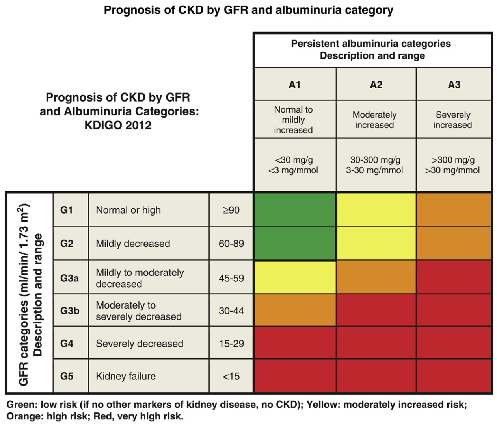

# Diagnosis of diabetic kidney disease: state of the art and future perspective

> [!Cite] [perssonF2018-DiagnosisDiabeticKidneyDisease](zotero://select/library/items/NQW2VIYC)
> [1]  F. Persson and P. Rossing, ‘Diagnosis of diabetic kidney disease: state of the art and future perspective’, _Kidney Int Suppl (2011)_, vol. 8, no. 1, pp. 2–7, Jan. 2018, doi: [10.1016/j.kisu.2017.10.003](https://doi.org/10.1016/j.kisu.2017.10.003). Available: [https://www.ncbi.nlm.nih.gov/pmc/articles/PMC6336222/](https://www.ncbi.nlm.nih.gov/pmc/articles/PMC6336222/). [Accessed: Jan. 29, 2025]
> > [!example]- Metadata    
> > **Title**:: Diagnosis of diabetic kidney disease: state of the art and future perspective
> > **Year**:: 2018
> > **Citekey**:: perssonF2018-DiagnosisDiabeticKidneyDisease
> > **Sources**:: [Zotero](zotero://select/library/items/NQW2VIYC) [pdf](file:////home/joeashton/Zotero/storage/V6XA5P9Q/Persson%20and%20Rossing%20-%202018%20-%20Diagnosis%20of%20diabetic%20kidney%20disease%20state%20of%20the%20art%20and%20future%20perspective.pdf) 
> > **Tags:** #👁
> > **FirstAuthor**:: Persson, Frederik
> > **Author**:: Rossing, Peter
> > 
> > **itemType**:: journalArticle
> > **Journal**:: *Kidney International Supplements*
> > **Volume**:: 8
> > **Issue**:: 1
> > **Pages**:: 2-7
> > **DOI**:: 10.1016/j.kisu.2017.10.003

> [!abstract]- Abstract
> Approximately 20% to 40% of patients with type 1 or type 2 diabetes mellitus develop diabetic kidney disease. This is a clinical syndrome characterized by persistent albuminuria (> 300 mg/24 h, or > 300 mg/g creatinine), a relentless decline in glomerular filtration rate (GFR), raised arterial blood pressure, and enhanced cardiovascular morbidity and mortality. There is a characteristic histopathology. In classical diabetic nephropathy, the first clinical sign is moderately increased urine albumin excretion (microalbuminuria: 30–300 mg/24 h, or 30–300 mg/g creatinine; albuminuria grade A2). Untreated microalbuminuria will gradually worsen, reaching clinical proteinuria or severely increased albuminuria (albuminuria grade A3) over 5 to 15 years. The GFR then begins to decline, and without treatment, end-stage renal failure is likely to result in 5 to 7 years. Although albuminuria is the first sign of diabetic nephropathy, the first symptom is usually peripheral edema, which occurs at a very late stage. Regular, systematic screening for diabetic kidney disease is needed in order to identify patients at risk of or with presymptomatic diabetic kidney disease. Annual monitoring of urinary albumin-to-creatinine ratio, estimated GFR, and blood pressure is recommended. Several new biomarkers or profiles of biomarkers have been investigated to improve prognostic and diagnostic precision, but none have yet been implemented in routine clinical care. In the future such techniques may pave the way for personalized treatment.

# Annotations

%% begin annotations %%

> [!YellowHighlight]
> "If renal biopsies were feasible in all patients without safety considerations, many patients would probably be diagnosed with early stages of diabetic nephropathy. Morphological changes such as mesangial expansion and thickening of the glomerular and tubular basement membranes, as well as typical glomerulosclerosis with nodular mesangial lesions (Kimmelstiel-Wilson lesions), can be attributed to the impact of hyperglycemia and hyperfiltration. These changes may be observed after only a few years of disease, but their presence is variable, and patients with long-standing diabetes may display only minor changes. Because renal biopsy is not without risk of complications, the procedure is rarely used in routine clinical practice in uncomplicated cases, and is often reserved for cases with severe albuminuria, a fast decline in GFR, or where differential diagnoses are required."
> > [!note]
> > Direct study of histopathology is able to catch early cases but biopsy is too risky in early cases. Clear need for non invasive early diagnostic biomarkers.
> 
> [see in Zotero](zotero://open-pdf/library/items/V6XA5P9Q?page=3&annotation=7D6SRBJ9)

> [!Quote]
> 
> 
> [see in Zotero](zotero://open-pdf/library/items/V6XA5P9Q?page=3&annotation=KTP7RE7X)%% end annotations %%

# Notes

%% begin notes %%%% end notes %%

%% Import Date: 2025-01-31T18:31:59.165+00:00 %%
