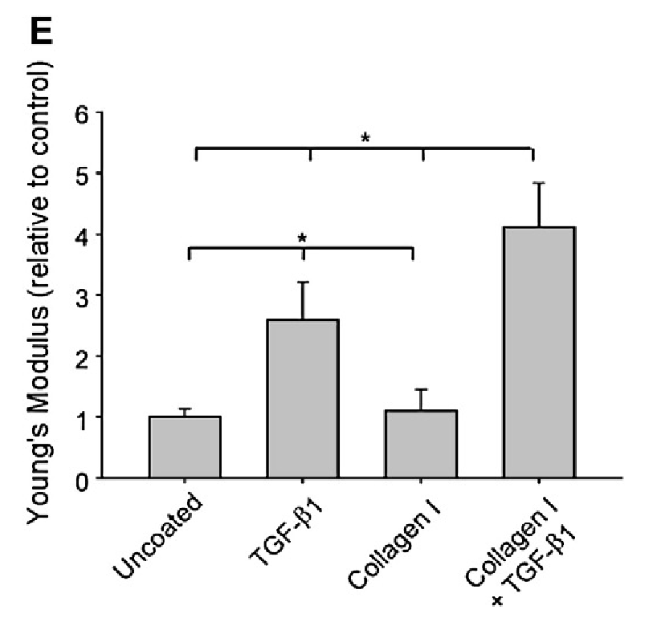

# Cytoskeletal re-arrangement in TGF-β1-induced alveolar epithelial-mesenchymal transition studied by atomic force microscopy and high-content analysis

> [!Cite] [buckleyST2012-CytoskeletalRearrangementTGFv1induced](zotero://select/library/items/LVL9N5FI)
> [1]  S. T. Buckley, C. Medina, A. M. Davies, and C. Ehrhardt, ‘Cytoskeletal re-arrangement in TGF-β1-induced alveolar epithelial-mesenchymal transition studied by atomic force microscopy and high-content analysis’, _Nanomedicine: Nanotechnology, Biology and Medicine_, vol. 8, no. 3, pp. 355–364, Apr. 2012, doi: [10.1016/j.nano.2011.06.021](https://doi.org/10.1016/j.nano.2011.06.021). Available: [https://linkinghub.elsevier.com/retrieve/pii/S1549963411002747](https://linkinghub.elsevier.com/retrieve/pii/S1549963411002747). [Accessed: Jan. 29, 2025]
> > [!example]- Metadata    
> > **Title**:: Cytoskeletal re-arrangement in TGF-β1-induced alveolar epithelial-mesenchymal transition studied by atomic force microscopy and high-content analysis
> > **Year**:: 2012
> > **Citekey**:: buckleyST2012-CytoskeletalRearrangementTGFv1induced
> > **Sources**:: [Zotero](zotero://select/library/items/LVL9N5FI) [pdf](file:////home/joeashton/Zotero/storage/V2XU8E6Z/Buckley%20et%20al.%20-%202012%20-%20Cytoskeletal%20re-arrangement%20in%20TGF-β1-induced%20alveolar%20epithelial-mesenchymal%20transition%20studied%20by.pdf) 
> > **Tags:** #👁, #🖉
> > **FirstAuthor**:: Buckley, Stephen T.
> > **Author**:: Medina, Carlos
> > **Author**:: Davies, Anthony M.
> > **Author**:: Ehrhardt, Carsten
> > 
> > **itemType**:: journalArticle
> > **Journal**:: *Nanomedicine: Nanotechnology, Biology and Medicine*
> > **Volume**:: 8
> > **Issue**:: 3
> > **Pages**:: 355-364
> > **DOI**:: 10.1016/j.nano.2011.06.021

# Annotations

%% begin annotations %%

> [!GrayHighlight] [see in Zotero](zotero://open-pdf/library/items/V2XU8E6Z?page=357&annotation=6PJMJWR7)
> "A549 cells in a temperature-controlled liquid cell at 37°C in contact mode."

> [!GrayHighlight] [see in Zotero](zotero://open-pdf/library/items/V2XU8E6Z?page=357&annotation=TWKTD3M6)
> "SiN cantilevers with a nominal spring constant of 0.06 N/m"

> [!GrayHighlight] [see in Zotero](zotero://open-pdf/library/items/V2XU8E6Z?page=357&annotation=IHVJXDGR)
> "On each cell, a 4 × 4 grid of force-distance curves was collected in at least 5 different positions (avoiding the nucleus and the very edge)."

> [!GrayHighlight] [see in Zotero](zotero://open-pdf/library/items/V2XU8E6Z?page=357&annotation=E8EYC9RQ)
> "The maximum load was kept constant at 0.3 nN for all measurements and the range was maintained at 5 μm retraction after each indentation."

> [!YellowHighlight] [see in Zotero](zotero://open-pdf/library/items/V2XU8E6Z?page=357&annotation=ZESCDFR5)
> "The thickness of cells ranged from 5 μm to 10 μm and indentation did not exceed 10% of these values."

> [!GrayHighlight] [see in Zotero](zotero://open-pdf/library/items/V2XU8E6Z?page=357&annotation=X3WI65DX)
> "producing deflection images in which the stiffer sub-membrane structures appear elevated,"

> [!YellowHighlight] [see in Zotero](zotero://open-pdf/library/items/V2XU8E6Z?page=361&annotation=C2EZ2JIR)
> "Before treatment, cells exhibited a stiffness of 8.3 ± 1.1 kPa when cultured on glass. Similarly, those grown on a matrix of collagen I displayed a Young's modulus of 9.1 ± 2.9 kPa. Following treatment, cell stiffness significantly increased, with a value of 21.5 ± 5.2 kPa for those grown on glass."

> [!MagentaHighlight] [see in Zotero](zotero://open-pdf/library/items/V2XU8E6Z?page=361&annotation=L6ZPUQ7D)
> "Interestingly, increases in cell stiffness were most apparent in cells treated with TGF-β1 and cultured on a collagen I substrate. Our data indicate that collagen I significantly (P b 0.05) augments the pro-stiffening effects of TGF-β1 (Figure 5, E). Together, these results confirm that actin filament organization is a determinant factor in the modulation of cell stiffness and suggest that ECM interactions may also play a contributory role."

> [!Quote] [see in Zotero](zotero://open-pdf/library/items/V2XU8E6Z?page=362&annotation=RG7S33AF)
> 
> > [!note]
> > Bar graph illustrating the average cell stiffness representing N750 single force–distance curves (means ± SD). On glass, TGF-β1 stimulation resulted in an increased stiffness of more than twofold in comparison with untreated cells. Exposure to TGF-β1 of cells cultured on collagen I enhanced stiffness fourfold and significantly augmented the effect of TGF-β1 alone.%% end annotations %%

# Notes

%% begin notes %%

> [!note]
> ## Summary
> 
> This paper uses atomic force microscopy (AFM) indentation to measure changes in A549 alveolar epithelial cell stiffness in response to $\text{TGF} \! - \! \beta 1$ and correlated those findings with AFM imaging and high contrast analysis (HCA). This showed the association between increased cell stiffness as measured by AFM indentation and the spindle-shaped mesenchymal phenotype as observed by imaging.
> 
> ## Glossary
> 
> IPF : Idiopathic pulmonary fibrosis
> 
> ECM : Extracellular matrix
>
> [see in Zotero](zotero://select/library/items/KQSKSY4L)

> [!note]
> ## Summary
> 
> This paper uses atomic force microscopy (AFM) indentation to measure changes in A549 alveolar epithelial cell stiffness in response to $\text{TGF} \! - \! \beta 1$ and correlated those findings with AFM imaging and high contrast analysis (HCA). This showed the association between increased cell stiffness as measured by AFM indentation and the spindle-shaped mesenchymal phenotype as observed by imaging.
> 
> ## Glossary
> 
> IPF : Idiopathic pulmonary fibrosis
> 
> ECM : Extracellular matrix
>
> [see in Zotero](zotero://select/library/items/KQSKSY4L)

> [!note]
> ## Summary
> 
> This paper uses atomic force microscopy (AFM) indentation to measure changes in A549 alveolar epithelial cell stiffness in response to $\text{TGF} \! - \! \beta 1$ and correlated those findings with AFM imaging and high contrast analysis (HCA). This showed the association between increased cell stiffness as measured by AFM indentation and the spindle-shaped mesenchymal phenotype as observed by imaging.
> 
> ## Glossary
> 
> IPF : Idiopathic pulmonary fibrosis
> 
> ECM : Extracellular matrix
>
> [see in Zotero](zotero://select/library/items/KQSKSY4L)

%% end notes %%

%% Import Date: 2025-02-18T06:25:45.833+00:00 %%
