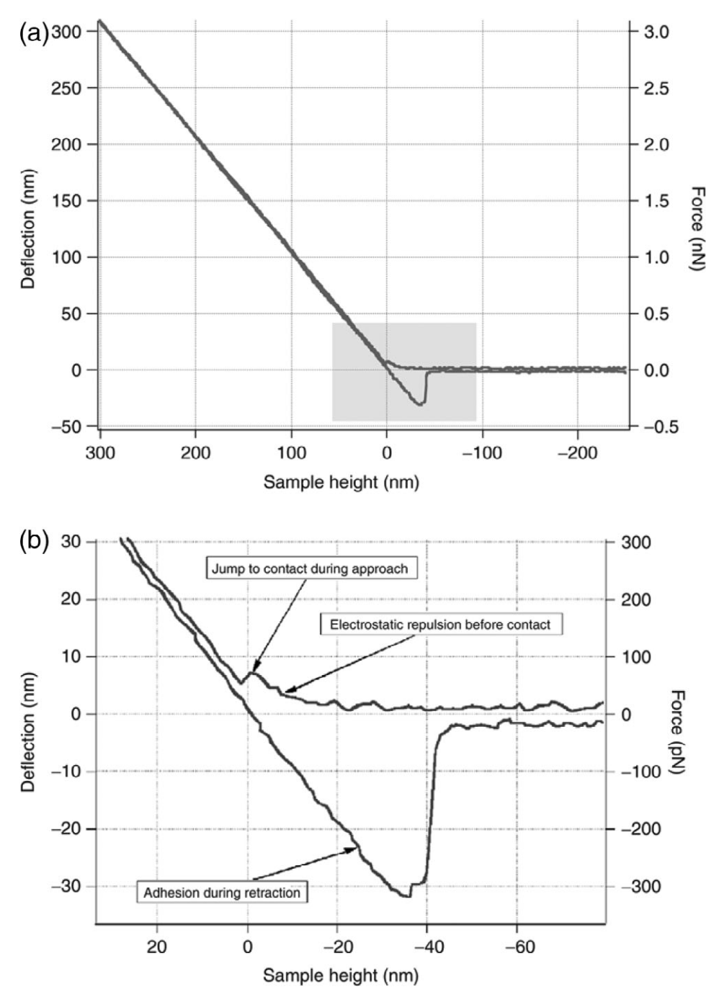

# Atomic force microscopy in disease-related studies: Exploring tissue and cell mechanics

> [!Cite] [liuS2024-AtomicForceMicroscopyDisease-relatedStudies](zotero://select/library/items/8PAHD2XR)
> [1]  S. Liu, Y. Han, L. Kong, G. Wang, and Z. Ye, ‘Atomic force microscopy in disease-related studies: Exploring tissue and cell mechanics’, _Microscopy Research and Technique_, vol. 87, no. 4, pp. 660–684, 2024, doi: [10.1002/jemt.24471](https://doi.org/10.1002/jemt.24471). Available: [https://onlinelibrary.wiley.com/doi/abs/10.1002/jemt.24471](https://onlinelibrary.wiley.com/doi/abs/10.1002/jemt.24471). [Accessed: Jan. 30, 2025]
> > [!example]- Metadata    
> > **Title**:: Atomic force microscopy in disease-related studies: Exploring tissue and cell mechanics
> > **Year**:: 2024
> > **Citekey**:: liuS2024-AtomicForceMicroscopyDisease-relatedStudies
> > **Sources**:: [Zotero](zotero://select/library/items/8PAHD2XR) [pdf](file:////home/joeashton/Zotero/storage/NWE6KYQC/Liu%20et%20al.%20-%202024%20-%20Atomic%20force%20microscopy%20in%20disease-related%20studies%20Exploring%20tissue%20and%20cell%20mechanics.pdf) 
> > **Tags:** #atomic-force-microscopy, #cell, #disease-diagnosis, #mechanical-properties, #tissue
> > **FirstAuthor**:: Liu, Shuaiyuan
> > **Author**:: Han, Yibo
> > **Author**:: Kong, Lingwen
> > **Author**:: Wang, Guixue
> > **Author**:: Ye, Zhiyi
> > 
> > **itemType**:: journalArticle
> > **Journal**:: *Microscopy Research and Technique*
> > **Volume**:: 87
> > **Issue**:: 4
> > **Pages**:: 660-684
> > **DOI**:: 10.1002/jemt.24471

> [!abstract]- Abstract
> Despite significant progress in human medicine, certain diseases remain challenging to promptly diagnose and treat. Hence, the imperative lies in the development of more exhaustive criteria and tools. Tissue and cellular mechanics exhibit distinctive traits in both normal and pathological states, suggesting that “force” represents a promising and distinctive target for disease diagnosis and treatment. Atomic force microscopy (AFM) holds great promise as a prospective clinical medical device due to its capability to concurrently assess surface morphology and mechanical characteristics of biological specimens within a physiological setting. This review presents a comprehensive examination of the operational principles of AFM and diverse mechanical models, focusing on its applications in investigating tissue and cellular mechanics associated with prevalent diseases. The findings from these studies lay a solid groundwork for potential clinical implementations of AFM. Research Highlights By examining the surface morphology and assessing tissue and cellular mechanics of biological specimens in a physiological setting, AFM shows promise as a clinical device to diagnose and treat challenging diseases.

# Annotations

%% begin annotations %%

> [!Quote] [see in Zotero](zotero://open-pdf/library/items/NWE6KYQC?page=667&annotation=MG6DUFDU)
> 
> > [!note]
> > Force curve in atomic force microscopy experiment. (a) Typical approach and retraction curves. (b) The “jump” phenomenon which is due to electrostatic repulsion in the approach curve, and the adhesion phenomenon in the retraction curve. Reprinted from reference (Radmacher, 2007) with permission from Elsevier.%% end annotations %%

# Notes

%% begin notes %%%% end notes %%

%% Import Date: 2025-02-13T10:29:38.281+00:00 %%
