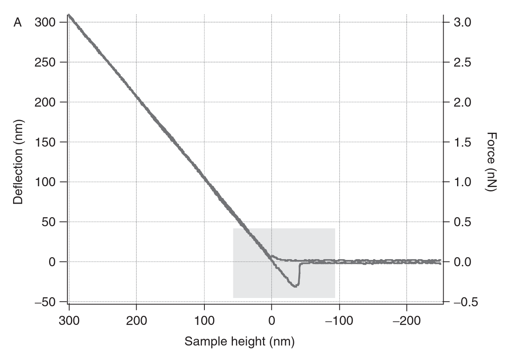
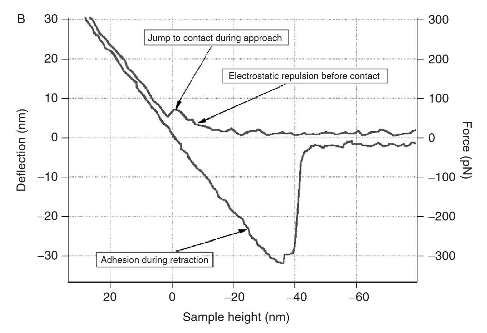

# Studying the Mechanics of Cellular Processes by Atomic Force Microscopy

> [!Cite] [radmacherM2007-StudyingMechanicsCellular](zotero://select/library/items/TEU6XIAU)
> [1]  M. Radmacher, ‘Studying the Mechanics of Cellular Processes by Atomic Force Microscopy’, in _Methods in Cell Biology_, Elsevier, 2007, pp. 347–372. doi: [10.1016/S0091-679X(07)83015-9](https://doi.org/10.1016/S0091-679X\(07\)83015-9). Available: [https://linkinghub.elsevier.com/retrieve/pii/S0091679X07830159](https://linkinghub.elsevier.com/retrieve/pii/S0091679X07830159). [Accessed: Feb. 13, 2025]
> > [!example]- Metadata    
> > **Title**:: Studying the Mechanics of Cellular Processes by Atomic Force Microscopy
> > **Year**:: 2007
> > **Citekey**:: radmacherM2007-StudyingMechanicsCellular
> > **Sources**:: [Zotero](zotero://select/library/items/TEU6XIAU) [pdf](file:////home/joeashton/Zotero/storage/2LPRUTGQ/Radmacher%20-%202007%20-%20Studying%20the%20Mechanics%20of%20Cellular%20Processes%20by%20Atomic%20Force%20Microscopy.pdf) 
> > **FirstAuthor**:: Radmacher, Manfred
> > 
> > **itemType**:: bookSection
> > **Volume**:: 83
> > **Book**:: 
> > **Publisher**:: Elsevier
> > **Pages**:: 347-372
> > **ISBN**:: 978-0-12-370500-6

# Annotations

%% begin annotations %%

> [!Quote] [see in Zotero](zotero://open-pdf/library/items/2LPRUTGQ?page=360&annotation=3EZSY3N7)
> 
> > [!note]
> > Force curve on a glass slide. The cantilever deflection (left y-axis) is plotted versus sample height. The right y-axis gives the corresponding force, using a cantilever force constant of 10 mN/m. Panel.
> > (A) shows the three main parts of the force curve: deflection is constant before the tip makes contact (at negative sample heights), deflection is proportional to sample height (at positive sample heights), and a strong adhesion during retraction.

> [!Quote] [see in Zotero](zotero://open-pdf/library/items/2LPRUTGQ?page=360&annotation=GUNK2YUY)
> 
> > [!note]
> > Force curve on a glass slide. The cantilever deflection (left y-axis) is plotted versus sample height. The right y-axis gives the corresponding force, using a cantilever force constant of 10 mN/m. Panel.
> > (B) shows the tip is deflected away from the sample before contact (due to electrostatic repulsion), but finally jumps into contact, due to strong van der Waals forces. These van der Waals forces cause also the large hysteresis during retract, which can be used to calculate the adhesion force (around 300 pN in this case).%% end annotations %%

# Notes

%% begin notes %%%% end notes %%

%% Import Date: 2025-02-13T10:50:03.615+00:00 %%
