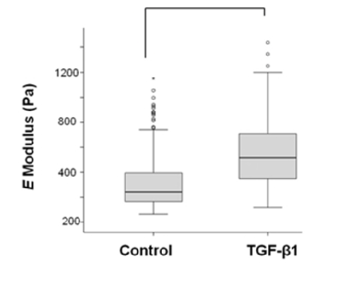

# Quantifying cellular mechanics and adhesion in renal tubular injury using single cell force spectroscopy

> [!Cite] [siamantourasE2016-QuantifyingCellularMechanics](zotero://select/library/items/5JXX6Q9B)
> [1]  E. Siamantouras, C. E. Hills, P. E. Squires, and K.-K. Liu, ‘Quantifying cellular mechanics and adhesion in renal tubular injury using single cell force spectroscopy’, _Nanomedicine: Nanotechnology, Biology and Medicine_, vol. 12, no. 4, pp. 1013–1021, May 2016, doi: [10.1016/j.nano.2015.12.362](https://doi.org/10.1016/j.nano.2015.12.362). Available: [https://www.sciencedirect.com/science/article/pii/S1549963415006073](https://www.sciencedirect.com/science/article/pii/S1549963415006073). [Accessed: Jan. 29, 2025]
> > [!example]- Metadata    
> > **Title**:: Quantifying cellular mechanics and adhesion in renal tubular injury using single cell force spectroscopy
> > **Year**:: 2016
> > **Citekey**:: siamantourasE2016-QuantifyingCellularMechanics
> > **Sources**:: [Zotero](zotero://select/library/items/5JXX6Q9B) [pdf](file:////home/joeashton/Zotero/storage/JAZG36C9/Siamantouras%20et%20al.%20-%202016%20-%20Quantifying%20cellular%20mechanics%20and%20adhesion%20in%20renal%20tubular%20injury%20using%20single%20cell%20force%20spectros.pdf) 
> > **Tags:** #Atomic-force-microscopy, #Cell-elasticity, #Fibrosis, #Nanomechanics, #TGF-β1, #👁, #🖉, #🖋
> > **FirstAuthor**:: Siamantouras, Eleftherios
> > **Author**:: Hills, Claire E.
> > **Author**:: Squires, Paul E.
> > **Author**:: Liu, Kuo-Kang
> > 
> > **itemType**:: journalArticle
> > **Journal**:: *Nanomedicine: Nanotechnology, Biology and Medicine*
> > **Volume**:: 12
> > **Issue**:: 4
> > **Pages**:: 1013-1021
> > **DOI**:: 10.1016/j.nano.2015.12.362

> [!abstract]- Abstract
> Tubulointerstitial fibrosis represents the major underlying pathology of diabetic nephropathy where loss of cell-to-cell adhesion is a critical step. To date, research has predominantly focussed on the loss of cell surface molecular binding events that include altered protein ligation. In the current study, atomic force microscopy single cell force spectroscopy (AFM-SCFS) was used to quantify changes in cellular stiffness and cell adhesion in TGF-β1 treated kidney cells of the human proximal tubule (HK2). AFM indentation of TGF-β1 treated HK2 cells showed a significant increase (42%) in the elastic modulus (stiffness) compared to control. Fluorescence microscopy confirmed that increased cell stiffness is accompanied by reorganization of the cytoskeleton. The corresponding changes in stiffness, due to F-actin rearrangement, affected the work of detachment by changing the separation distance between two adherent cells. Overall, our novel data quantitatively demonstrate a correlation between cellular elasticity, adhesion and early morphologic/phenotypic changes associated with tubular injury.
From the Clinical Editor
Diabetes affects many patients worldwide. One of the long term problems is diabetic nephropathy. Here, the authors utilized atomic force microscopy single cell force spectroscopy (AFM- SCFS) to study cellular stiffness and cell adhesion after TGF1 treatment in human proximal tubule kidney cells. The findings would help further understand the overall disease mechanism in diabetic patients.

# Annotations

%% begin annotations %%

> [!YellowHighlight]
> "Elasticity is defined as the ability of a cell to resist an applied force or stress  and return to its original configuration when the stress is removed. If the cell is assumed as  linear elastic material, the elasticity can be expressed quantitatively by modulus, such as  Young's modulus"
> 
> [see in Zotero](zotero://open-pdf/library/items/JAZG36C9?page=4&annotation=TXJ82QL5)> [!MagentaHighlight] [see in Zotero](zotero://open-pdf/library/items/JAZG36C9?page=8&annotation=8CYNPYRD)
> "The spring constant of the  bead-attached cantilever beam was measured before each set of experiments using the  thermal noise method."

> [!MagentaHighlight] [see in Zotero](zotero://open-pdf/library/items/JAZG36C9?page=8&annotation=3VJQC9V4)
> "Each substrate cell was indented 5 times with an interval pause of  60secs"

> [!MagentaHighlight] [see in Zotero](zotero://open-pdf/library/items/JAZG36C9?page=8&annotation=8R5GVJ2G)
> "indented immediately at the position above the nucleus"

> [!MagentaHighlight] [see in Zotero](zotero://open-pdf/library/items/JAZG36C9?page=8&annotation=U2N2MDNF)
> "Approach  and retraction speed was kept constant at 5μm/sec to minimize hydrodynamic forces acting  on the cantilever."

> [!MagentaHighlight] [see in Zotero](zotero://open-pdf/library/items/JAZG36C9?page=8&annotation=V7H9HHZH)
> "in order to  minimise the effects of the hard substrate in the calculation of E modulus"

> [!MagentaHighlight] [see in Zotero](zotero://open-pdf/library/items/JAZG36C9?page=8&annotation=8NWLJS83)
> ", the depth of indentation was tailored for each cell under  investigation."

> [!MagentaHighlight] [see in Zotero](zotero://open-pdf/library/items/JAZG36C9?page=8&annotation=LFL6UA8M)
> "the  classic Hertz model which was modified by Chen to take account of the influence of the  substrate to the measured elasticity may be applied for modelling the cell indentation tests."

> [!MagentaHighlight] [see in Zotero](zotero://open-pdf/library/items/JAZG36C9?page=8&annotation=WAUTFKB5)
> "the first 10% of the loading  F-d curves (i.e. cell under very small deformation) was used to calculate the cell elasticity, in  order that the substrate effect could be reasonably ignored."

> [!MagentaHighlight] [see in Zotero](zotero://open-pdf/library/items/JAZG36C9?page=12&annotation=DCB3ZZQI)
> "150 curves for  each treatment obtained from 5 separate AFM-SCFS indentation experiments."

> [!YellowHighlight] [see in Zotero](zotero://open-pdf/library/items/JAZG36C9?page=12&annotation=Y89P8MRH)
> "The  data indicate that the TGF-β1 (48hrs; 10ng/ml) increased the elastic modulus by 71% (>30  cells, n=5, p<0.001) (Figure 4, B), clearly showing that cells treated with the cytokine  became considerably more rigid."

> [!MagentaHighlight] [see in Zotero](zotero://open-pdf/library/items/JAZG36C9?page=13&annotation=LE2GUGFE)
> "single cell indentation experiments were performed to depths up to 10% of  cell height."

> [!YellowHighlight] [see in Zotero](zotero://open-pdf/library/items/JAZG36C9?page=13&annotation=HGICGWHP)
> "to depths up to 10% of  cell height. At this moderate degree of indentation changes in elasticity are largely dictated  by the changes in cytoskeletal rearrangement."

> [!MagentaHighlight] [see in Zotero](zotero://open-pdf/library/items/JAZG36C9?page=13&annotation=LI5YEU6B)
> "Morphological changes in the TGF-β1  treated cells were associated with the remodelling of the cytoskeleton from F-actin filaments  to dense stress fibers towards the periphery of the cell."

> [!YellowHighlight] [see in Zotero](zotero://open-pdf/library/items/JAZG36C9?page=13&annotation=NIEIP73T)
> "The average calculated value of E modulus for the control cells was 320Pa while for the  treated cells was 549Pa, indicating a raise of 71% that signifies a dramatic increase in cell  stiffness upon treatment."

> [!OrangeHighlight] [see in Zotero](zotero://open-pdf/library/items/JAZG36C9?page=13&annotation=5MRAIYEH)
> "The greater reduction in the work of detachment  was accompanied by a decrease in distance of separation (46%) and could be partly 14  explained by the increase in cell stiffness as demonstrated by the large increase in E  modulus"

> [!Quote] [see in Zotero](zotero://open-pdf/library/items/JAZG36C9?page=25&annotation=3QF4RU9D)
> 
> > [!note]
> > The effects of the cytokine TGF-β1 (48h;10ng/mL) on the E modulus of HK2  cells. The values inside the box represent the first (lower value) and third quartile, the line  within the box represents the median, the (-) show the minimum and maximum observations  and the (○) symbol the indicates outliers. (A) Fitting of Hertz model in incremental parts of  displacement helped to determine the contact point for each cell separately. The depth of  indentation was customised to 10% of the cell's height. (B) Treated cells showed an  increase of 71% compared to the untreated group. Key significances of more than 30 cells  from 3 separate experiments are shown, ***p<0.001. Cell morphology was affected by  cytoskeletal reorganisation (red), resulting in such a significant increase of E modulus.%% end annotations %%

# Notes

%% begin notes %%

> [!note]
> ## Summary
> 
> This study finds that pro-fibrotic cytokine transforming growth factor beta $\text{TGF} \! - \! \beta 1$ affected cell morphology increasing the [[Young's modulus]] of $\text{HK}2$ cells. This was associated with a weakening of cell adhesion shown by:
> 
> - 53% decrease in the work of detachment,
> 
> - 46% decrease in the distance to complete separation,
> 
> - 19% lower peak unbinding force,
> 
> - 35% fewer TRE events.
> 
> Indicating $\text{TGF} \! - \! \beta 1$ plays a role in the early changes of tubular injury in human proximal tubule cells.  
>   
> ## Tubular Injury
> 
> Tublar injury involves:
> 
> - loss of cell integrity
> 
> - decreased expression of proteins that bind the cells together
> 
> - altered cell morphology
> 
> - reorganisation of cell cytoskeleton
> 
> - de-novo (novel gene expression) of fibroblastic markers
> 
> ## Glossary
> 
> ### SCFS
> 
> AFM-single cell force spectroscopy (SCFS) measures cell adhesion.
> 
> ### fibrosis
> 
> a condition where collagenous scar tissue builds up and stiffens, impairing organ function.
>
> [see in Zotero](zotero://select/library/items/9R3AB4VM)

> [!note]
> ## Summary
> 
> This study finds that pro-fibrotic cytokine transforming growth factor beta $\text{TGF} \! - \! \beta 1$ affected cell morphology increasing the [[Young's modulus]] of $\text{HK}2$ cells. This was associated with a weakening of cell adhesion shown by:
> 
> - 53% decrease in the work of detachment,
> 
> - 46% decrease in the distance to complete separation,
> 
> - 19% lower peak unbinding force,
> 
> - 35% fewer TRE events.
> 
> Indicating $\text{TGF} \! - \! \beta 1$ plays a role in the early changes of tubular injury in human proximal tubule cells.  
>   
> ## Tubular Injury
> 
> Tublar injury involves:
> 
> - loss of cell integrity
> 
> - decreased expression of proteins that bind the cells together
> 
> - altered cell morphology
> 
> - reorganisation of cell cytoskeleton
> 
> - de-novo (novel gene expression) of fibroblastic markers
> 
> ## Glossary
> 
> ### SCFS
> 
> AFM-single cell force spectroscopy (SCFS) measures cell adhesion.
> 
> ### fibrosis
> 
> a condition where collagenous scar tissue builds up and stiffens, impairing organ function.
>
> [see in Zotero](zotero://select/library/items/9R3AB4VM)

> [!note]
> ## Summary
> 
> This study finds that pro-fibrotic cytokine transforming growth factor beta $\text{TGF} \! - \! \beta 1$ affected cell morphology increasing the [[Young's modulus]] of $\text{HK}2$ cells. This was associated with a weakening of cell adhesion shown by:
> 
> - 53% decrease in the work of detachment,
> 
> - 46% decrease in the distance to complete separation,
> 
> - 19% lower peak unbinding force,
> 
> - 35% fewer TRE events.
> 
> Indicating $\text{TGF} \! - \! \beta 1$ plays a role in the early changes of tubular injury in human proximal tubule cells.  
>   
> ## Tubular Injury
> 
> Tublar injury involves:
> 
> - loss of cell integrity
> 
> - decreased expression of proteins that bind the cells together
> 
> - altered cell morphology
> 
> - reorganisation of cell cytoskeleton
> 
> - de-novo (novel gene expression) of fibroblastic markers
> 
> ## Glossary
> 
> ### SCFS
> 
> AFM-single cell force spectroscopy (SCFS) measures cell adhesion.
> 
> ### fibrosis
> 
> a condition where collagenous scar tissue builds up and stiffens, impairing organ function.
>
> [see in Zotero](zotero://select/library/items/9R3AB4VM)

%% end notes %%

%% Import Date: 2025-02-18T06:25:46.213+00:00 %%
