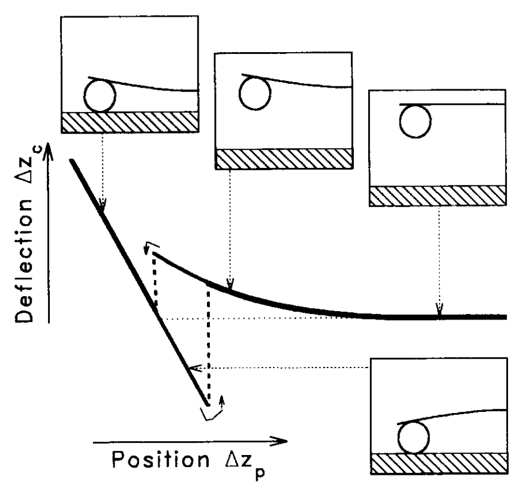

# Measuring surface forces in aqueous electrolyte solution with the atomic force microscope

> [!Cite] [buttHJ1995-MeasuringSurfaceForces](zotero://select/library/items/H7W5CASM)
> [1]  H.-J. Butt, M. Jaschke, and W. Ducker, ‘Measuring surface forces in aqueous electrolyte solution with the atomic force microscope’, _Bioelectrochemistry and Bioenergetics_, vol. 38, no. 1, pp. 191–201, Aug. 1995, doi: [10.1016/0302-4598(95)01800-T](https://doi.org/10.1016/0302-4598\(95\)01800-T). Available: [https://www.sciencedirect.com/science/article/pii/030245989501800T](https://www.sciencedirect.com/science/article/pii/030245989501800T). [Accessed: Feb. 03, 2025]
> > [!example]- Metadata    
> > **Title**:: Measuring surface forces in aqueous electrolyte solution with the atomic force microscope
> > **Year**:: 1995
> > **Citekey**:: buttHJ1995-MeasuringSurfaceForces
> > **Sources**:: [Zotero](zotero://select/library/items/H7W5CASM) [pdf](file:////home/joeashton/Zotero/storage/XTBCZPDG/Butt%20et%20al.%20-%201995%20-%20Measuring%20surface%20forces%20in%20aqueous%20electrolyte%20solution%20with%20the%20atomic%20force%20microscope.pdf) 
> > **Tags:** #Atomic-force-microscope, #Avidin-coating, #DLVO, #Halobacterium, #Purple-membrane, #Surface-forces
> > **FirstAuthor**:: Butt, Hans-Jürgen
> > **Author**:: Jaschke, Manfred
> > **Author**:: Ducker, William
> > 
> > **itemType**:: journalArticle
> > **Journal**:: *Bioelectrochemistry and Bioenergetics*
> > **Volume**:: 38
> > **Issue**:: 1
> > **Pages**:: 191-201
> > **DOI**:: 10.1016/0302-4598(95)01800-T

> [!abstract]- Abstract
> Surface forces determine the behaviour and properties of colloids, including biological molecules, micelles and membranes. Recently it has been realized that the atomic force microscope, which is normally used to image the topography of surfaces with high resolution, can also be used to measure surface forces. The advantages of the atomic force microscope are that virtually any surface of interest can be investigated and that measurements are relatively fast and easy to perform. Furthermore, since the interacting areas are small (typically 102–1002 nm2) samples only need to be smooth and homogeneous on a small scale. Local surface properties, like the surface charge density or micromechemical properties, can be determined.

# Annotations

%% begin annotations %%

> [!YellowHighlight]
> "V(D) is the interaction potential which depends on the distance between the interacting surfaces D."
> > [!note]
> > The [Derjaguin approximation](https://en.wikipedia.org/wiki/Derjaguin_approximation) expresses the force between two bodies as a function of surface separation:
> > $$F(D) = 2 \pi (R_{1}^{-1} + R_{2}^{-1})^{-1} V_{A}(z)$$
> > 
> > and inversley, interation potential:
> > $$ V(D) = $$
> > 
> > #WIP
> > %% I ought to go about trying to derive this %%
> 
> [see in Zotero](zotero://open-pdf/library/items/XTBCZPDG?page=192&annotation=WBCVFEIN)

> [!YellowHighlight]
> "the surface of the AFM probe. For microscopy the most commonly used probes are the sharp microfabricated silicon nitride or silicon tips which provide a high lateral resolution. These probes also provide high resolution when measuring surface forces, but introduce the problem that the surface geometry is difficult to determine in the 10 nm regime [18,19]. In addition, the surface chemistry of silicon nitride tips, which are most frequently used for force measurements, is rather complex [20-22]."
> > [!note]
> > Silicone nitride tips are finer, so well suited to surface imaging as the can provide higher lateral resollution. However they are poorly suited for measuring surface forces as the topology and chemistry make it difficult to calculate the force they exert accurately.
> 
> [see in Zotero](zotero://open-pdf/library/items/XTBCZPDG?page=192&annotation=ESHATNGG)

> [!YellowHighlight]
> "The problems of unknown surface geometry and chemistry can be solved by attaching smooth micrometer-sized spheres to the cantilever (Fig. 1). For a sphere of radius R and a fiat, a simple equation relates the measured force F to the interaction energy per unit area VA:  F(D)  Va(D) = 2qrR"
> > [!note]
> > Smooth spherical probes of a known radius allow for effective approximation of interaction potential, allowing users to callabrate for non contact surface force measurements.
> 
> [see in Zotero](zotero://open-pdf/library/items/XTBCZPDG?page=192&annotation=84IL2J53)

> [!YellowHighlight]
> "To obtain a force distance curve Azc and Azp have to be converted into force and distance. The force F is obtained by multiplying the deflection of the cantilever with its spring constant K, and the tip-sample separation D is calculated by adding the deflection to the position."
> 
> [see in Zotero](zotero://open-pdf/library/items/XTBCZPDG?page=192&annotation=3DM3WFTG)

> [!YellowHighlight]
> "A beam from a laser diode is focused onto the end of the cantilever and the position of the reflected beam is monitored by a position sensitive detector (PSD)."
> 
> [see in Zotero](zotero://open-pdf/library/items/XTBCZPDG?page=192&annotation=6YRNSITV)

> [!YellowHighlight]
> "When a force is applied to the probe, the cantilever bends and the reflected light beam moves through an angle equal to twice the change of the endslope tan a"
> 
> [see in Zotero](zotero://open-pdf/library/items/XTBCZPDG?page=192&annotation=4TEMVYXR)

> [!Quote]
> 
> > [!note]
> > On approach; in close proximity the non contact forces will deflect the cantilever [see Interatomic potential](https://en.wikipedia.org/wiki/Interatomic_potential). Once this has been overcome the probe will jump into contact. The opposite is true on retreat.
> 
> [see in Zotero](zotero://open-pdf/library/items/XTBCZPDG?page=193&annotation=GBVA46MZ)%% end annotations %%

# Notes

%% begin notes %%%% end notes %%

%% Import Date: 2025-02-05T01:07:13.030+00:00 %%
