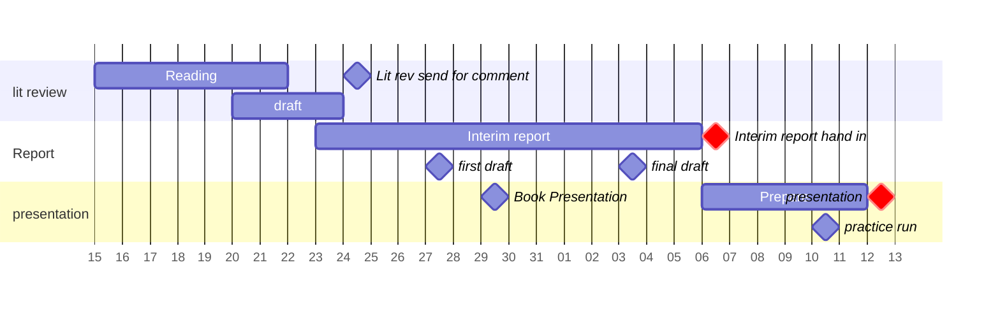

## Plan up to interim presentation
%%[[2025-01-21]] @ 12:49%%

### Key dates

- Report hand in: 2025-02-06
- Presentation: within 15 days of report hand in

### Key milestones

- Literature review draft
- Book Presentation
- Interim report first draft
- Interim report final draft
- interim presentation practice run

### Gantt chart

^IndividualProjectInterimGantt

## ToDos

- [ ] [[Interim Report]] 
	- [ ] Interim Report Plan
	- [x] [[Literature Review]] (*see [[Literature Review Plan]] for more detail*) ✅ 2025-01-24
	- [ ] First Draft

- [ ] [[Interim Presentation]]
	- [ ] Interim Presentation Plan
	- [ ] Handouts
		- [ ] [[Diabetic nephropathy]] handout
	- [ ] Slides
	- [ ] talking points

