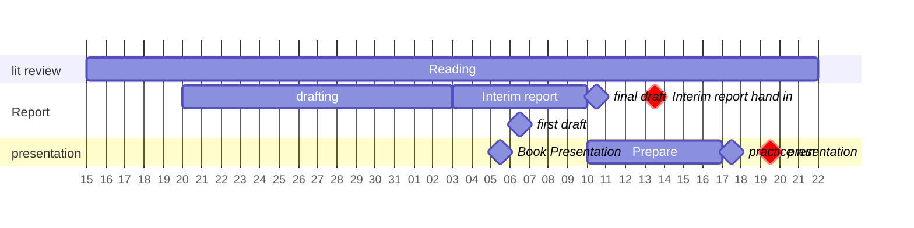

## Plan up to interim presentation
%%[[2025-01-21]] @ 12:49%%

### Key dates

- Report hand in: 2025-02-06
- Presentation: within 15 days of report hand in

### Key milestones

- Literature review draft
- Book Presentation
- Interim report first draft
- Interim report final draft
- interim presentation practice run

### Gantt chart

^IndividualProjectInterimGantt

## ToDos

- [ ] [[Interim Report]] 
	- [x] Interim Report Plan ✅ 2025-02-05
	- [x] [[Interim Report - Main Body]] (*see [[Literature Review Plan]] for more detail*) ✅ 2025-01-24
	- [ ] First Draft

- [ ] [[Interim Presentation]]
	- [x] Interim Presentation Plan ✅ 2025-02-16
	- [ ] Handouts
		- [ ] [[Diabetic nephropathy]] handout
	- [ ] Slides
	- [ ] talking points

## Assessment

> [!quote] Expected progress
> Typically by the interim assessment literature reviews are broadly completed and some initial practical work (e.g. in a lab; data collection etc.) may have commenced.  

The interim comprises a **progress report** which capture the **literature survey** and future directions that the student intends to take the project based on this survey. The report is supported by a 20 minute oral examination where you must bring your **logbook** and a **Self-Evaluation Form** to demonstrate reflective practice. The Interim stage is ‘Double Marked’ (i.e. independently assessed by 1st and 2nd Marker).

The following must be submitted electronically on TurnitIn as a single document:  
- Written Report.  
- The Self Evaluation form (appended below).  
- A Risk Assessment Form (If applicable - this must be completed as soon as it is  

needed, and no later than this deadline and handed to the Supervisor. A copy should be kept in the student’s logbook.)  
- An updated ethics application should be submitted if applicable and not already done.
