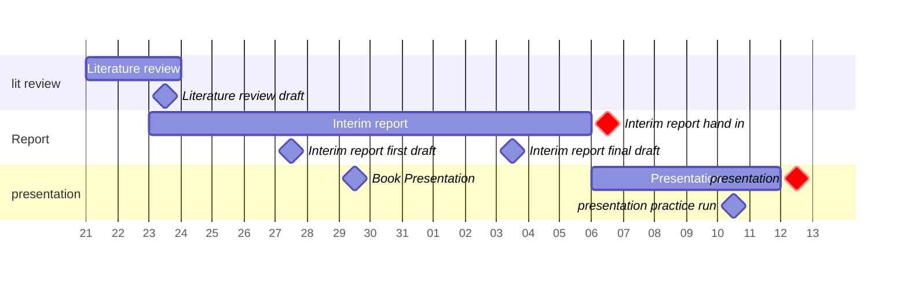

## Plan up to interim presentation
%%[[2025-01-21]] @ 12:49%%

### Key dates

- Report hand in: 2025-02-06
- Presentation: within 15 days of report hand in

### Key milestones

- Literature review draft
- Book Presentation
- Interim report first draft
- Interim report final draft
- interim presentation practice run

### Gantt chart

^IndividualProjectInterimGantt
