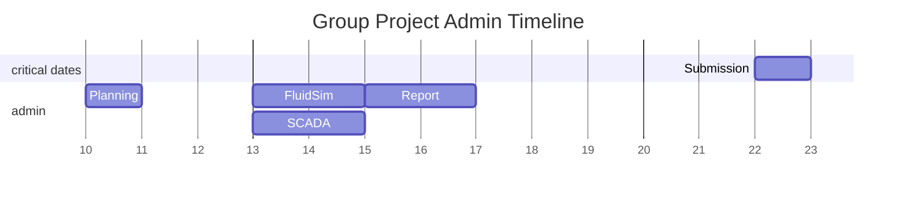
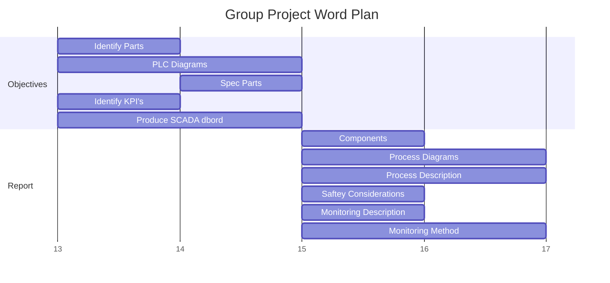

```mermaid
---
displayMode: compact
---
gantt
title Group Project Admin Timeline
dateFormat YYYY-MM-DD
axisFormat %d
tickInterval 1day

section critical dates
	Submission: 2025-05-22, 1d
section admin
	Planning: 2025-05-10, 1d
  FluidSim: 2025-05-13, 2d
  SCADA: 2025-05-13, 2d
  Report: 2025-05-15, 2d
```

```mermaid
gantt
title Group Project Word Plan
dateFormat YYYY-MM-DD
axisFormat %d
tickInterval 1day

section Objectives
	Identify Parts: 2025-05-13, 1d
	PLC Diagrams: 2025-05-13, 2d
	Spec Parts: 2025-05-14,1d
	Identify KPI's: 2025-05-13, 1d
	Produce SCADA dbord: 2025-05-13, 2d
section Report
	Components: 2025-05-15, 1d
	Process Diagrams: 2025-05-15, 2d
	Process Description: 2025-05-15, 2d
	Saftey Considerations: 2025-05-15, 1d
	Monitoring Description: 2025-05-15, 1d
	Monitoring Method: 2025-05-15, 2d
```
