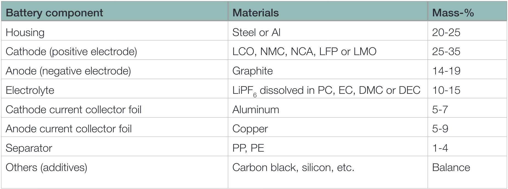
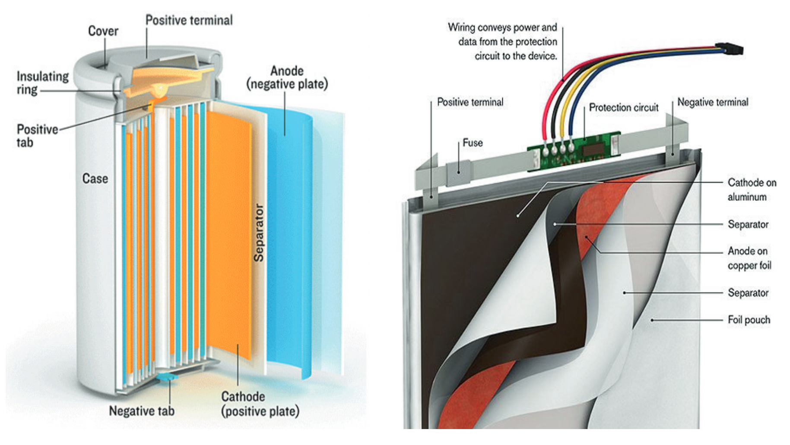
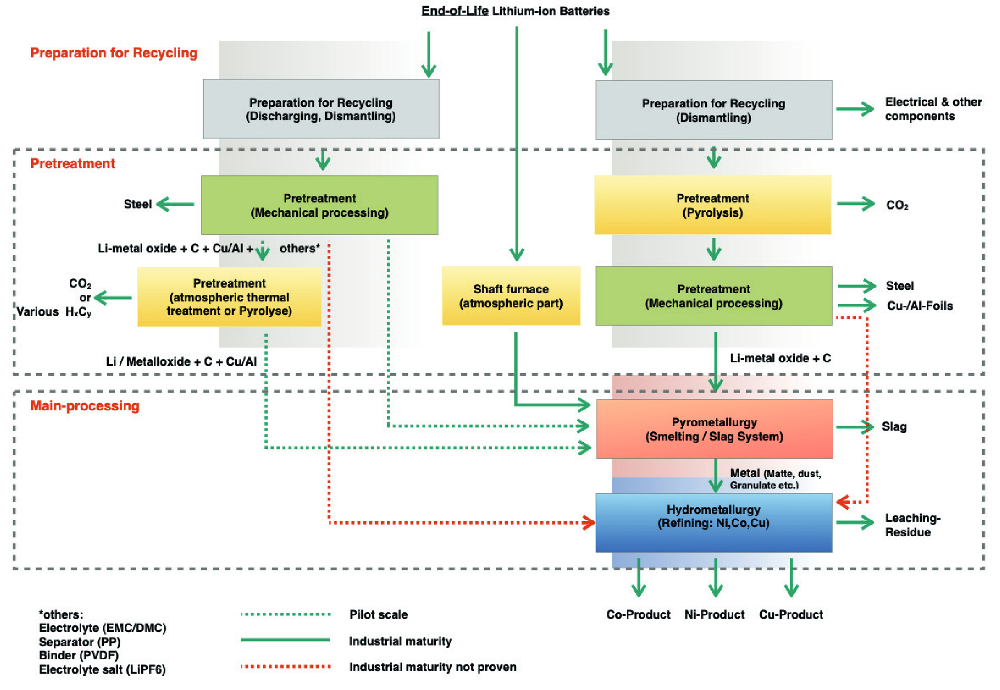
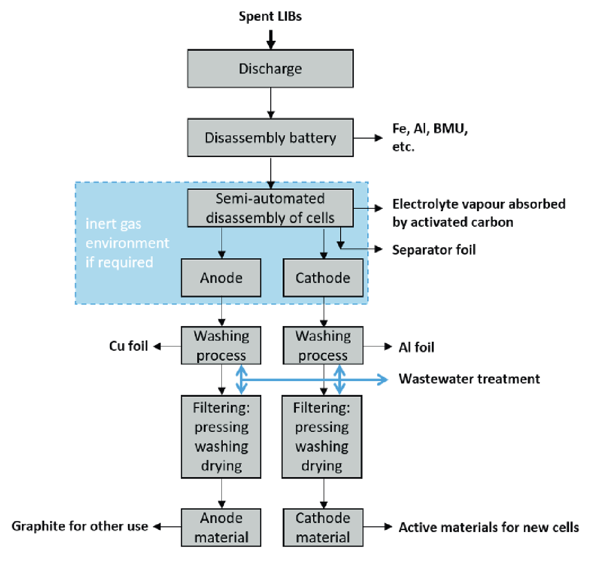

# Comparative study of Li-ion battery recycling processes

> [!Cite] [sojkaR-ComparativeStudyLiion](zotero://select/library/items/WNF84L23)
> [1]  R. Sojka, Q. Pan, and L. Billmann, ‘Comparative study of Li-ion battery recycling processes’, _ACCUREC Recycling GmbH_.
> > [!example]- Metadata    
> > **Title**:: Comparative study of Li-ion battery recycling processes
> > **Year**:: Error: `format` can only be applied to dates. Tried for format object
> > **Citekey**:: sojkaR-ComparativeStudyLiion
> > **Sources**:: [Zotero](zotero://select/library/items/WNF84L23) [pdf](file:////home/joeashton/Zotero/storage/NSJKLV6T/Sojka%20et%20al.%20-%20Comparative%20study%20of%20Li-ion%20battery%20recycling%20processes.pdf) 
> > **FirstAuthor**:: Sojka, Reiner
> > **Author**:: Pan, Qiaoyan
> > **Author**:: Billmann, Laura
> > 
> > **itemType**:: journalArticle
> > **Journal**:: *ACCUREC Recycling GmbH*

> [!abstract]- Abstract
> 
> This study provides a comprehensive review of Li-ion battery (LIB) recycling technologies. In the study, we outline and evaluate the current existing industrial LIB recycling processes globally as well as novel lab-scale initiatives. We briefly introduce the LIB components and their possible reactions during battery handling, in order to substantiate the technical requirements for recycling plant specification and process management. Secondly, we give a brief introduction of LIB recycling technologies and an overview of current LIB recyclers in the world. Thirdly, we further introduce the industrial recyclers, giving more detailed information about the companies, their LIB recycling technologies, treatment capacity, etc. Afterwards, several representative examples lab of novel -scale LIB recycling technologies are described, in order to integrate the latest development. Finally, we evaluate and compare these recycling technologies comprehensively from technical, economic and environmental performances points of view.
> Main conclusions from the study can be drawn as follows:
> 
> 1) The LIB materials and their reactions generate environmentally hazardous, human-toxic, highly corrosive substances (e.g. HF), as well as explosive gas mixtures, which must be considered to design a safe LIB tt process.
> 2) After investigating current industrial available LIB recycling technologies, we can structure them into four different process steps, namely Preparation, Pretreatment (including thermal and mechanical Pretreatment), Pyrometal lurgy and Hydrometallurgy, which can be combined in six different possible sequences. What they all have in common is that the material has to undergo the final necessary hydrometallurgical refining, to obtain tradeable products.
> 3) Currently only two of the combinations, both of which involve thermal Pre treatment and Pyrometallurgy, have proven their technical feasibility and in- dustrial maturity. Economic evaluation shows that these two process routes exhibit overall advantages.
> 4) In contrast, those process routes without these two steps (e.g. mechanical pretreatment + hydrometallurgy) show technical-economic disadvantages, because, for example, the formed corrosive gases increase maintenance cost in Pretreatment step and the highly contaminated intermediate products require additional effort and cost for impurity removal in the final hydrometal lurgical refining step, which indicates the reason why they haven’t been up scaled to mature industrial technologies yet.
> 5) Many novel lab-scale LIB recycling technologies are being developed in order to increase recycling rate and/or to lower the cost, including a so-called Direct Re cycling Process, in which cathode or anode materials are separated, recondi tioned and then directly re-used for manufacturing LIB, instead of undergoing pyro- and hydrometallurgy. However, the commercialization feasibility of those lab-scale technologies still needs to be proved. Considering unproved product quality, “Direct Recycling Process” and usage of separated AM for battery material precursor seem to be unrealistic.

# Annotations

%% begin annotations %%

> [!OrangeHighlight] [see in Zotero](zotero://open-pdf/library/items/NSJKLV6T?page=2&annotation=9DMB59E8)
> "The LIB materials and their reactions generate environmentally hazardous, human-toxic, highly corrosive substances (e.g. HF), as well as explosive gas mixtures, which must be considered to design a safe LIB tt process."

> [!OrangeHighlight] [see in Zotero](zotero://open-pdf/library/items/NSJKLV6T?page=2&annotation=HHNUQ3XU)
> "four different process steps, namely Preparation, Pretreatment (including thermal and mechanical Pretreatment), Pyrometal lurgy and Hydrometallurgy, which can be combined in six different possible sequences."

> [!OrangeHighlight] [see in Zotero](zotero://open-pdf/library/items/NSJKLV6T?page=2&annotation=DSRPBNTM)
> "Currently only two of the combinations, both of which involve thermal Pre treatment and Pyrometallurgy, have proven their technical feasibility and industrial maturity. Economic evaluation shows that these two process routes exhibit overall advantages."

> [!YellowHighlight] [see in Zotero](zotero://open-pdf/library/items/NSJKLV6T?page=3&annotation=IF75S9FT)
> "
> **AM** Active Mass (Powder) 
> **DEC** Di Ethyl Carbonate 
> **DMC** Di Methyl Carbonate 
> **EC** Ethylene Carbonate 
> **EMC** Ethyl Methyl Carbonate 
> **EOL** End of Life 
> **EV** Electric Vehicle 
> **GHS** Globally Harmonized System of Classification and Labelling of Chemicals 
> **ISC** Internal Short Circuit 
> **LCO** Lithium Cobalt Oxide, LiCoO2 
> **LFP** Lithium Iron Phosphate, LiFePO4 
> **LFL** Lower Flammability Limit 
> **LIB** Li-ion Battery 
> **LMO** Lithium Manganese Oxide, LiMn2O4 
> **LTO** Lithium Titanium Oxide, Li4Ti5O12 
> **NCA** Lithium Nickel Cobalt Aluminum oxide, LiNixCoyAlzO2 
> **NMC** Lithium Nickel Manganese Cobalt Oxide, LiNixMnyCozO2 
> **PC** Propylene Carbonate 
> **SEI** Solid-Electrolyte Interphase 
> **SME** Small and Medium-Sized Enterprises 
> **UFL** Upper Flammability Limit
> "

> [!OrangeHighlight] [see in Zotero](zotero://open-pdf/library/items/NSJKLV6T?page=3&annotation=BG55Y763)
> "Considering unproved product quality, “Direct Recycling Process” and usage of separated AM for battery mate rial precursor seem to be unrealistic."

> [!Quote] Table 1: Exemplary commercial Li-ion battery cell composition, adopted from [1]. [see in Zotero](zotero://open-pdf/library/items/NSJKLV6T?page=6&annotation=BNLAA4L8)
> 

> [!Quote] Figure 1: Constructional design of Li-ion cells (left: cylindrical, right: pouch) [2][3]. [see in Zotero](zotero://open-pdf/library/items/NSJKLV6T?page=7&annotation=NJM7CMBX)
> 

> [!YellowHighlight] [see in Zotero](zotero://open-pdf/library/items/NSJKLV6T?page=15&annotation=CS8VQ4J6)
> ## Pretreatment
> "the components are chemically and/or physically changed"
> "the goal of separating or changing the battery ingredients to such an extent that they can be fed into existing, large-scale industrial routes."
> This is to reduce the risk of:
> "
> - Fire and explosion events in feeding systems (TR), 
> - Input of impurities due to incorrect sorting (Pb, Cd, Hg etc.) and 
> - Gas explosions in smelters due to spontaneous evaporation and reaction of organic components (especially volatile electrolytes) and/or water components.
> 
> "
> "pretreatment can be merely mechanical or thermal treatment, or a combination of both."

> [!YellowHighlight] [see in Zotero](zotero://open-pdf/library/items/NSJKLV6T?page=15&annotation=56TI5IK9)
> ## Pyrometallurgy
> "to remove unwanted or process disturbing components and to convert the target components into a uniform intermediate product."
> "Battery components such as fluorine, chlorine, graphite, phosphorus etc. are essentially technically disturbing in hydrometallurgy."
> "It also makes economic sense here to slag low-value, non-precious metals such as iron, manganese or aluminium residues,"

> [!YellowHighlight] [see in Zotero](zotero://open-pdf/library/items/NSJKLV6T?page=16&annotation=TTWCVI6H)
> ## Hydrometallurgy
> 'usually consists of an autoclave, (chlo-rine) acid leaching of the intermediate product, precipitation and filtering of non-noble metals or undesirable elements, followed by solvent extraction and nickel electrowinning, ion exchange and cobalt electrowinning. Further roasting, dissolving, precipitation, filtering and electro-extraction processes take place in parallel and sequentially on side routes to extract copper and other by-metals such as lead, precious metals, etc.'

> [!Quote] Figure 5: Overview about schematized Li-ion batteries recycling routes [see in Zotero](zotero://open-pdf/library/items/NSJKLV6T?page=17&annotation=V6FXHRJI)
> 

> [!YellowHighlight] [see in Zotero](zotero://open-pdf/library/items/NSJKLV6T?page=20&annotation=TFAEY9UK)
> ## Industrial-scale (>1000t/a) Li-ion battery recycling processors
> - Umicore (Belgium) - [Pyro + Hydro] [see in Zotero](zotero://open-pdf/library/items/NSJKLV6T?page=20&annotation=LV8MXUKX)
> - Accurec (Germany) - [Thermal + Mechanical + Pyro + Hydro] [see in Zotero](zotero://open-pdf/library/items/NSJKLV6T?page=22&annotation=BMPRA5GQ)
> - Nickelhütte Aue (Germany) - [Thermal + Pyro + Hydro] [see in Zotero](zotero://open-pdf/library/items/NSJKLV6T?page=24&annotation=DCGUUVEY)
> - SungEel HiTech (South Korea) - [Mechanical + (Thermal +) Hydro] [see in Zotero](zotero://open-pdf/library/items/NSJKLV6T?page=25&annotation=USKWEKDZ)
> - Kyoei Seiko (Japan) - [Pyro] [see in Zotero](zotero://open-pdf/library/items/NSJKLV6T?page=25&annotation=XD5J54UP)
> - Dowa (Japan) - [Thermal + Pyro + Hydro] [see in Zotero](zotero://open-pdf/library/items/NSJKLV6T?page=26&annotation=YZBLC5SF)
> - Brunp (China) - [Thermal + Mechanical + Hydro] [see in Zotero](zotero://open-pdf/library/items/NSJKLV6T?page=27&annotation=ZI56RVNW)
> - GEM (China) - [Mechanical + Hydro] [see in Zotero](zotero://open-pdf/library/items/NSJKLV6T?page=28&annotation=JZM9FA96)
> - Huayou Cobalt (China) - [Mechanical + Hydro] [see in Zotero](zotero://open-pdf/library/items/NSJKLV6T?page=29&annotation=GERQM9XS)
> - Ganzhou Highpower (China) - [Mechanical + Pyro + Hydro] [see in Zotero](zotero://open-pdf/library/items/NSJKLV6T?page=29&annotation=UE52GVPL)

> [!YellowHighlight] [see in Zotero](zotero://open-pdf/library/items/NSJKLV6T?page=30&annotation=IJ9L2UMM)
> ## Pilot-scale (<1000 t/a) Li-ion battery recycling processors
> - SNAM (France) - [Thermal + Pyro + Hydro] [see in Zotero](zotero://open-pdf/library/items/NSJKLV6T?page=30&annotation=SH9D22Y7)
> - EDI (France) - [Mech (aqueous shred) + unknown] [see in Zotero](zotero://open-pdf/library/items/NSJKLV6T?page=30&annotation=GC5J2KJT)
> - AkkuSer (Finland) - [Mechanical + unknown] [see in Zotero](zotero://open-pdf/library/items/NSJKLV6T?page=31&annotation=GWSMDG8J)
> - Redux (Germany) - [Thermal + Mechanical + unknown] [see in Zotero](zotero://open-pdf/library/items/NSJKLV6T?page=31&annotation=KL9TXX6U)
> - Duesenfeld (Germany) - [Mechanical + Hydro] [see in Zotero](zotero://open-pdf/library/items/NSJKLV6T?page=32&annotation=IDQAHCI2)
> - Promesa (Germany) - [Mechanical (aqueous shred) + unknown] [see in Zotero](zotero://open-pdf/library/items/NSJKLV6T?page=33&annotation=LYKFSITT)
> - TES-AMM (formerly: Recupyl) (France) - [Mechanical (inert gas)] [see in Zotero](zotero://open-pdf/library/items/NSJKLV6T?page=33&annotation=L32FA5SD)
> - Retriev (US) - [Mechanical (aqueous shred) + Hydro] [see in Zotero](zotero://open-pdf/library/items/NSJKLV6T?page=34&annotation=LHKIP3I5)
> - Kobar (Korea) - [Mechanical + Hydro] [see in Zotero](zotero://open-pdf/library/items/NSJKLV6T?page=34&annotation=EITLPMZ6)
> - JX Nippon (Japan) - [Thermal + Mechanical + Hydro] [see in Zotero](zotero://open-pdf/library/items/NSJKLV6T?page=35&annotation=Q54DRVX6)
> - Telerecycle (China) - [Mechanical + Hydro] [see in Zotero](zotero://open-pdf/library/items/NSJKLV6T?page=36&annotation=FI6KBVYT)
> - Guanghua (China) - [Mechanical + Hydro] [see in Zotero](zotero://open-pdf/library/items/NSJKLV6T?page=37&annotation=IUURVW7I)

> [!YellowHighlight] [see in Zotero](zotero://open-pdf/library/items/NSJKLV6T?page=38&annotation=PIGUVJMY)
> ## "Mechanical separation and reconditioning for direct reuse (“Direct Recycling”)"
> 'Direct recycling process, in which cathode or anode materials are separated (by mechanical separation), reconditioned and then directly re-used for manufacturing LIB'
> ### "The process [16]:"
> "
> 1) After discharge (surplus of energy used within the company), the battery packs are dismantled com pletely to battery cell level mainly by hand.  
> 2) Subsequently, the pouch cells enter an encapsulated chamber flooded with inert gas to prevent fire or explosion where the pouch are automatically opened and separated into anodes and cathodes by the help of robots. This automation is a further safety measure in contrast to manual processing. The electrolyte vapor is collected by an exhaust system with an activated carbon filter that has to be exchanged regularly. Beside the electrodes, the separator foils are collected for plastic recycling or for thermal usage in incineration plants.  
> 3) The cathode and anode electrodes are treated separately in the following washing process. The cathode is treated with water and/or sodium hydrogen carbonate solution at 20-30°C and with a maximum of 90 bar air pressure to separate the aluminum foil and the coating (active mass contain ing nickel, manganese, cobalt and carbon).  
> 4) The liquid fraction containing the cathode materials is filtered, pressed, washed and dried in a gas oven, obtaining marketable recycled cathode materials that can be used partially for the production of new cells. However, the recycled cathode materials need to be mixed with primary cathode ma terials. All collected aluminum foils from the cathode are sent to an independent metal recycler.  
> 5) The anode is treated in the same way, separating and recovering the copper foil and the graphite active mass. However, the recycled graphite material is not used for battery anodes, but for other purposes. All collected copper foils from the anode are dried and sold for third party recycling.  
> 6) Because the washing water contains parts of the electrolyte and other contaminants it is treated and cleaned in a sewage treatment plant.
>  
> "
>
> > [!Quote] Figure 16: Direct recycling process including mechanical separation and reconditioning ap-plied by Erlos [16] [see in Zotero](zotero://open-pdf/library/items/NSJKLV6T?page=39&annotation=U6SW5WQ8)
> > 

> [!YellowHighlight] [see in Zotero](zotero://open-pdf/library/items/NSJKLV6T?page=44&annotation=83MNWL67)
> "According to EU-legislation, a recycling process is complete when, at the end of the process chain, a specified, tradable end product has been produced outside the waste regime."%% end annotations %%

# Notes

%% begin notes %%%% end notes %%

%% Import Date: 2025-02-24T13:50:47.305+00:00 %%
