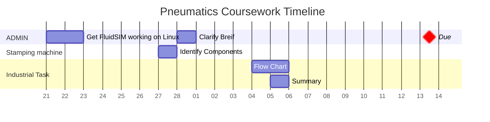

---
tags:
  - "#Assessment/Coursework"
title: Pneumatics Coursework
module: EGR3039 Industrial Automation
due: 2025-03-13T16:00:00
weight: 30
---

# Brief

> [!INFO]- [Brief](Projects/Uni%20Projects/Industrial%20Automation/Assessments/Pneumatics%20Coursework/Brief.md)
> 

# Plan

- [ ] Report
	- [x] Layout/Plan ✅ 2025-03-11
	- [x] Stamping machine ✅ 2025-03-11
		- [x] Screen shots of FluidSIM diagrams ✅ 2025-03-11
		- [x] Components list ✅ 2025-03-12
	- [ ] Chosen task
		- [x] Screen shots of FluidSIM diagrams ✅ 2025-03-11
		- [x] Add Flow diagrams ✅ 2025-03-11
		- [x] Components list ✅ 2025-03-12
		- [ ] Descriptions

# LogBook

