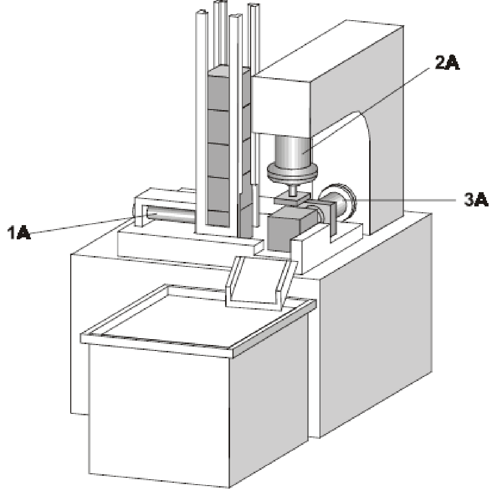

Cylinder 1A is to push parts out of the gravity feed magazine and clamp them. Only then can cylinder 2A stamp the part and retract once again. Next, clamping cylinder 1A is to unclamp. The part is to be ejected by cylinder 3A, which then returns to the retracted end position.

