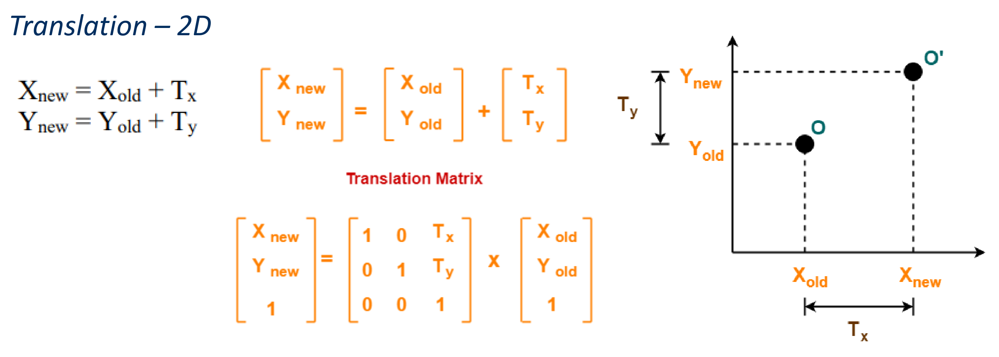
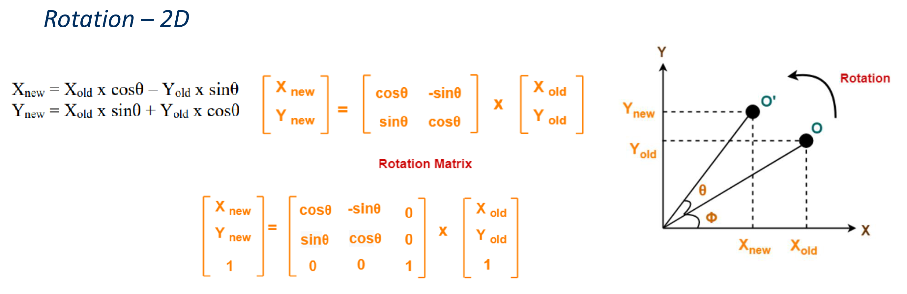
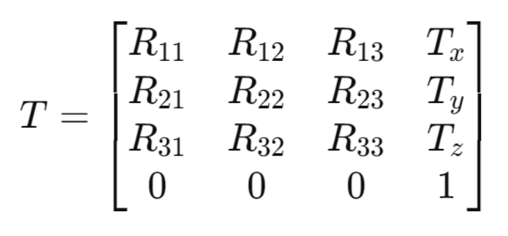
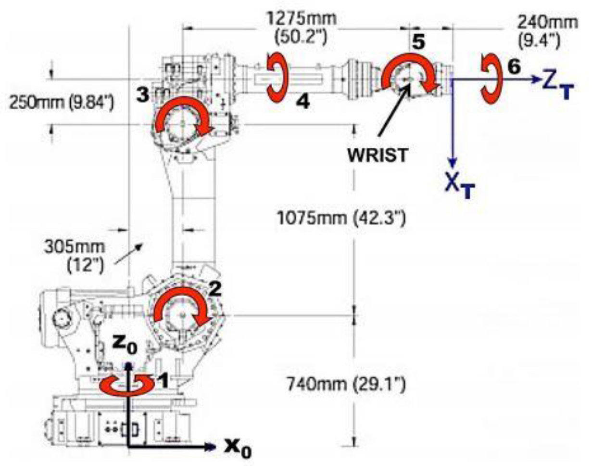
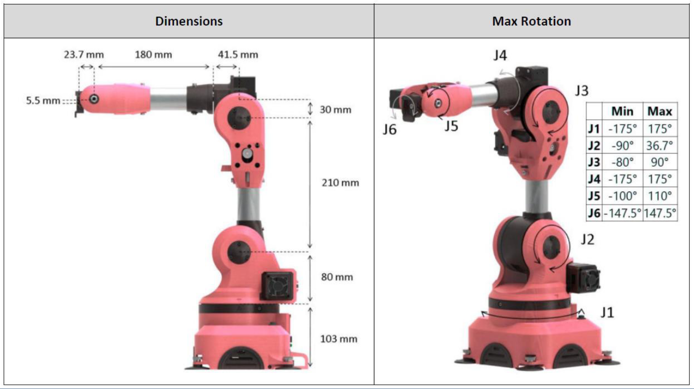

# Lecutures


> [!Cite] [drsamuelliu-Lecutures](zotero://select/library/items/LTAYMI4T)
> [1]  Dr Samuel Liu, ‘Lecutures’, presented at the ELE3005M – Robotics and Automation,
> > [!example]- Metadata    
> > **Title**:: Lecutures
> > **Year**:: Error: `format` can only be applied to dates. Tried for format object
> > **Citekey**:: drsamuelliu-Lecutures
> > **Sources**:: [Zotero](zotero://select/library/items/LTAYMI4T) [pdf](file:////home/joeashton/Zotero/storage/EJV5INYY/w1.pdf)  [pdf](file:////home/joeashton/Zotero/storage/SX2NHWFL/w2.pdf)  [pdf](file:////home/joeashton/Zotero/storage/A5ZZKSZB/w3.pdf)  [pdf](file:////home/joeashton/Zotero/storage/6BMLQQSN/w4.pdf) 
> > **FirstPresenter**:: Dr Samuel Liu
> > 
> > **itemType**:: presentation

# Annotations

%% begin annotations %%

> [!YellowHighlight] [see in Zotero](zotero://open-pdf/library/items/EJV5INYY?page=26&annotation=4LTLBZSI)
> "169.254.200.202"

> [!YellowHighlight] [see in Zotero](zotero://open-pdf/library/items/EJV5INYY?page=30&annotation=6HYE6LXM)
> "• calibrate_auto()  • move_joints(*[0, 0, 0, 0, 0, 0])  • request_new_calibration()  • move_pose(*[0.2, 0.2, 0.2, 0, 0, 0])"

> [!BlueHighlight] [see in Zotero](zotero://open-pdf/library/items/SX2NHWFL?page=-&annotation=GKTVM6QI)
> "body1 = rigidBody('body1');"

> [!BlueHighlight] [see in Zotero](zotero://open-pdf/library/items/SX2NHWFL?page=-&annotation=S5JYXDAM)
> "jnt1 = rigidBodyJoint('jnt1','revolute');"

> [!Quote] [see in Zotero](zotero://open-pdf/library/items/SX2NHWFL?page=-&annotation=26NQDX88)
> 
> > [!note]
> > A 2D linear translation is represented in a homogeneous coordinate system like so:
> > 
> > In 3D this becomes:

> [!Quote] [see in Zotero](zotero://open-pdf/library/items/SX2NHWFL?page=-&annotation=BAR7KNCM)
> 
> > [!note]
> > Rotations about the origin can be expressed in the following form:
> > Where:
> > 
> > To rotate about an arbitrary coordinate this becomes:
> > 
> > And for a 3D rotation this would be:

> [!Quote] [see in Zotero](zotero://open-pdf/library/items/SX2NHWFL?page=-&annotation=P5YBJ62H)
> 

> [!BlueHighlight] [see in Zotero](zotero://open-pdf/library/items/SX2NHWFL?page=-&annotation=KQXBX9JS)
> "tform = trvec2tform([0, 0, 0.2]); tform = eul2tform([0, 0, pi/2]);"
> > [!note]
> > To generate homogeneous transform matrices from
> > 1. cartesian linear translation
> > ```
> > 
> > trvec2tform([x,y,z]);
> > ```
> > 2. euler rotation
> > ```
> > eul2tform([z,x,y])
> > % or
> > 
> > eul2tform([x,y,z], "xyz")
> > ```

> [!Quote] [see in Zotero](zotero://open-pdf/library/items/A5ZZKSZB?page=5&annotation=EANXLTSW)
> 

> [!YellowHighlight] [see in Zotero](zotero://open-pdf/library/items/6BMLQQSN?page=5&annotation=5XQCTDEJ)
> "• Given joint parameters, the position and orientation of the chain's end, e.g. the hand of the character or robot, can typically be calculated directly  ELE3005-2425/Robotics And Automation/Week 4  Forward kinematics"

> [!YellowHighlight] [see in Zotero](zotero://open-pdf/library/items/6BMLQQSN?page=8&annotation=EX7SATX5)
> "Inverse kinematics  • The mathematical process of calculating the variable joint parameters needed to place the end of a kinematic chain, such as a robot manipulator, in a given position and orientation relative to the start of the chain."

> [!YellowHighlight] [see in Zotero](zotero://open-pdf/library/items/6BMLQQSN?page=10&annotation=L4ALHR82)
> "ik = inverseKinematics('RigidBodyTree', robot);"

> [!YellowHighlight] [see in Zotero](zotero://open-pdf/library/items/6BMLQQSN?page=10&annotation=LTYE3KGE)
> "qSol = ik(endEffector, poseTF, weights, qInitial);"

> [!Quote] [see in Zotero](zotero://open-pdf/library/items/6BMLQQSN?page=13&annotation=R2T8F9ET)
> %% end annotations %%

# Notes

%% begin notes %%%% end notes %%

%% Import Date: 2025-02-28T14:04:24.115+00:00 %%
