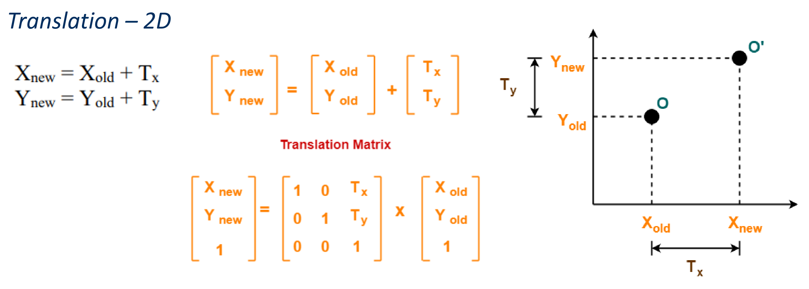
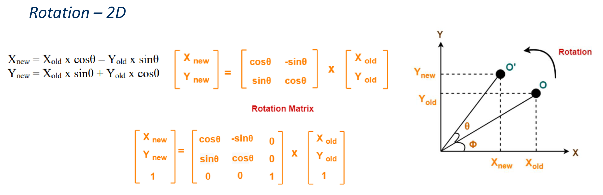
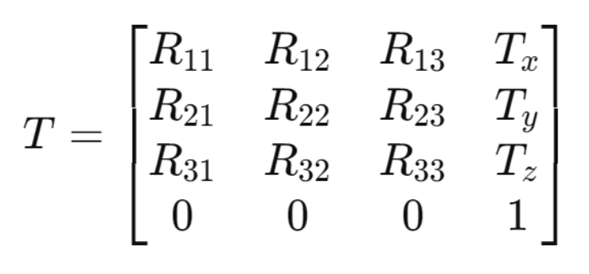

# ELE3005M – Robotics and Automation Lecutures


> [!Cite] [drsamuelliu-ELE3005MRoboticsAutomation](zotero://select/library/items/LTAYMI4T)
> [1]  Dr Samuel Liu, ‘ELE3005M – Robotics and Automation Lecutures’, presented at the Robotics and Automation,
> > [!example]- Metadata    
> > **Title**:: ELE3005M – Robotics and Automation Lecutures
> > **Year**:: Error: `format` can only be applied to dates. Tried for format object
> > **Citekey**:: drsamuelliu-ELE3005MRoboticsAutomation
> > **Sources**:: [Zotero](zotero://select/library/items/LTAYMI4T) [pdf](file:////home/joeashton/Zotero/storage/EJV5INYY/w1.pdf)  [pdf](file:////home/joeashton/Zotero/storage/SX2NHWFL/w2.pdf) 
> > **FirstPresenter**:: Dr Samuel Liu
> > 
> > **itemType**:: presentation

# Annotations

%% begin annotations %%
## Week 1

> [!YellowHighlight] [see in Zotero](zotero://open-pdf/library/items/EJV5INYY?page=26&annotation=4LTLBZSI)
> Robot IP = "169.254.200.202"

```C++ title="move arm"
calibrate_auto()  
move_joints(*[0, 0, 0, 0, 0, 0])  
request_new_calibration()  
move_pose(*[0.2, 0.2, 0.2, 0, 0, 0])
```

> [see in Zotero](zotero://open-pdf/library/items/EJV5INYY?page=30&annotation=6HYE6LXM)

## Week 2

### Coordinate Transformations

> [!Quote] [see in Zotero](zotero://open-pdf/library/items/SX2NHWFL?page=-&annotation=26NQDX88)
> 

A 2D linear translation is represented in a homogeneous coordinate system like so:

In 3D this becomes:

> [!Quote] [see in Zotero](zotero://open-pdf/library/items/SX2NHWFL?page=-&annotation=BAR7KNCM)
> 

Rotations about the origin can be expressed in the following form:
Where:

To rotate about an arbitrary coordinate this becomes:

And for a 3D rotation this would be:

Thus a full homogeneous transfer function takes the following form:

> [!Quote] [see in Zotero](zotero://open-pdf/library/items/SX2NHWFL?page=-&annotation=P5YBJ62H)
> 

$$\Large
T = 
\begin{bmatrix}
R_{xx} & R_{xy} & R_{xz} & T_{x} \\ 
R_{yx} & R_{yy} & R_{yz} & T_{y} \\ 
R_{zx} & R_{zy} & R_{zz} & T_{z} \\ 
0 & 0 & 0 & 1 \\ 
\end{bmatrix}$$


### Matlab Robotics System Toolbox

#### Defining bodies

> [!BlueHighlight] `body1 = rigidBody('body1');` [see in Zotero](zotero://open-pdf/library/items/SX2NHWFL?page=-&annotation=GKTVM6QI) 

> [!BlueHighlight] `jnt1 = rigidBodyJoint('jnt1','revolute');` [see in Zotero](zotero://open-pdf/library/items/SX2NHWFL?page=-&annotation=S5JYXDAM)


#### Transforms 

> [!BlueHighlight] [see in Zotero](zotero://open-pdf/library/items/SX2NHWFL?page=-&annotation=KQXBX9JS)
> "tform = trvec2tform([0, 0, 0.2]); tform = eul2tform([0, 0, pi/2]);"

To generate homogeneous transform matrices from

1. Cartesian linear translation

```matlab
trvec2tform([x,y,z]);
```

1. Euler rotation

```matlab
eul2tform([z,x,y])
% or
eul2tform([x,y,z], "xyz")
```

%% end annotations %%

# Notes

%% begin notes %%%% end notes %%

%% Import Date: 2025-02-07T12:17:50.614+00:00 %%
