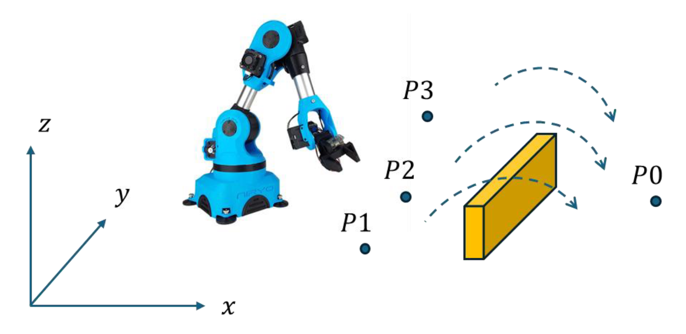

## Summary

> [!Abstract]- Learning Objectives
> 1. Select and evaluate technical literature and other sources of information to address problems in the robotics and automation field and its underlying principles.
> 2. Select, evaluate and apply key control principles, quantitative science and robot programming tools in the design of robotics systems and problems
> 3. Select and apply appropriate computational and analytical techniques to model typical robotics applications in automation problems and recognise the limitations of the techniques employed
> 4. Understand and evaluate the operation and application of a range of sensory systems in robotics and demonstrate principles of secure data storage and analysis
> 5. Communicate effectively on complex engineering matters with technical and non-technical audiences

Group Project to automate a basic manipulation task in which the Niryo robot is programmed using MATLAB/Python/ROS to pick up three small boxes (P1, P2, P3, 10 mm × 10 mm × 10 mm) and stack them on top of each other at the other side of a barrier (P0, barrier height 100 mm, width 10 mm).
Innovative solutions that go beyond the project requirements to improve performance and/or user interface are encouraged.

## Group Work

### Project files (40 marks)
Submit all MATLAB/Python files you created to complete the task for this project in the form of a single zipped file named as your group number.

### Simulation Video (20 marks)
1. The aim of this simulation video is to showcase what you achieved in this project by recording the simulation of the required task being completed.
2. Your submission will be a recorded video of the simulation. Adding commentary and/or supporting text is encouraged to highlight areas of innovation and limitations that can be further improved.
3. Note: there is a maximum of 6 minutes limit for your video.

## Individual

### Technical report (40 marks)

1. The aim of your report is to document all your progress on this project and show your understanding of the technical aspects involved.
2. Your submission should take the form of an individual PDF report using the following structure:
	- Background (Introduction to robotic manipulation and the project task),
	- System overview (hardware specifications and software used),
	- Methodology (explain your approach to solving this project),
	- Results and Conclusions (evaluate how well your solution performed and areas for future improvement). 
3. A good technical report will combine the implementation with the supporting theory in a concise and organised format. Supporting figures are encouraged where applicable.

Note: there is a 10-page limit for your report.