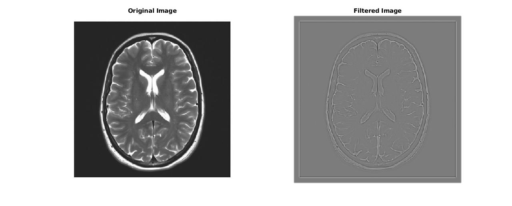
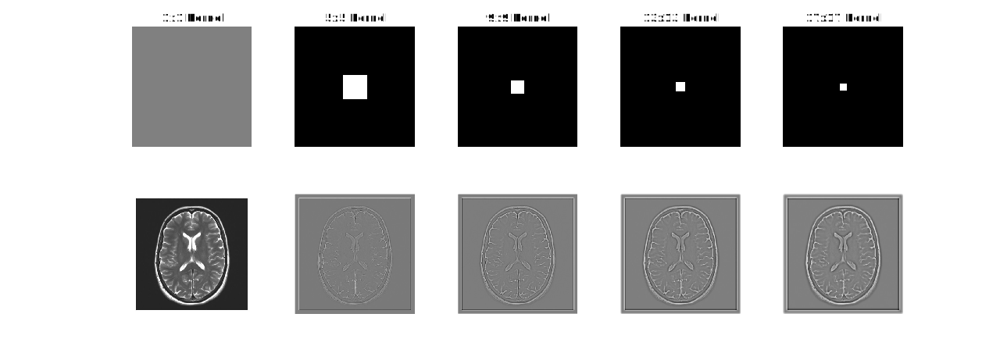
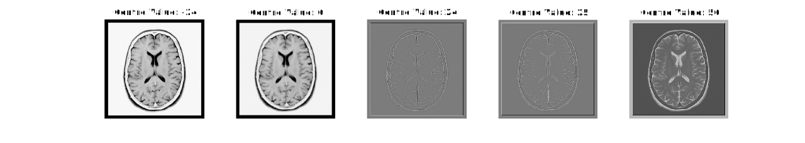

$$\begin{bmatrix} 
−1 & −1 & −1 & −1 & −1 \\
−1 & −1 & −1 & −1 & −1 \\
−1 & −1 & 24 & −1 & −1 \\
−1 & −1 & −1 & −1 & −1 \\
−1 & −1 & −1 & −1 & −1 \\
\end{bmatrix}$$

This kernel highlights pixels by how they differ from pixels in their immediate vicinity, when applied to the brain scan this makes the edges of bright features show up as light lines with darker outlines or the inverse for darker features. 

This is done by considering a region of up to 2 pixels in every direction and subtracting the value of each neighbouring pixel from the one at the centre of this region, to compensate the the pixel at the centre is multiplied in magnitude by the number of neighbouring pixels compared against. 

The filter could be adjusted to only pick up larger features by increasing the size of both the centre and the surroundings considered, or discriminate against a larger region by increasing just the surroundings like shown below.

By changing the centre value we can essentially add this on top of the original image (or an inverted version) with the effect of increasing it's sharpness.

