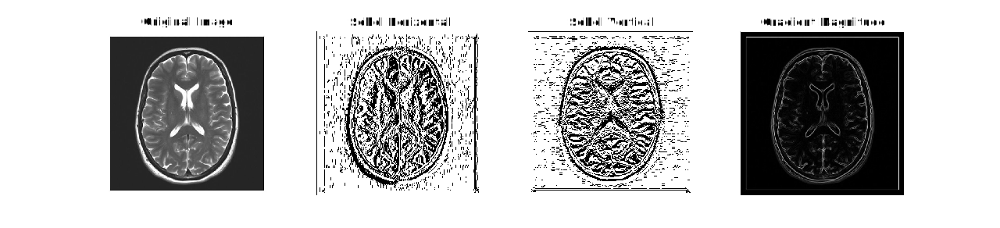

Adding the effective brightness of pixels to one side and subtracting the brightness of those on the other will show the effective gradient along that axis like taking a local derivative. This is the principle behind the Sobel filter, where the magnitude of two axial gradient detecting kernels are summed to the effect of a rudimentary edge detection filter.

$$
\begin{array}{}
\text{Horisontal Sobel Filter} &\quad&
\text{Vertical Sobel Filter} &\quad&
\text{Edge Detect} \\
G_{x} = \begin{bmatrix}
-1, & 0, & 1 \\ 
-2, & 0, & 2 \\ 
-1, & 0, & 1 \\ 
\end{bmatrix} &&
G_{y} = \begin{bmatrix}
-1, & -2, & -1 \\ 
0, & 0, & 0 \\ 
1, & 2, & 1 \\ 
\end{bmatrix} &&
E = \sqrt{G_{x}{^2} + G_{y}{^2}}
\end{array}
$$

Applied to the black and white brain image considered in the previous section this method can clearly outline the features of the brain.

###### Figure 12: 3x3 Sobel Edge Detection



This was achieved in MATLAB utilising the `conv2` function.

```MATLAB title="3x3 Sobel Edge Detection"
original_image = double(imread('Brain_BW512x512.png'));

% Sobel kernels
Gx = [
  -1 0 1;
  -2 0 2;
  -1 0 1
  ];

Gy = [
  -1 -2 -1;
  0  0  0;
  1  2  1
  ];

% Apply convolution
filtered_x = conv2(original_image, Gx);
filtered_y = conv2(original_image, Gy);

% Compute gradient magnitude
sobel_magnitude = sqrt(filtered_x.^2 + filtered_y.^2);
sobel_magnitude = mat2gray(sobel_magnitude);

% Plot results
figure('Name', 'Sobel Filter Results');
tiledlayout(1,4);
nexttile;
imshow(uint8(original_image));
title('Original Image');
nexttile;
imshow(uint8(mat2gray(filtered_x)) * 255);
title('Sobel Horizontal');
nexttile;
imshow(uint8(mat2gray(filtered_y)) * 255);
title('Sobel Vertical');
nexttile;
imshow(uint8(sobel_magnitude * 255));
title('Gradient Magnitude');
```


It's worth noting the impact of the size of the sobel filter, the reader will notice the filters picking up noise in the background in figure ! %%add figure label%%. As far as the filter is concerned this noise is just a very small feature so by increasing the size of the kernel, effectivley blurring it's input, the filter can be tuned to only detect larger features.

###### Figure 13: Sobel Kernel Size Comparison


Details on the script used to generate the figure above can be found in the annex.