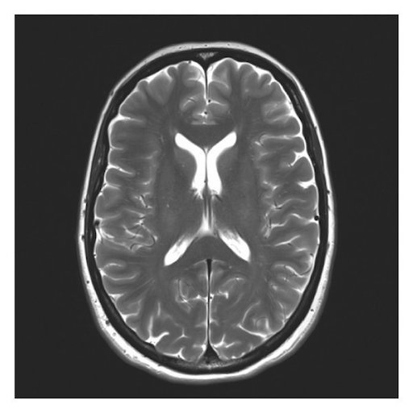

## Question 1 (60marks)
You are going to design and implement a digital Low Pass Filter (LPF) based on the Bilinear Transform that you will see in lectures. The filter prototype is going to be a (maximally flat) Butterworth Low Pass Filter, which has the transfer function:

$$\frac{Y(s)}{X(s)} = \frac{{\omega_{b}}^{2}}{s^{2} + {\omega_{b}} \sqrt{2} s + {\omega_{b}}^{2}}$$

You are required to design the filter so that has a bandwidth of 𝜔b=5 rad/sec. The sampling frequency you are going to use to implement your digital filter is a compromise between the accuracy of obtaining the same characteristics as the analogue prototype filter, and computational effort (and finite wordlength effects—more on this later in the course). In this case, you are going to choose a sampling frequency of 𝜔s=10x 𝜔b Hz. 

There are 7 elements to Question 1 of this assignment, see below: 

### i) Derive the S domain transfer function (5 marks) 
Derive the transfer function of your Butterworth prototype filter in the Laplace $s$ domain. 
### ii) Plot the impulse & frequency response (5 marks)
Plot the frequency response of your prototype filter (using $s$ domain transfer function) in Matlab—ensure it matches your specification i.e. the -3dB point is at the equivalent of ${\omega_{b}}$ save your frequency response plot for your report. Plot the impulse response of your prototype filter in Matlab—save the impulse response for your report. 
### iii) Derive the Z domain transfer function (5marks) 
Apply the Bilinear Transform and derive the z-domain transfer function of your digital filter. Show your derivation in your report.

### iv) Use Matlab to obtain the frequency response (5marks) 
Use Matlab to obtain the frequency response of your digital filter in the digital (𝜔d) and Analogue (𝜔c) domains—do they match at around the Break (of cut-off) frequency ? Note: take care to use digital frequency response function for your digital filter and analogue frequency response functions for your original prototype filter. Include your frequency response plot comparisons in your report.
### v) Derive the Difference Equation (5marks) 
Derive the Difference Equation of your digital filter. Show your derivation in your report. 
### vi) Implement your filter using Matlab (10 marks) 
Implement your filter using a Matlab m-File using your derived Difference Equation in response to a unit step input. Include your m-file and results to show it implements the filter in your report. 
### vii) Implement your filter on an Arduino (25marks)
Implement your filter on an Arduino (eg. Uno or nano) or an alternative computational microcontroller/dsp/fpga platform. Provide all your code etc in your report so that the module leader can reproduce your results. You can either use real Arduino board and obtain the output data using a 3rd party graphing tool, OR use an online virtual simulator of an Arduino (eg. Uno) with your code eg. Virtronics, OR you can alternatively decide to use the Serial Plotter function in the Arduino IDE (?). Some example websites that may be useful include those below, although there are many more available—there is no prescriptive way to do this; choose something that you can get working! 
https://www.tinkercad.com/circuits 
http://www.makerplot.com

https://github.com/gregpinero/ArduinoPlot 
https://github.com/devinaconley/arduino-plotter 
https://www.megunolink.com 
https://github.com/sebnil/RealtimePlotter 
You could also open a com port in Matlab and display data using Matlab 
routines if this is your preferred route. 
Then: 
Apply input squarewaves to your implemented digital filter and show that your filter has the correct step response characteristics for your 2nd order Butterworth filter 

## Question 2 (10marks)
You have been given a grayscale image file of a human brain, depicted below (Figure 2.1):

> 
> Figure 2.1

Load the image file into Matlab. 
Use Matlab to perform convolution on the Image with the Kernel:

$$\begin{bmatrix} 
−1 & −1 & −1 & −1 & −1 \\
−1 & −1 & −1 & −1 & −1 \\
−1 & −1 & 24 & −1 & −1 \\
−1 & −1 & −1 & −1 & −1 \\
−1 & −1 & −1 & −1 & −1 \\
\end{bmatrix}$$

Show the Matlab command/s you have used, and include the resulting image in your report. 
What effect has the operation had on the original image, and why ? What is the significance of 
the value ‘24’ in the middle element of the kernel? 
(10 marks) 

## Question 3 (15 marks)
Use a 3x3 Sobel Kernel to provide edge detection, and apply it to the human brain in Figure 2.1. 
Include the resultant figure in your report, and briefly explain how this method works. 
 
## Question 4 (15 marks)
Pseudo Random Binary Sequences (PRBSs) are often used for system identification. Explain the underlying principles of the technique. Include how the concepts of autocorrelation/correlation are used in your answer booklet—note: the module leader has provided you with introductory correlation concepts on Blackboard. 
