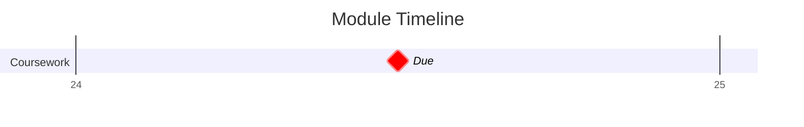

## Key Dates

| Date                                  | Event                                                                   |
| ------------------------------------- | ----------------------------------------------------------------------- |
| [April 24th (2025-04-24)](2025-04-24) | [Signal Processing Coursework](Signal%20Processing%20Coursework.md) Due |

## Lecture Notes
```dataview
LIST rows.file.link
FROM "Projects/Uni Projects/Signal Processing/Notes"
GROUP BY substring(file.folder,46)
```


