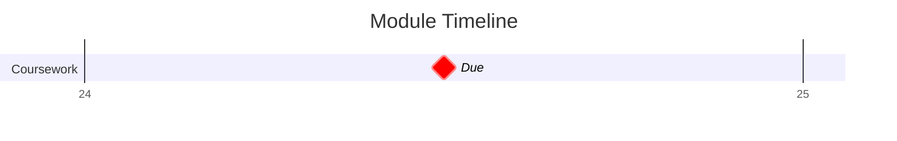

## Key Dates

```dataview
TABLE link(dateformat(due,"yyyy-MM-dd"),dateformat(due,"yyyy-MM-dd")) AS "Due Date", due - date(today) AS "Due In", weight + "%" AS "Weight"
FROM "Projects/Uni Projects/Signal Processing" AND #Assessment/Coursework
SORT due 
```

## Lecture Notes
```dataview
LIST rows.file.link
FROM "Projects/Uni Projects/Signal Processing/Notes" AND #Lecture_Notes
GROUP BY substring(file.folder,46)
```


